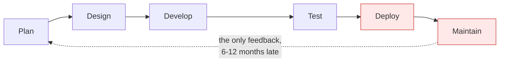
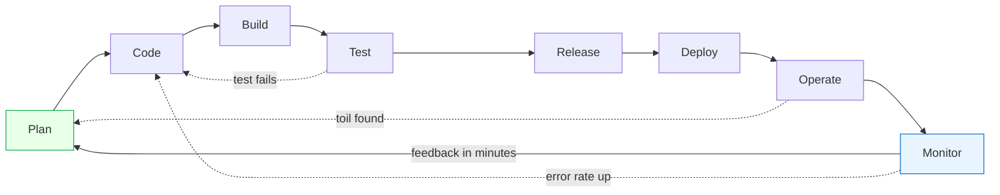
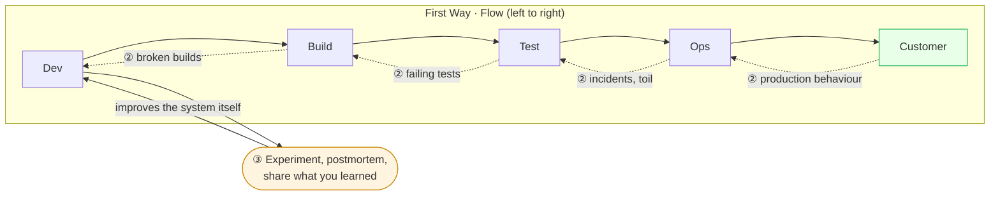
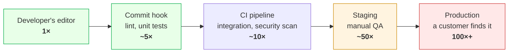
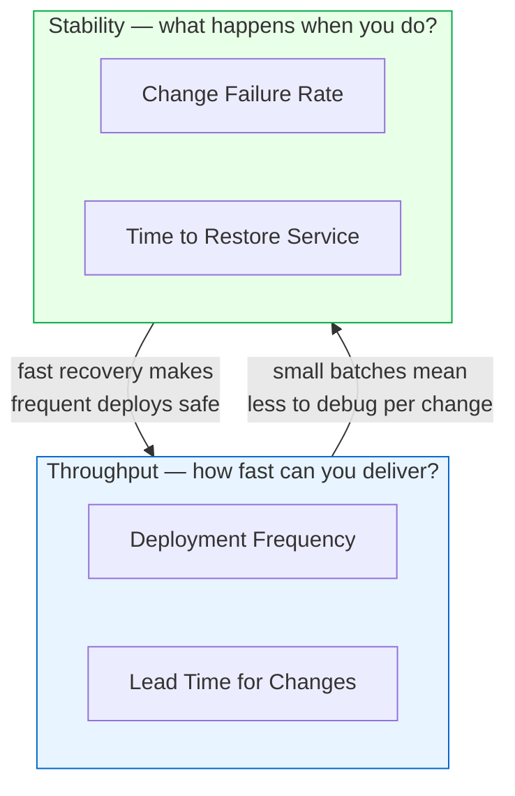
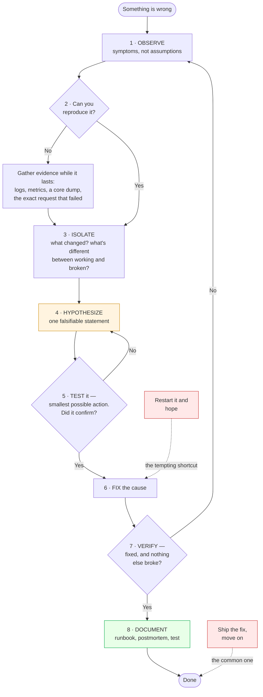

# Module 00: DevOps Foundations

> *"DevOps is not a tool, a team, or a title. It's a culture of collaboration, automation, and continuous improvement."*

---

## 🎯 Why This Module Matters

Before you touch a single tool, you need to understand **why DevOps exists**. Every company you'll work at has its own version of "DevOps," but the underlying principles are universal. This module gives you the mental model that makes every subsequent tool and practice click into place.

**In real-world DevOps work**, you'll constantly be asked:

- "Why are we automating this?"
- "How does this fit into our delivery pipeline?"
- "What's the risk of this change?"

If you don't understand the foundations, you'll be a tool operator. If you do, you'll be an **engineer**.

---

## 📚 Table of Contents

1. [What Is DevOps?](#1-what-is-devops)
2. [The Software Development Lifecycle (SDLC)](#2-the-software-development-lifecycle-sdlc)
3. [DevOps vs Traditional IT](#3-devops-vs-traditional-it)
4. [Core DevOps Principles](#4-core-devops-principles)
5. [DevOps Culture and Collaboration](#5-devops-culture-and-collaboration)
6. [Key DevOps Practices](#6-key-devops-practices)
7. [The DevOps Toolchain](#7-the-devops-toolchain)
8. [DevOps Metrics That Matter](#8-devops-metrics-that-matter)
9. [Common Mistakes and Anti-Patterns](#9-common-mistakes-and-anti-patterns)
10. [Debugging Mindset](#10-debugging-mindset)
11. [Interview Insights](#11-interview-insights)

---

## 1. What Is DevOps?

### The Simple Answer

DevOps is a **set of practices, cultural philosophies, and tools** that increase an organization's ability to deliver applications and services at high velocity.

### The Real Answer

DevOps was born from a problem: **developers and operations teams worked in silos**.

```
BEFORE DevOps:
┌─────────────┐     "Works on my machine"     ┌─────────────┐
│  Developers  │──────────── ❌ ──────────────▶│  Operations  │
│  (Build it)  │     Wall of Confusion         │  (Run it)    │
└─────────────┘                                └─────────────┘
     Fast but unstable                           Stable but slow

AFTER DevOps:
┌──────────────────────────────────────────────┐
│              DevOps Culture                   │
│  Developers + Operations = Shared Ownership   │
│  Build → Test → Deploy → Monitor → Improve    │
│  Automated, Measured, Continuously Improving   │
└──────────────────────────────────────────────┘
     Fast AND stable
```

### The Three Pillars

| Pillar | What It Means | Example |
|--------|--------------|---------|
| **People** | Break silos, shared responsibility | Dev and Ops in same standup |
| **Process** | Automate, iterate, measure | CI/CD pipelines, blameless postmortems |
| **Technology** | Right tools for the job | Docker, Kubernetes, Terraform, etc. |

> **🔑 Key Insight**: Tools are the *least* important pillar. Most DevOps failures come from culture and process problems, not tooling.

---

## 2. The Software Development Lifecycle (SDLC)

Understanding the SDLC is critical because DevOps wraps around every phase of it.

### Traditional SDLC (Waterfall)



**Problems**: Slow feedback, high risk releases, "big bang" deployments. Look at where the single feedback arrow starts — you learn whether the plan was right only after the whole thing has shipped.

### DevOps-Enhanced SDLC



**Key difference**: the cycle is continuous, and — more importantly — there are *several* feedback arrows, not one. Each iteration is small, so risk is low and every arrow is short enough that the person who caused a problem is still holding the context needed to fix it.

### SDLC Phases in DevOps Context

| Phase | Traditional | DevOps Way |
|-------|------------|------------|
| **Plan** | Quarterly planning documents | Sprint planning, backlog grooming, shared OKRs |
| **Code** | Developers code in isolation | Trunk-based dev, code reviews, pair programming |
| **Build** | Manual builds on dev machines | Automated builds (CI), build as code |
| **Test** | QA phase after development | Automated tests run on every commit |
| **Release** | Change advisory boards, manual sign-offs | Automated release pipelines, feature flags |
| **Deploy** | Weekend maintenance windows | Blue-green, canary, rolling deployments |
| **Operate** | Ops on-call, firefighting | Infrastructure as code, self-healing systems |
| **Monitor** | Check dashboards when something fails | Continuous monitoring, alerting, SLOs |

---

## 3. DevOps vs Traditional IT

| Aspect | Traditional IT | DevOps |
|--------|---------------|--------|
| **Release frequency** | Weeks/months | Hours/days |
| **Deployment** | Manual, risky | Automated, routine |
| **Team structure** | Siloed (Dev, QA, Ops) | Cross-functional |
| **Failure response** | Blame, root cause (find the person) | Blameless postmortems (fix the system) |
| **Infrastructure** | Manually configured servers | Infrastructure as Code |
| **Testing** | Manual QA at the end | Automated tests throughout |
| **Monitoring** | Reactive ("server is down!") | Proactive (alerts before users notice) |
| **Change management** | Heavy approval processes | Small, frequent, low-risk changes |

### The CALMS Framework

A well-known model for evaluating DevOps maturity:

- **C**ulture — Shared ownership between Dev and Ops
- **A**utomation — Automate repetitive tasks
- **L**ean — Focus on value, eliminate waste
- **M**easurement — Data-driven decisions
- **S**haring — Knowledge sharing, transparency

---

## 4. Core DevOps Principles

### Principle 1: The Three Ways (from *The Phoenix Project*)

**The First Way — Systems Thinking (Flow)**

- Optimize for the overall system, not individual parts
- Work flows from left (Dev) to right (Ops) to customer
- Reduce batch sizes and intervals of work
- Never pass known defects downstream

**The Second Way — Feedback Loops**

- Create right-to-left feedback at all stages
- Shorten and amplify feedback loops
- When problems happen, fix them immediately
- Push quality closer to the source

**The Third Way — Continuous Learning**

- Foster a culture of experimentation
- Accept that failure is inevitable — learn from it
- Allocate time for process improvement
- Share knowledge widely

The three are one system, and the diagram is the point: each Way only works because the one before it does.



**Read it in order.** ① Work only ever moves right, and defects never do. ② Every stage reports back to the one before it, as fast as possible — that is what makes the flow safe. ③ The learning loop is the one that changes the *system* rather than the work item, and it is the one organisations skip, which is why they get faster at repeating the same failure.

### Principle 2: Automation Everything

```
Manual Process              →  Automated Process
──────────────                 ──────────────────
"SSH into server and         →  Infrastructure as Code
 install packages"              (Terraform/Ansible)

"Run tests before you        →  CI pipeline runs tests
 push to main"                  on every commit

"Check if the app is up"     →  Prometheus + Grafana
                                with alerting
```

### Principle 3: Infrastructure as Code (IaC)

Treat your infrastructure like application code:

- **Version controlled** — track every change
- **Reviewable** — code reviews for infra changes
- **Testable** — validate before applying
- **Reproducible** — spin up identical environments

### Principle 4: Shift Left

Move quality activities earlier in the pipeline:

The argument is not "test more". It is that the *same defect* costs a different amount depending on which gate catches it:



The multipliers are rough, and the shape is not: cost rises because the number of people involved rises. A failing unit test costs one developer two minutes with the code already in their head. The same bug in production costs an incident channel, a rollback, a postmortem, and a customer who now doubts you — and the developer has to rebuild the context they lost three weeks ago. **Shift Left means moving each check to the earliest gate that can honestly run it.**

### Principle 5: Observability First

**You cannot manage what you cannot measure.**

- Monitor everything from day one
- Metrics, logs, and traces are non-negotiable
- Set alerts before you need them

> ⚠️ **This is why we teach Observability (Module 07) BEFORE infrastructure automation (Modules 10-12)**. You need to understand how systems behave before you automate them at scale.

---

## 5. DevOps Culture and Collaboration

### Blameless Postmortems

When things break (and they will), the response should be:

❌ **"Who pushed the bad code?"**
✅ **"What system gap allowed this to reach production?"**

A blameless postmortem template:

```markdown
## Incident: [Title]
**Date**: YYYY-MM-DD
**Duration**: X hours
**Severity**: P1/P2/P3
**Impact**: What users experienced

### Timeline
- HH:MM — First alert fired
- HH:MM — Investigation began
- HH:MM — Root cause identified
- HH:MM — Fix deployed
- HH:MM — All clear confirmed

### Root Cause
[Technical explanation of what went wrong]

### Contributing Factors
[Why the problem wasn't caught earlier]

### Action Items
- [ ] [Preventive action 1] — Owner: [name] — Due: [date]
- [ ] [Preventive action 2] — Owner: [name] — Due: [date]

### Lessons Learned
[What we'll do differently]
```

### Shared Responsibility (You Build It, You Run It)

In modern DevOps organizations:

- The team that **builds** the service also **operates** it
- This creates incentive to build reliable, observable software
- On-call rotations include developers, not just ops

### Communication Practices

- **Daily standups** — Short sync on blockers and progress
- **Chatops** — Use Slack/Teams bots for deployment, monitoring
- **Documentation** — Runbooks for every service
- **War rooms** — Collaborative incident response

---

## 6. Key DevOps Practices

### Continuous Integration (CI)

- Developers merge code to main branch frequently (at least daily)
- Every merge triggers automated build + tests
- Broken builds are fixed immediately (top priority)

### Continuous Delivery (CD)

- Every code change is automatically prepared for release
- Deployment to production is a one-click (or zero-click) operation
- Production-like environments for testing

### Continuous Deployment

- CI + CD, but deployments happen automatically
- No human approval gate for production
- Requires high confidence in test suite

```
CI only:         Code → Build → Test → ✅ (done)
CI + CD:         Code → Build → Test → Package → Staging → ✅ (manual deploy to prod)
CI + Continuous:  Code → Build → Test → Package → Staging → Production (automatic)
```

### Infrastructure as Code (IaC)

- Define infrastructure in code files
- Version control all infrastructure
- Apply changes through pipelines, not manual commands

### Configuration Management

- Ensure all servers are configured consistently
- Detect and correct configuration drift
- Tools: Ansible, Puppet, Chef

### Monitoring and Observability

- **Metrics**: Numbers that describe system state (CPU, latency, error rate)
- **Logs**: Event records from applications and infrastructure
- **Traces**: Request path through distributed systems
- **Alerting**: Automated notifications when things go wrong

---

## 7. The DevOps Toolchain

Here's how our tool stack maps to DevOps practices:

```
PLAN        CODE        BUILD       TEST        RELEASE
┌──────┐   ┌──────┐   ┌──────┐   ┌──────┐    ┌──────────┐
│Jira  │   │ Git  │   │Docker│   │GitHub│    │  GitHub   │
│GitHub│   │GitHub│   │GitHub│   │Action│    │  Actions  │
│Issues│   │      │   │Action│   │      │    │  (CD)     │
└──────┘   └──────┘   └──────┘   └──────┘    └──────────┘

DEPLOY          OPERATE          MONITOR
┌────────┐    ┌──────────┐    ┌────────────┐
│Terraform│   │ Ansible  │    │ Prometheus │
│Ansible  │   │Kubernetes│    │  Grafana   │
│K8s      │   │  Docker  │    │  ELK/Loki  │
│Nginx    │   │          │    │            │
└────────┘    └──────────┘    └────────────┘
```

### Why These Specific Tools?

| Tool | Market Adoption | Why We Chose It |
|------|----------------|-----------------|
| **Git + GitHub** | 95%+ of companies | Universal, collaborative, integrates everything |
| **Docker** | 83% of companies use containers | Industry standard, portable, reproducible |
| **GitHub Actions** | Fastest-growing CI/CD | Free, native GitHub, modern YAML syntax |
| **Prometheus + Grafana** | De facto for cloud-native | Open-source, powerful, industry standard |
| **Terraform** | 70%+ IaC market share | Multi-cloud, declarative, huge community |
| **Kubernetes** | 96% of orgs evaluating/using | Standard container orchestration platform |

---

## 8. DevOps Metrics That Matter

### DORA Metrics (Google's DevOps Research)

These four metrics define elite DevOps performance:

| Metric | Elite | High | Medium | Low |
|--------|-------|------|--------|-----|
| **Deployment Frequency** | On-demand (multiple/day) | Weekly to monthly | Monthly to 6-monthly | Fewer than once per 6 months |
| **Lead Time for Changes** | Less than one day | One day to one week | One to six months | More than six months |
| **Change Failure Rate** | 0-15% | 16-30% | 16-30% | 16-30% |
| **Time to Restore Service** | Less than one hour | Less than one day | One day to one week | More than six months |

The four split into two pairs, and the finding that made DORA famous is what the diagram shows: teams do **not** trade one pair against the other.



⭐ **This is the counterintuitive part.** Intuition says shipping more often must break things more often, so you slow down to be safe. The data says the opposite: elite performers score well on *both* pairs, because the mechanisms reinforce each other. Deploying ten small changes a day means each failure has one obvious suspect, and knowing you can restore in an hour is what makes deploying at all reasonable. Slowing down does not buy stability — it buys larger, riskier batches and rustier recovery skills.

> ⚠️ Report all four together or none. Deployment Frequency on its own is the easiest metric in the industry to game, and a team optimising it alone will happily ship faster while the change failure rate climbs.

### Other Important Metrics

- **Mean Time to Detect (MTTD)** — How fast you notice a problem
- **Mean Time to Recover (MTTR)** — How fast you fix it
- **Availability** — Uptime percentage (99.9% = 8.76 hours downtime/year)
- **Error Budget** — How much downtime you can "afford" (100% - SLO)

---

## 9. Common Mistakes and Anti-Patterns

### ❌ Anti-Pattern 1: "DevOps Team"

Creating a separate "DevOps team" between Dev and Ops just creates **another silo**.

✅ **Correct**: Embed DevOps practices within existing teams. Everyone owns the pipeline.

### ❌ Anti-Pattern 2: Tool-First Thinking

"Let's use Kubernetes!" before understanding the problem.

✅ **Correct**: Identify the pain point first, then choose the simplest tool that solves it.

### ❌ Anti-Pattern 3: Automating Chaos

Automating a broken process makes it break **faster**.

✅ **Correct**: Fix the process first, then automate it.

### ❌ Anti-Pattern 4: Ignoring Monitoring

"We'll add monitoring later."

✅ **Correct**: Monitoring is day-one infrastructure. Build it alongside your application.

### ❌ Anti-Pattern 5: Treating IaC Like Scripts

Writing Terraform like a shell script (procedural, no state management).

✅ **Correct**: Understand declarative vs imperative. Use state files, modules, and proper structure.

### ❌ Anti-Pattern 6: No Runbooks

"Only one person knows how to restart the payment service."

✅ **Correct**: Document every operational procedure. If only one person can do it, it's a bus-factor risk.

---

## 10. Debugging Mindset

> *The most valuable DevOps skill is not knowing tools — it's knowing how to systematically troubleshoot problems.*

### The Debugging Framework

```
1. OBSERVE     →  What exactly is happening? (symptoms, not assumptions)
2. REPRODUCE   →  Can I trigger the issue consistently?
3. ISOLATE     →  What changed recently? What's different?
4. HYPOTHESIZE →  Based on evidence, what could cause this?
5. TEST        →  Verify your hypothesis with the smallest possible action
6. FIX         →  Apply the fix
7. VERIFY      →  Confirm the fix works AND nothing else broke
8. DOCUMENT    →  Write it down so no one fights this again
```

As a loop, with the two places people actually go wrong marked in red:



Both red boxes are shortcuts that feel like progress. Restarting jumps from symptom straight to "fix" with no hypothesis, so you learn nothing and it returns at 3am. Skipping step 8 means the next person — often you, in six months — starts this flowchart again from the top.

### Real-World Debugging Examples

**Scenario**: "The website is slow"

```
❌ Beginner response: "Let's restart the server"
✅ DevOps response:
   1. Check monitoring dashboards (CPU, memory, I/O, network)
   2. Check application logs for errors/warnings
   3. Check recent deployment history (what changed?)
   4. Check database query performance
   5. Check external dependencies (APIs, CDN, DNS)
   6. Narrow down to the specific bottleneck
   7. Fix root cause, not just symptom
```

**Scenario**: "Deployment failed"

```
✅ DevOps response:
   1. Read the pipeline logs (don't guess!)
   2. Identify which step failed
   3. Check what's different (code change? config? dependency?)
   4. Reproduce locally if possible
   5. Fix forward or rollback based on impact
   6. Add a test to prevent recurrence
```

---

## 11. Interview Insights

### Frequently Asked Questions

**Q: What is DevOps?**
> DevOps is a set of practices that combines software development and IT operations to shorten the development lifecycle and deliver software with high reliability. It emphasizes culture, automation, measurement, and sharing.

**Q: Explain CI/CD.**
> CI (Continuous Integration) is the practice of merging code changes frequently and automatically running builds and tests. CD can mean Continuous Delivery (every change is release-ready) or Continuous Deployment (every change goes to production automatically).

**Q: What's the difference between DevOps and SRE?**
> SRE (Site Reliability Engineering) is Google's implementation of DevOps. SRE focuses on reliability through error budgets, SLOs, and reducing toil. DevOps is broader — it covers culture, processes, and tools across the entire delivery lifecycle. SRE can be seen as a specific framework within the DevOps philosophy.

**Q: Name DevOps best practices.**
> Infrastructure as Code, CI/CD pipelines, automated testing, monitoring and observability, blameless postmortems, small frequent deployments, shift-left security, and documentation as code.

**Q: What are the DORA metrics?**
> Deployment frequency, lead time for changes, change failure rate, and time to restore service. These are research-backed metrics from Google that correlate with organizational performance.

### Scenario-Based Questions

**Q: Your team deploys once a month and releases keep breaking. What do you do?**
>
> 1. Increase deployment frequency (smaller changes = less risk)
> 2. Implement CI with automated tests
> 3. Add staging environment that mirrors production
> 4. Set up monitoring and alerting
> 5. Conduct blameless postmortems for each failure
> 6. Gradually move toward continuous delivery

**Q: A developer says "it works on my machine." How do you solve this?**
> This is a classic environment inconsistency problem. Solutions: containerize the application (Docker), use infrastructure as code for environment parity, implement CI that builds in a clean environment, and define development environments in code.

---

## 🧪 Labs and Projects

Read the sections above first, then work through these **in order**. Every lab ends with a 🧨 **Break It** section — those are not optional; they are where the debugging skill actually comes from.

| # | Lab | What you'll do |
|---|-----|----------------|
| 1 | **[Mapping a Software Delivery Pipeline](./labs/lab-01-mapping-delivery-pipeline.md)** | Understand how software gets from a developer's machine to production by mapping a real delivery pipeline. |
| 2 | **[DevOps Self-Assessment & Environment Setup](./labs/lab-02-devops-self-assessment.md)** | Assess your current knowledge level and set up the foundational environment you'll use throughout this entire handbook. |

**Portfolio project:**

- [Project: Delivery Pipeline Map and Improvement Proposal](./projects/project-01-delivery-pipeline-map.md) — Choose a real or realistic software delivery process and map how work moves from idea to production.

---

## ✅ Self-Check

Answer these from memory before you expand them. If more than two give you trouble, re-read the sections they come from — the labs assume this material is solid.

<details>
<summary><strong>1. What problem was DevOps invented to solve?</strong></summary>

The wall of confusion: development was rewarded for shipping change, operations for keeping things stable, and the two lived in separate teams with opposing incentives. Releases were rare, large, and risky. DevOps makes one team own the service from build through run, so the people who write the change also feel it in production.

</details>

<details>
<summary><strong>2. Name the four DORA metrics and say what each one tells you.</strong></summary>

Deployment frequency and lead time for changes measure speed; change failure rate and time to restore service measure stability. The point is that they move together — teams that deploy often recover faster, because small changes are easier to understand and undo.

</details>

<details>
<summary><strong>3. Why is "we hired a DevOps team" usually an anti-pattern?</strong></summary>

It recreates the silo DevOps was meant to remove — now there are three teams and a new hand-off. A platform team is fine when it builds tooling other teams use themselves; it stops being fine when it becomes the queue every deployment waits in.

</details>

<details>
<summary><strong>4. What is the difference between continuous integration, continuous delivery, and continuous deployment?</strong></summary>

CI: every commit is merged to shared main and automatically built and tested. Continuous delivery: every green build is releasable and deploying is a decision someone makes. Continuous deployment: that decision is automated — green means it goes to production.

</details>

<details>
<summary><strong>5. Why are postmortems blameless, given that a human usually did type the command?</strong></summary>

Because punished people stop volunteering information, and that information is the entire value of the exercise. A system where one mistyped command causes an outage has a design defect; the fix is a guardrail, not a scolded engineer.

</details>

<details>
<summary><strong>6. Why does finding a defect earlier cost less?</strong></summary>

The later it surfaces, the more context has been lost and the more work has been built on top of it. A failing unit test costs minutes and one person's attention; the same bug found in production costs an incident, a rollback, and everyone's trust in the release.

</details>

---

## Practical Checkpoint

Before moving on, you should be able to:

- Map a software delivery process from idea to production.
- Identify manual handoffs, slow feedback loops, and common failure points.
- Explain one improvement using DevOps principles such as automation, observability, or smaller releases.

Portfolio evidence to keep:

- A delivery pipeline map.
- A short improvement proposal with one metric you would track.
- Notes from one real or imagined deployment failure and how the process should change.

Suggested project: [Delivery Pipeline Map and Improvement Proposal](./projects/project-01-delivery-pipeline-map.md)

---

## ➡️ What's Next?

You now understand **why** DevOps exists and its core principles. Next, we dive into the first practical skill every DevOps engineer needs:

**[Module 01: Linux →](../01-linux/)**

Linux is the backbone of DevOps. Almost every server, container, and CI/CD runner is Linux. You must be comfortable at the command line before anything else.

---

<div align="center">

**Module 00 Complete** ✅

[← Back to Main README](../README.md) | [Next: Linux →](../01-linux/)

</div>
