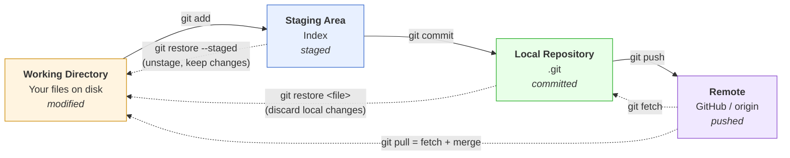
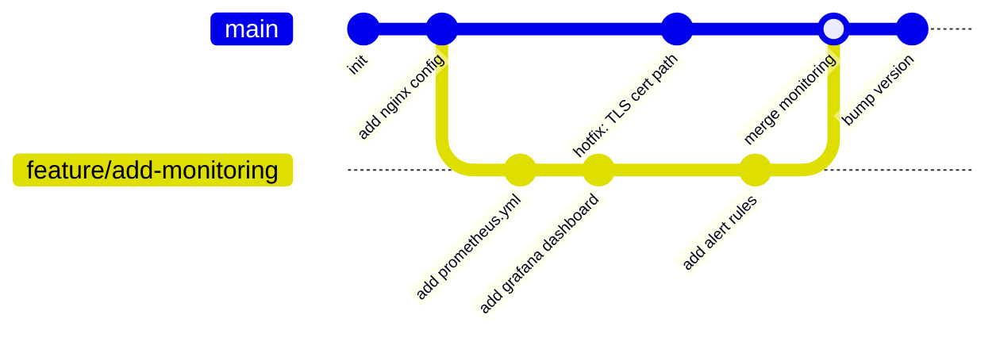
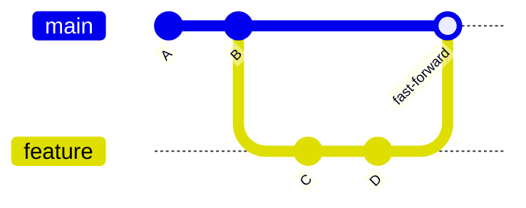
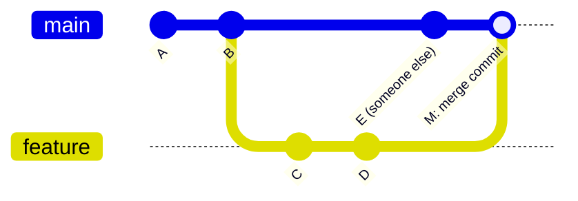
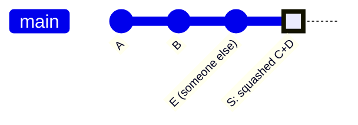
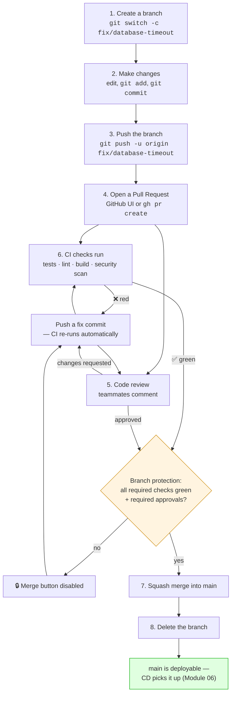
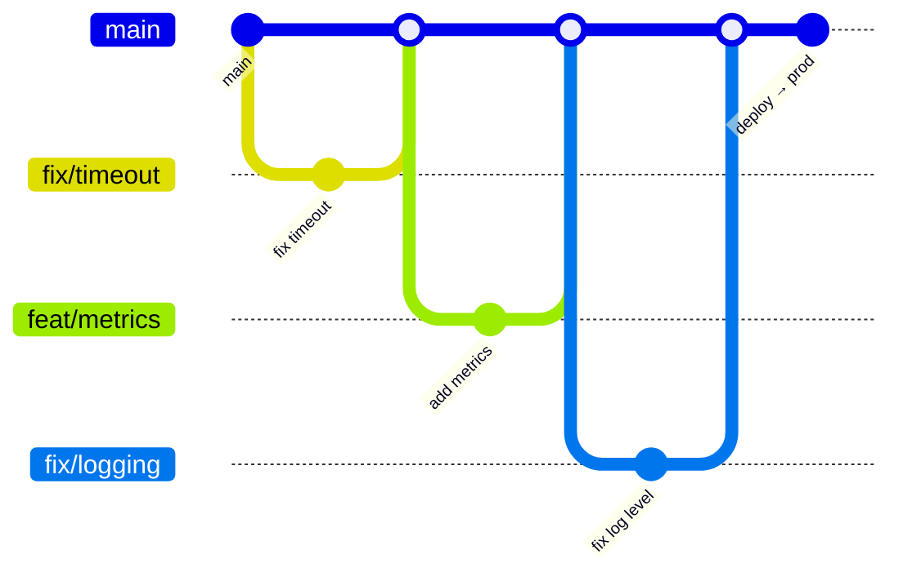
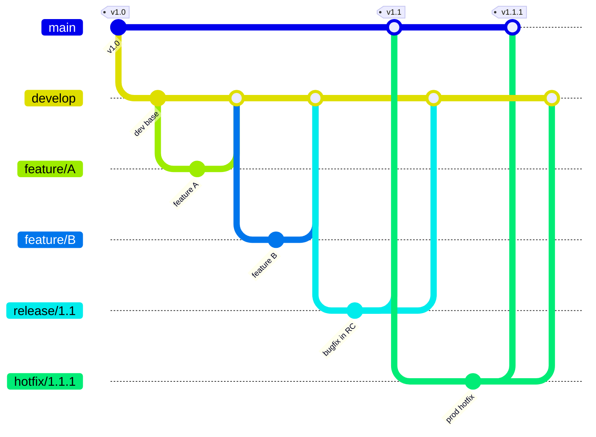
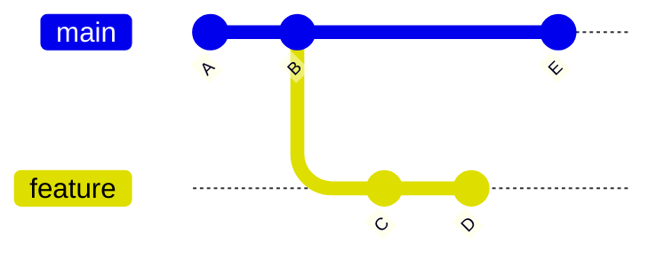
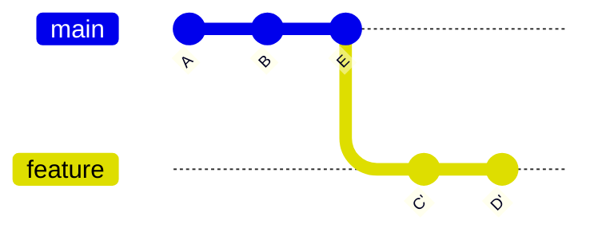

# Module 03: Git & GitHub

> *"If your infrastructure isn't in Git, it doesn't exist."*

---

> 📋 **Command reference**: [`cheatsheet.md`](./cheatsheet.md) — every command in this module, grouped by task, with the gotchas.
>
> ⚡ **Cross-module lookup**: [Quick Reference](../QUICK-REFERENCE.md)

---

## 🎯 Why This Module Matters

**Git is the single most important tool in DevOps.** Every piece of code, every configuration file, every pipeline definition, every infrastructure template — all of it lives in Git. Your ability to use Git fluently determines how effectively you collaborate, track changes, and recover from mistakes.

**In real-world DevOps work**, you will:
- Manage infrastructure code across multiple repositories
- Review pull requests for Terraform, Ansible, and Kubernetes changes
- Resolve merge conflicts in CI/CD pipeline configurations
- Use Git history to debug "what changed?" during incidents
- Enforce branching strategies across engineering teams

---

## 📚 Table of Contents

1. [Git Fundamentals](#1-git-fundamentals)
2. [Core Git Workflow](#2-core-git-workflow)
3. [Branching and Merging](#3-branching-and-merging)
4. [Remote Repositories and GitHub](#4-remote-repositories-and-github)
5. [Pull Requests and Code Review](#5-pull-requests-and-code-review)
6. [Git Workflows for Teams](#6-git-workflows-for-teams)
7. [Advanced Git Operations](#7-advanced-git-operations)
8. [.gitignore and Secrets Prevention](#8-gitignore-and-secrets-prevention)
9. [Git Hooks](#9-git-hooks)
10. [Common Mistakes and Anti-Patterns](#10-common-mistakes-and-anti-patterns)
11. [Debugging Mindset](#11-debugging-mindset)
12. [Security Considerations](#12-security-considerations)
13. [Interview Insights](#13-interview-insights)

---

## 1. Git Fundamentals

### What Is Git?

Git is a **distributed version control system** — every developer has a complete copy of the repository, including its full history. This means you can work offline, branch freely, and recover from almost any mistake.

### The Three Areas of Git (Plus the Remote)

Almost every confusing Git moment comes from not knowing **which of these four places** your change currently lives in. Learn this map and half of Git stops being mysterious.



> **💡 The mental check**: before you run any recovery command, ask *"where is my work right now?"* If it's only in the working directory, `git checkout`/`git restore` will destroy it permanently. If it reached a commit — even on a deleted branch — `git reflog` can get it back. **Committing is what makes work recoverable.** Commit early, tidy up later.

### Key Concepts

| Concept | What It Is | Analogy |
|---------|-----------|---------|
| **Repository** | A project tracked by Git | A filing cabinet with history |
| **Commit** | A snapshot of all tracked files | A save point in a game |
| **Branch** | An independent line of development | A parallel universe |
| **Merge** | Combining branches together | Merging parallel universes |
| **Remote** | A copy of the repo on a server (GitHub) | Cloud backup |
| **HEAD** | Pointer to your current position | "You are here" marker |

### Initial Setup

```bash
# Configure your identity (required — every commit records this)
git config --global user.name "Your Name"
git config --global user.email "you@example.com"

# Set default branch name
git config --global init.defaultBranch main

# Set default editor
git config --global core.editor "vim"    # or nano, code

# Enable useful colors
git config --global color.ui auto

# Set up credential caching (HTTPS)
git config --global credential.helper cache

# Verify your config
git config --list
```

---

## 2. Core Git Workflow

### Creating a Repository

```bash
# Option 1: Initialize a new repository
mkdir my-project && cd my-project
git init

# Option 2: Clone an existing repository
git clone https://github.com/user/repo.git
cd repo
```

### The Daily Workflow

```bash
# 1. Check what's changed
git status

# 2. See the actual changes
git diff                    # Changes not yet staged
git diff --staged           # Changes staged for commit

# 3. Stage changes
git add filename.txt        # Stage a specific file
git add .                   # Stage everything (be careful!)
git add -p                  # Stage interactively (pick specific hunks)

# 4. Commit with a meaningful message
git commit -m "Fix nginx config: increase proxy timeout to 30s"

# 5. Push to remote
git push origin main
```

### Writing Good Commit Messages

```bash
# BAD commit messages:
git commit -m "fix"
git commit -m "update"
git commit -m "WIP"
git commit -m "asdfgh"

# GOOD commit messages:
git commit -m "fix: resolve 502 errors by increasing proxy timeout"
git commit -m "feat: add health check endpoint to user service"
git commit -m "docs: update deployment runbook for v2.3"
git commit -m "chore: upgrade terraform provider to 5.0"

# Conventional commits format (widely adopted):
# type(scope): description
#
# Types: feat, fix, docs, style, refactor, test, chore, ci
```

### Viewing History

```bash
# View commit log
git log                         # Full log
git log --oneline               # Compact (one line per commit)
git log --oneline -10           # Last 10 commits
git log --graph --oneline       # Visual branch graph
git log --author="John"        # Commits by author
git log --since="2 weeks ago"  # Recent commits
git log -- path/to/file        # History of a specific file

# Show details of a specific commit
git show abc1234

# Who changed each line? (ESSENTIAL for debugging)
git blame filename.txt
```

---

## 3. Branching and Merging

### Why Branches Matter

Branches let you work on features, fixes, or experiments **without affecting the main codebase**. In DevOps, you'll use branches for:
- Infrastructure changes (new Terraform modules)
- Pipeline updates (CI/CD config changes)
- Config modifications (Kubernetes manifests)

A branch is not a copy of your files — it is just a **movable pointer to a commit**. That is why creating one is instant and free.



Notice that `main` kept moving while the feature branch was in progress — that's the normal case, and it's exactly why merges and rebases exist.

### Branch Operations

```bash
# List branches
git branch                  # Local branches
git branch -r               # Remote branches
git branch -a               # All branches

# Create and switch to a new branch
git checkout -b feature/add-monitoring
# Or (newer syntax):
git switch -c feature/add-monitoring

# Switch between branches
git checkout main
git switch main

# Delete a branch (after merging)
git branch -d feature/add-monitoring     # Safe delete (refuses if not merged)
git branch -D feature/add-monitoring     # Force delete

# Rename current branch
git branch -m new-name
```

### Merging

```bash
# Merge a feature branch into main
git checkout main
git merge feature/add-monitoring

# Three types of merges:
# 1. Fast-forward: Linear history, no merge commit
# 2. Recursive: Creates a merge commit (default when histories diverge)
# 3. Squash: Combines all commits into one

# Squash merge (clean history)
git merge --squash feature/add-monitoring
git commit -m "feat: add Prometheus monitoring stack"
```

#### The three merge shapes, side by side

**1. Fast-forward** — `main` hasn't moved since you branched, so Git just slides the pointer forward. No merge commit, perfectly linear history.



**2. Merge commit (recursive)** — both branches moved, so Git creates a new commit with **two parents**. History is truthful but shows the branch topology.



**3. Squash merge** — all feature commits are flattened into **one new commit** on `main`. The feature branch's individual commits never enter `main`'s history.



| Strategy | History | Use when |
|----------|---------|----------|
| **Fast-forward** | Linear, no extra commit | Solo work, trivial changes, `main` hasn't moved |
| **Merge commit** | Preserves branch shape | You want to see *when* and *what* was integrated; release branches |
| **Squash** | One commit per PR | Trunk-based development — the default for most teams, keeps `main` readable and easy to revert |

> **💡 DevOps Impact**: Squash merges make `git revert` on `main` a single-commit operation. When a bad deploy needs rolling back at 2 AM, reverting one commit beats untangling nine. This is why most teams enable "Squash and merge" as the only allowed option in GitHub branch protection.

### Handling Merge Conflicts

```bash
# When a merge has conflicts:
git merge feature/add-monitoring
# CONFLICT (content): Merge conflict in nginx.conf
# Automatic merge failed; fix conflicts and commit the result.

# 1. See which files have conflicts
git status

# 2. Open the conflicted file — you'll see:
# <<<<<<< HEAD
# proxy_timeout 30s;
# =======
# proxy_timeout 60s;
# >>>>>>> feature/add-monitoring

# 3. Choose the correct version (or combine), remove markers

# 4. Mark as resolved
git add nginx.conf

# 5. Complete the merge
git commit -m "merge: resolve proxy timeout conflict, using 60s"
```

---

## 4. Remote Repositories and GitHub

### Working with Remotes

```bash
# View remotes
git remote -v
# origin  git@github.com:user/repo.git (fetch)
# origin  git@github.com:user/repo.git (push)

# Add a remote
git remote add upstream https://github.com/original/repo.git

# Fetch changes (download but don't merge)
git fetch origin

# Pull changes (fetch + merge)
git pull origin main

# Push changes
git push origin main
git push origin feature/add-monitoring

# Push a new branch
git push -u origin feature/add-monitoring
# -u sets up tracking (so you can just 'git push' next time)
```

### Syncing a Fork

```bash
# Add the original repo as upstream
git remote add upstream https://github.com/original/repo.git

# Fetch upstream changes
git fetch upstream

# Merge upstream into your main
git checkout main
git merge upstream/main

# Push to your fork
git push origin main
```

---

## 5. Pull Requests and Code Review

### The PR Workflow (Industry Standard)



The two paths — **review** and **CI** — run in parallel and both must go green. Branch protection is what makes that a rule instead of a suggestion; without it, the whole diagram is optional.

### GitHub CLI (gh)

```bash
# Install GitHub CLI
sudo apt install -y gh
sudo dnf install -y gh

# Authenticate
gh auth login

# Create a PR
gh pr create --title "Fix: database connection timeout" \
  --body "Increased connection pool timeout from 5s to 30s to handle peak load"

# List PRs
gh pr list

# Review a PR
gh pr checkout 42    # Check out PR #42 locally
gh pr review 42 --approve
gh pr merge 42 --squash
```

### Code Review Best Practices (DevOps Perspective)

When reviewing infrastructure PRs, check:
- [ ] **Does it include a rollback plan?**
- [ ] **Are secrets properly handled?** (Not hardcoded)
- [ ] **Does the CI pipeline pass?**
- [ ] **Is there documentation** for the change?
- [ ] **Has it been tested** in a non-production environment?
- [ ] **Does it follow naming conventions?**

---

## 6. Git Workflows for Teams

### Trunk-Based Development (Recommended for DevOps)

One long-lived branch. Everything else is measured in hours.



**Rules:**
- Branches live for **hours or days, not weeks**
- Everyone merges to `main` frequently (at least daily)
- Feature flags for incomplete work — ship the code dark, enable it later
- CI runs on every push; `main` is always deployable

### GitFlow (More Structured)

Two long-lived branches (`main` + `develop`) plus three supporting branch types. More ceremony, slower flow — but it fits scheduled releases and versioned software.



**Branches:**

| Branch | Lifetime | Purpose |
|--------|----------|---------|
| `main` | Permanent | Production-ready code only; every commit is a release |
| `develop` | Permanent | Integration branch — where features land first |
| `feature/*` | Days–weeks | New features, branched from and merged to `develop` |
| `release/*` | Days | Release stabilisation; merges to **both** `main` and `develop` |
| `hotfix/*` | Hours | Emergency production fixes, branched from `main`, merged to **both** |

> **💡 The tradeoff**: notice that every `release/*` and `hotfix/*` in GitFlow has to be merged back into **two** places. Forgetting the second merge is the classic GitFlow bug — the hotfix ships to production and then silently regresses on the next release. Trunk-based has no such trap, which is why continuous-delivery teams prefer it.

### Which Workflow to Use?

| Team Size | Deployment Frequency | Recommended |
|-----------|---------------------|-------------|
| 1-5 developers | Multiple times/day | Trunk-based |
| 5-20 developers | Daily/weekly | Trunk-based or simplified GitFlow |
| 20+ developers | Weekly/monthly | GitFlow or custom |

---

## 7. Advanced Git Operations

### Stashing (Save Work Temporarily)

```bash
# Save uncommitted changes temporarily
git stash
git stash push -m "WIP: prometheus config changes"

# List stashes
git stash list

# Apply last stash (keep in stash list)
git stash apply

# Apply and remove from stash list
git stash pop

# Apply a specific stash
git stash apply stash@{2}
```

### Reverting and Resetting

```bash
# Undo the last commit (keep changes staged)
git reset --soft HEAD~1

# Undo the last commit (keep changes unstaged)
git reset HEAD~1

# Undo the last commit (DISCARD changes — DANGEROUS)
git reset --hard HEAD~1

# Revert a specific commit (creates a NEW commit that undoes it — SAFE)
git revert abc1234
# This is preferred in shared repos because it preserves history

# Discard all local changes
git checkout -- .
# Or:
git restore .
```

### Cherry-Pick (Apply Specific Commits)

```bash
# Apply a specific commit from another branch
git cherry-pick abc1234

# Use case: A bugfix was committed to the wrong branch
# Cherry-pick it to the correct branch
git checkout main
git cherry-pick fix-commit-hash
```

### Rebasing

```bash
# Rebase your branch on top of main (linear history)
git checkout feature/monitoring
git rebase main

# Interactive rebase (squash commits, reword messages)
git rebase -i HEAD~5
# Opens editor — you can:
# pick   = keep commit
# squash = combine with previous
# reword = change commit message
# drop   = remove commit

# When to rebase vs merge:
# Rebase: Before PR (clean up your commits)
# Merge: When merging PRs into main
# NEVER rebase public/shared branches
```

#### What rebase actually does

Rebase does **not** move your commits. It *replays* them as brand-new commits with new hashes on top of a new base, then abandons the originals.

**Before** — `feature` branched from `B`, and `main` has moved on to `E`:



**After `git rebase main`** — `C` and `D` are re-created as `C'` and `D'` on top of `E`. Same changes, **different commit hashes**, and the branch point is gone:



> **⚠️ Why "never rebase a shared branch"**: `C'` is a *different commit* from `C`. Anyone who already pulled `C` now has history that no longer exists upstream. Their next `git pull` produces duplicated commits and conflicts they didn't cause. Rebase is a tool for **your own unpushed work** — or a branch only you are on, where you then `git push --force-with-lease` (never bare `--force`).

| | Rebase | Merge |
|---|---|---|
| **History** | Linear, rewritten | Truthful, branched |
| **Commit hashes** | Changed | Preserved |
| **Safe on shared branches** | ❌ No | ✅ Yes |
| **Use for** | Tidying your branch before opening a PR; pulling in `main` updates | Integrating a finished PR |

---

## 8. .gitignore and Secrets Prevention

### Essential .gitignore

```bash
# .gitignore for DevOps projects

# Environment and secrets
.env
.env.*
*.pem
*.key
*secret*
credentials.json
terraform.tfvars

# Terraform
.terraform/
*.tfstate
*.tfstate.backup
.terraform.lock.hcl

# IDE
.vscode/
.idea/
*.swp
*.swo

# OS
.DS_Store
Thumbs.db

# Dependencies
node_modules/
vendor/
__pycache__/
*.pyc

# Build artifacts
dist/
build/
*.tar.gz
*.zip

# Logs
*.log
logs/
```

### 🔐 Preventing Secrets from Entering Git

```bash
# Check if secrets are already in history
git log -p | grep -i "password\|secret\|api_key\|token" | head -20

# If you accidentally committed a secret:
# 1. Remove it from the current code
# 2. Use git-filter-repo to purge from history
pip install git-filter-repo
git filter-repo --path-glob '*.env' --invert-paths

# 3. Force push (requires team coordination)
git push --force-with-lease

# Better: Use pre-commit hooks to prevent secrets
# (Covered in Git Hooks section)
```

---

## 9. Git Hooks

### Pre-Commit Hooks (Catch Problems Before They're Committed)

```bash
# Install pre-commit framework
pip install pre-commit

# Create .pre-commit-config.yaml
cat > .pre-commit-config.yaml << 'HOOKS'
repos:
  - repo: https://github.com/pre-commit/pre-commit-hooks
    rev: v4.5.0
    hooks:
      - id: trailing-whitespace
      - id: end-of-file-fixer
      - id: check-yaml
      - id: check-json
      - id: detect-private-key
      - id: check-merge-conflict

  - repo: https://github.com/gitleaks/gitleaks
    rev: v8.18.1
    hooks:
      - id: gitleaks    # Detects secrets in code
HOOKS

# Install the hooks
pre-commit install

# Now every commit will be checked automatically
# Test it:
pre-commit run --all-files
```

---

## 10. Common Mistakes and Anti-Patterns

### ❌ Committing Secrets

```bash
# BAD: Committing credentials
echo "DB_PASSWORD=prod_password_123" >> config.env
git add . && git commit -m "add config"
# This secret is now in Git history FOREVER (even if you delete the file later)

# GOOD: Use .gitignore + environment variables
echo "config.env" >> .gitignore
# Store secrets in vault (HashiCorp Vault, AWS Secrets Manager, etc.)
```

### ❌ Force Pushing to Shared Branches

```bash
# BAD: Force pushing to main (destroys others' work)
git push --force origin main

# GOOD: Use --force-with-lease (fails if remote has new commits)
git push --force-with-lease origin feature-branch
# And NEVER force-push to main/develop
```

### ❌ Giant Commits

```bash
# BAD: One commit with 50 files changed
git add . && git commit -m "stuff"

# GOOD: Atomic commits (one logical change per commit)
git add terraform/modules/vpc/
git commit -m "feat(infra): add VPC module with public/private subnets"

git add terraform/modules/rds/
git commit -m "feat(infra): add RDS module for PostgreSQL"
```

---

## 11. Debugging Mindset

### Using Git to Debug Production Issues

```bash
# "When did this config change?"
git log --oneline -- path/to/config.yml

# "Who changed this line and why?"
git blame path/to/config.yml

# "What changed between two points in time?"
git diff v2.1.0..v2.2.0

# "Which commit introduced this bug?"
git bisect start
git bisect bad HEAD          # Current version has the bug
git bisect good v2.0.0       # This version was fine
# Git will checkout commits for you to test
# Mark each as: git bisect good / git bisect bad
# Git finds the exact commit that introduced the bug!
git bisect reset             # When done
```

---

## 12. Security Considerations

> 🔐 Git security directly impacts your entire infrastructure.

- **Never commit secrets** — use `.gitignore`, pre-commit hooks, secret scanning
- **Sign commits** — `git config --global commit.gpgsign true`
- **Use SSH keys** for authentication, not passwords
- **Enable branch protection** — require PR reviews, CI checks before merge
- **Audit access** — regularly review who has repo access
- **Use CODEOWNERS** — require specific reviewers for critical files

---

## 13. Interview Insights

### Frequently Asked Questions

**Q: What's the difference between `git merge` and `git rebase`?**
> Merge creates a merge commit preserving both branch histories. Rebase replays your commits on top of the target branch, creating a linear history. Use rebase to clean up local branches before PR; use merge for integrating PRs into main.

**Q: How do you undo a pushed commit?**
> Use `git revert <commit-hash>` which creates a new commit that undoes the changes. Never use `git reset --hard` + force push on shared branches as it rewrites history and breaks collaborators' repos.

**Q: What is `git stash` used for?**
> Stash temporarily saves uncommitted changes so you can switch branches cleanly. Common scenario: you're working on a feature but need to switch to main for a hotfix.

**Q: How do you handle secrets in Git?**
> Never commit secrets. Use `.gitignore` for env files, pre-commit hooks with tools like gitleaks for detection, and external secret managers (Vault, AWS Secrets Manager) for storage. If a secret is accidentally committed, use git-filter-repo to purge history and rotate the credential immediately.

**Q: Explain trunk-based development.**
> Developers merge small changes to the main branch frequently (multiple times daily). Feature branches live for hours, not weeks. Incomplete features use feature flags. This reduces merge conflicts and enables continuous delivery.

---

## 🧪 Labs and Projects

Read the sections above first, then work through these **in order**. Every lab ends with a 🧨 **Break It** section — those are not optional; they are where the debugging skill actually comes from.

| # | Lab | What you'll do |
|---|-----|----------------|
| 1 | **[Git Core Workflow Mastery](./labs/lab-01-git-core-workflow.md)** | Build complete fluency with Git's daily workflow — init, add, commit, branch, merge, and conflict resolution. |
| 2 | **[GitHub Workflows & Pull Requests](./labs/lab-02-github-workflows.md)** | Practice the complete GitHub collaboration workflow — forking, branching, PRs, code review, and branch protection. |

**Portfolio project:**

- [Project: Branching Workflow with Conflict Resolution](./projects/project-01-branching-conflict-workflow.md) — Build a small repository that demonstrates a realistic Git workflow: feature branches, pull request review, merge conflict, conflict resolution,…

---
## Practical Checkpoint

Before moving on, you should be able to:

- Create branches, make commits, resolve conflicts, and explain the history with `git log`.
- Use pull requests as a review and collaboration workflow.
- Recover from common mistakes such as committing to the wrong branch or needing to inspect an older version.

Portfolio evidence to keep:

- A sample repository with a clean commit history.
- Conflict-resolution notes.
- A short PR workflow explanation with screenshots or copied command output where useful.

Suggested project: [Branching Workflow with Conflict Resolution](./projects/project-01-branching-conflict-workflow.md)

---

## ➡️ What's Next?

With Git mastered, you're ready to automate tasks with scripting — the bridge between manual operations and full automation.

**[Module 04: Scripting →](../04-scripting/)**

---

<div align="center">

**Module 03 Complete** ✅

[← Back to Networking](../02-networking/) | [📋 Cheat Sheet](./cheatsheet.md) | [Next: Scripting →](../04-scripting/)

</div>
