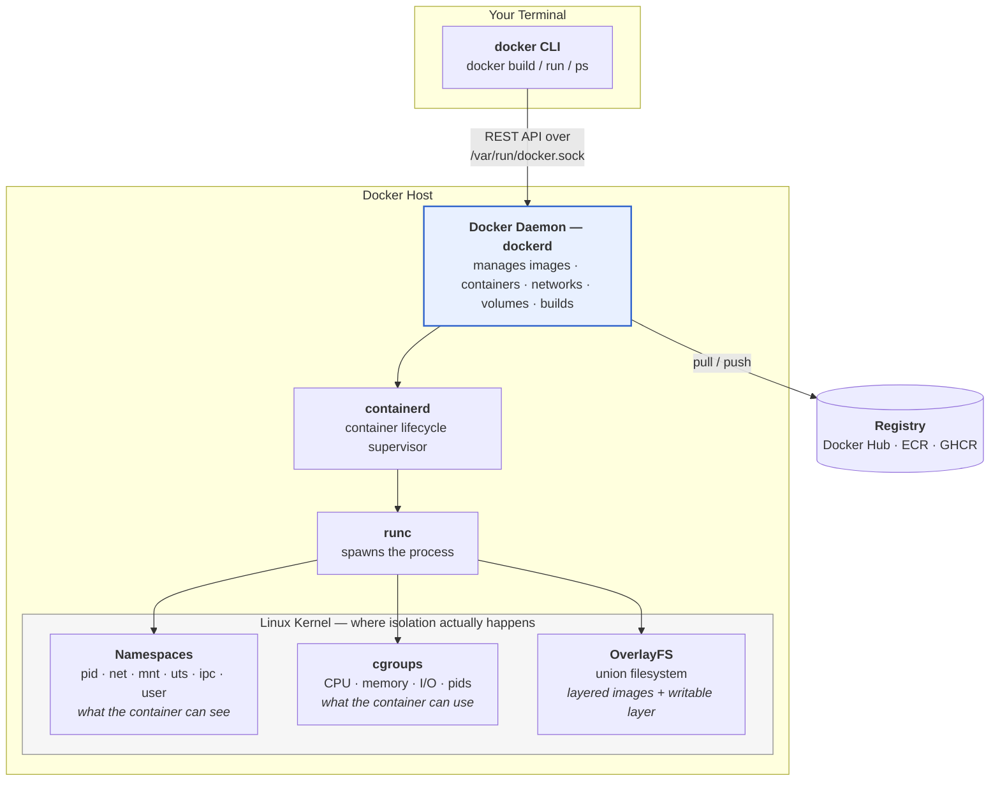
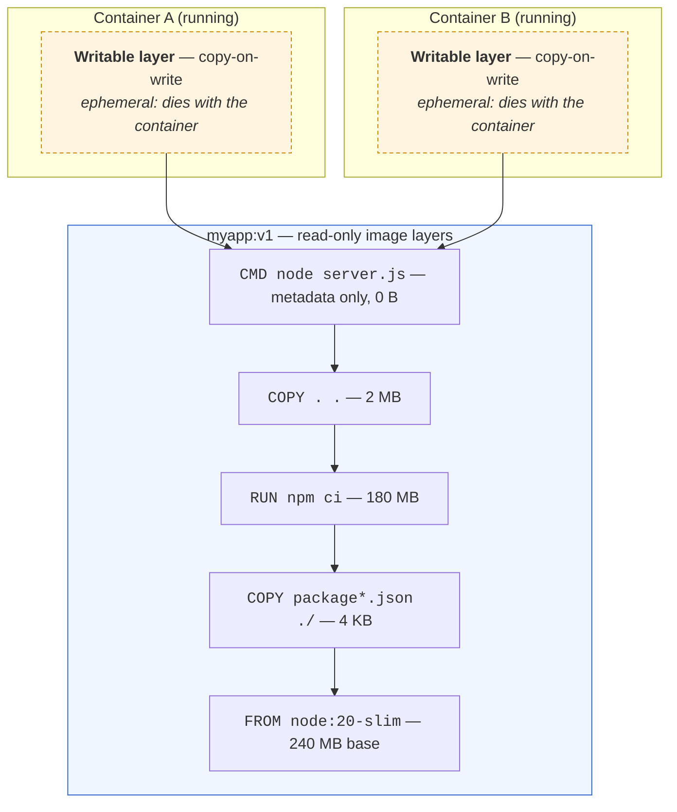
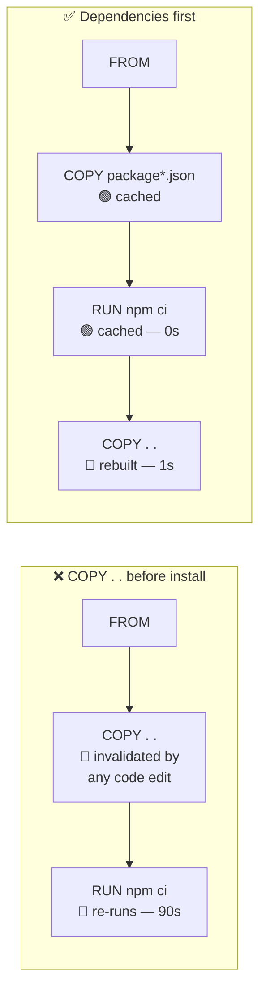
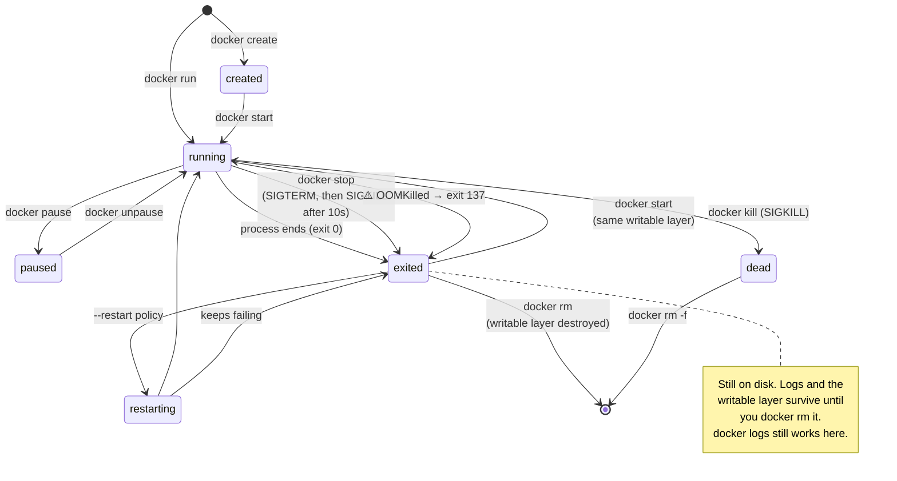
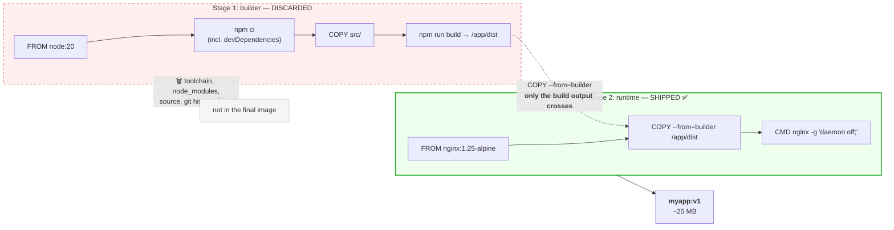
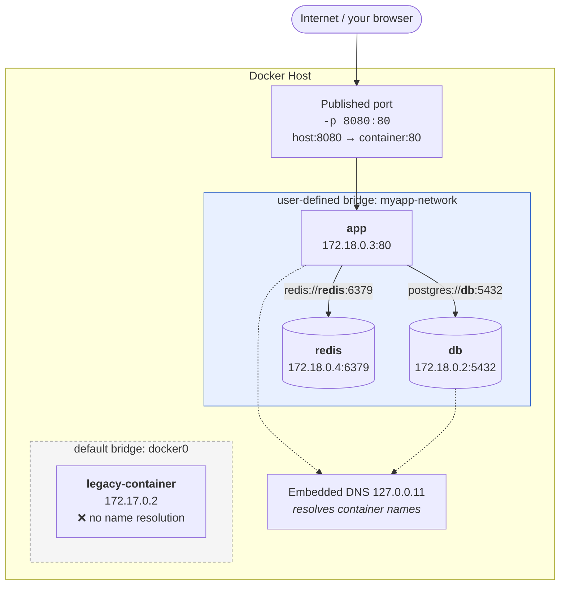

# Module 05: Containers & Docker

> *"Containers are not just a tool — they're a fundamental shift in how software is packaged, deployed, and run."*

---

> 📋 **Command reference**: [`cheatsheet.md`](./cheatsheet.md) — every command in this module, grouped by task, with the gotchas.
>
> ⚡ **Cross-module lookup**: [Quick Reference](../QUICK-REFERENCE.md)

---

## 🎯 Why This Module Matters

Docker is the **most transformative tool in modern DevOps**. It solves the "works on my machine" problem by packaging applications with their entire runtime environment. Every CI/CD pipeline, every Kubernetes cluster, every microservice architecture — all built on containers.

**In real-world DevOps work**, you will:

- Containerize applications for consistent deployment
- Build multi-stage Docker images for production
- Manage multi-container applications with Docker Compose
- Debug container networking and storage issues
- Optimize images for size and security
- Push images to registries and manage versioning

---

## 📚 Table of Contents

1. [What Are Containers?](#1-what-are-containers)
2. [Docker Architecture](#2-docker-architecture)
3. [Docker Images](#3-docker-images)
4. [Docker Containers](#4-docker-containers)
5. [Dockerfile — Building Custom Images](#5-dockerfile--building-custom-images)
6. [Multi-Stage Builds](#6-multi-stage-builds)
7. [Docker Networking](#7-docker-networking)
8. [Docker Volumes and Storage](#8-docker-volumes-and-storage)
9. [Docker Compose](#9-docker-compose)
10. [Docker Registry](#10-docker-registry)
11. [Image Optimization](#11-image-optimization)
12. [Common Mistakes and Anti-Patterns](#12-common-mistakes-and-anti-patterns)
13. [Debugging Mindset](#13-debugging-mindset)
14. [Security Considerations](#14-security-considerations)
15. [Interview Insights](#15-interview-insights)

---

## 1. What Are Containers?

### Containers vs Virtual Machines

```
Virtual Machines:                    Containers:
┌─────┐ ┌─────┐ ┌─────┐            ┌─────┐ ┌─────┐ ┌─────┐
│App A│ │App B│ │App C│            │App A│ │App B│ │App C│
├─────┤ ├─────┤ ├─────┤            ├─────┤ ├─────┤ ├─────┤
│Libs │ │Libs │ │Libs │            │Libs │ │Libs │ │Libs │
├─────┤ ├─────┤ ├─────┤            └──┬──┘ └──┬──┘ └──┬──┘
│Guest│ │Guest│ │Guest│               │       │       │
│ OS  │ │ OS  │ │ OS  │            ┌──┴───────┴───────┴──┐
├─────┴─┴─────┴─┴─────┤            │   Container Runtime  │
│     Hypervisor       │            │      (Docker)         │
├──────────────────────┤            ├──────────────────────┤
│      Host OS         │            │      Host OS         │
├──────────────────────┤            ├──────────────────────┤
│     Hardware         │            │     Hardware         │
└──────────────────────┘            └──────────────────────┘

VMs: Full OS per app (GB each)      Containers: Shared kernel (MB each)
Boot: Minutes                       Start: Seconds
Heavy: CPU + RAM overhead           Light: Near-native performance
```

| Feature | Virtual Machine | Container |
|---------|----------------|-----------|
| **Size** | Gigabytes | Megabytes |
| **Start time** | Minutes | Seconds |
| **Isolation** | Full OS-level | Process-level |
| **Performance** | ~95% native | ~99% native |
| **Density** | 10-20 per host | 100+ per host |
| **Use case** | Different OS requirements | Same OS, different apps |

---

## 2. Docker Architecture

When you type `docker run`, the CLI does almost nothing — it sends a REST call to a daemon that does all the work. Understanding that split explains most Docker permission and connectivity errors.



> **💡 DevOps Impact**: Two things fall straight out of this diagram. **(1)** `permission denied while trying to connect to the Docker daemon socket` means your user isn't in the `docker` group — you're being refused at the socket, not by Docker itself. **(2)** Membership in the `docker` group is effectively **root on the host**, because you can ask the daemon to mount `/` into a privileged container. Treat it as a privilege grant, not a convenience.
>
> A container is **not a lightweight VM** — it's an ordinary Linux process that the kernel lies to about what it can see (namespaces) and limits in what it can consume (cgroups).

---

## 3. Docker Images

An image is a **read-only template** containing everything needed to run an application.

```bash
# Pull an image from Docker Hub
docker pull nginx:1.25
docker pull python:3.12-slim
docker pull ubuntu:22.04

# List local images
docker images
# REPOSITORY   TAG        IMAGE ID       SIZE
# nginx        1.25       abc123         187MB
# python       3.12-slim  def456         130MB

# Image naming convention:
# registry/repository:tag
# docker.io/library/nginx:1.25
# ghcr.io/myorg/myapp:v2.1.0

# Inspect image details
docker inspect nginx:1.25

# View image layers
docker history nginx:1.25

# Remove an image
docker rmi nginx:1.25

# Remove all unused images
docker image prune -a
```

### Images Are Stacks of Read-Only Layers

Every instruction in a Dockerfile that changes the filesystem creates a **layer**. Layers are immutable, content-addressed, and shared between images. When you run a container, Docker adds one thin **writable layer** on top — that's the only part that isn't shared.



Two consequences you will rely on constantly:

**1. Layer caching drives build speed.** Docker reuses a cached layer only if that instruction *and every instruction before it* is unchanged. This is why `COPY package*.json ./` + `RUN npm ci` comes **before** `COPY . .` — editing your source code invalidates the last layer only, not the 180 MB dependency install.



**2. Deleting a file in a later layer does not shrink the image.** The earlier layer still contains it, and anyone can extract it. This is how secrets leak:

```dockerfile
# ❌ The key is permanently in layer 1 — `docker history` and
#    `docker save | tar -x` will both reveal it.
COPY id_rsa /tmp/id_rsa
RUN git clone git@github.com:org/private.git && rm /tmp/id_rsa
```

Use multi-stage builds or BuildKit secret mounts instead (§6 and §14).

---

## 4. Docker Containers

A container is a **running instance** of an image.

```bash
# Run a container
docker run nginx:1.25
# This runs in the foreground (Ctrl+C to stop)

# Run in background (detached)
docker run -d --name webserver nginx:1.25

# Run with port mapping
docker run -d -p 8080:80 --name webserver nginx:1.25
# -p HOST_PORT:CONTAINER_PORT
# Access at: http://localhost:8080

# Run with environment variables
docker run -d \
  --name myapp \
  -p 8080:8080 \
  -e DATABASE_URL="postgres://db:5432/myapp" \
  -e LOG_LEVEL="info" \
  myapp:latest

# List running containers
docker ps

# List all containers (including stopped)
docker ps -a

# Stop a container
docker stop webserver

# Start a stopped container
docker start webserver

# Restart a container
docker restart webserver

# Remove a container
docker rm webserver           # Must be stopped
docker rm -f webserver        # Force remove (even if running)

# Execute a command inside a running container
docker exec -it webserver bash
# -i = interactive
# -t = allocate a TTY
# Now you're INSIDE the container!

# View container logs
docker logs webserver
docker logs -f webserver      # Follow (real-time)
docker logs --tail 50 webserver  # Last 50 lines
docker logs --since 1h webserver # Last hour

# View resource usage
docker stats
# Shows: CPU%, Memory, Network I/O, Disk I/O

# Copy files to/from container
docker cp localfile.txt webserver:/usr/share/nginx/html/
docker cp webserver:/etc/nginx/nginx.conf ./
```

### Container Lifecycle

`docker ps` shows only **running** containers. Most debugging confusion comes from containers sitting in a state you can't see by default — use `docker ps -a`.



**Exit codes you will actually see:**

| Code | Meaning | First thing to check |
|------|---------|----------------------|
| `0` | Clean exit | The main process finished — is your CMD a long-running foreground process? |
| `1` / `2` | Application error | `docker logs <name>` |
| `125` | Docker itself failed | Bad `docker run` flags |
| `126` | Command found but not executable | Missing `chmod +x` on an entrypoint script |
| `127` | Command not found | Wrong path, or the binary isn't in your slim base image |
| `137` | **SIGKILL — usually OOM** | `docker inspect --format '{{.State.OOMKilled}}' <name>`; raise `--memory` or fix the leak |
| `143` | SIGTERM — graceful stop | Normal `docker stop` |

> **💡 The #1 beginner bug**: a container that exits immediately with code `0`. Containers live exactly as long as their **PID 1** process. If your CMD starts a daemon that forks into the background, PID 1 returns instantly and Docker considers the job done. Always run the process in the **foreground** (`nginx -g 'daemon off;'`, `postgres` not `pg_ctl start`).

---

## 5. Dockerfile — Building Custom Images

### Basic Dockerfile

```dockerfile
# Dockerfile for a Python web application

# Base image — always use specific tags in production!
FROM python:3.12-slim

# Metadata
LABEL maintainer="devops@example.com"
LABEL version="1.0"

# Set working directory
WORKDIR /app

# Copy dependency file first (for caching)
COPY requirements.txt .

# Install dependencies
RUN pip install --no-cache-dir -r requirements.txt

# Copy application code
COPY . .

# Create non-root user (SECURITY!)
RUN useradd -r -s /usr/sbin/nologin appuser
USER appuser

# Expose port (documentation — doesn't actually publish)
EXPOSE 8080

# Health check
HEALTHCHECK --interval=30s --timeout=5s --retries=3 \
  CMD curl -f http://localhost:8080/health || exit 1

# Run the application
CMD ["python", "app.py"]
```

### Build and Run

```bash
# Build an image
docker build -t myapp:v1.0 .
# -t = tag (name:version)
# . = build context (current directory)

# Build with build arguments
docker build --build-arg ENV=production -t myapp:v1.0 .

# Run the built image
docker run -d -p 8080:8080 --name myapp myapp:v1.0
```

### Dockerfile Best Practices

```dockerfile
# ✅ GOOD: Specific base image tag
FROM python:3.12-slim

# ❌ BAD: Latest tag (non-reproducible)
# FROM python:latest

# ✅ GOOD: Copy dependency file first (layer caching)
COPY requirements.txt .
RUN pip install -r requirements.txt
COPY . .

# ❌ BAD: Copy everything at once (no cache benefit)
# COPY . .
# RUN pip install -r requirements.txt

# ✅ GOOD: Combine RUN commands (fewer layers)
RUN apt-get update && \
    apt-get install -y --no-install-recommends curl && \
    rm -rf /var/lib/apt/lists/*

# ❌ BAD: Separate RUN for each command
# RUN apt-get update
# RUN apt-get install -y curl

# ✅ GOOD: Run as non-root user
USER appuser

# ❌ BAD: Run as root (default)
```

---

## 6. Multi-Stage Builds

Multi-stage builds produce **smaller, more secure** production images.

```dockerfile
# Stage 1: Build
FROM node:20 AS builder
WORKDIR /app
COPY package*.json ./
RUN npm ci
COPY . .
RUN npm run build

# Stage 2: Production (only the built artifacts)
FROM nginx:1.25-alpine
COPY --from=builder /app/dist /usr/share/nginx/html
COPY nginx.conf /etc/nginx/conf.d/default.conf
EXPOSE 80
CMD ["nginx", "-g", "daemon off;"]

# Result: Build stage has Node.js, npm, source code (~1GB)
#         Production image has only Nginx + static files (~25MB)
```

### What Actually Gets Shipped

Only the **final stage** becomes your image. Every earlier stage — compilers, dev dependencies, source code, build secrets — is discarded entirely. It isn't hidden in a lower layer; it never enters the image at all.



**Why this matters beyond size:**

| Benefit | Explanation |
|---------|-------------|
| **Smaller images** | 1 GB → 25 MB: faster pulls, faster pod starts, cheaper registry storage |
| **Smaller attack surface** | No compiler, no `curl`, no shell package manager for an attacker to use |
| **Fewer CVEs** | Most scanner findings come from build tooling you never needed at runtime |
| **Secret safety** | A token used in the build stage cannot be extracted from the shipped image |

> **💡 Debug tip**: you can build and inspect any intermediate stage directly — `docker build --target builder -t debug-build .` then `docker run -it debug-build sh`. This is how you diagnose "it built fine but the artifact is missing."

---

## 7. Docker Networking

Containers on the **default bridge** can only reach each other by IP. Containers on a **user-defined bridge** get automatic DNS resolution by container name — which is the single most important reason to always create your own network (and what Compose does for you).



> **💡 The rule that saves hours**: inside a container, `localhost` means **that container**, not the host and not a sibling. `DB_HOST=localhost` is the classic failure — it must be `DB_HOST=db`, the container name on a shared user-defined network. Ports published with `-p` are for traffic coming from **outside** Docker; containers talking to each other do **not** need published ports, they use the container port directly.

```bash
# List networks
docker network ls
# NETWORK ID   NAME     DRIVER    SCOPE
# abc123       bridge   bridge    local    ← Default
# def456       host     host      local
# ghi789       none     null      local

# Create a custom network (containers can resolve each other by name)
docker network create myapp-network

# Run containers on the same network
docker run -d --name db --network myapp-network postgres:15
docker run -d --name app --network myapp-network -e DB_HOST=db myapp:latest

# The 'app' container can now reach 'db' by hostname!
# This is how Docker Compose works under the hood

# Inspect a network
docker network inspect myapp-network

# Connect a running container to a network
docker network connect myapp-network existing-container
```

---

## 8. Docker Volumes and Storage

```bash
# Named volume (managed by Docker — preferred)
docker volume create mydata
docker run -d -v mydata:/var/lib/postgresql/data postgres:15

# Bind mount (map host directory into container)
docker run -d \
  -v /host/path/nginx.conf:/etc/nginx/nginx.conf:ro \
  -v /host/path/html:/usr/share/nginx/html \
  nginx:1.25

# :ro = read-only (container can't modify the host file)

# List volumes
docker volume ls

# Inspect a volume
docker volume inspect mydata

# Remove unused volumes
docker volume prune
```

---

## 9. Docker Compose

Docker Compose manages **multi-container applications** with a single YAML file.

### docker-compose.yml Example

```yaml
# docker-compose.yml
version: "3.8"

services:
  app:
    build: .
    ports:
      - "8080:8080"
    environment:
      - DATABASE_URL=postgres://user:pass@db:5432/myapp
      - REDIS_URL=redis://cache:6379
    depends_on:
      db:
        condition: service_healthy
      cache:
        condition: service_started
    restart: unless-stopped
    healthcheck:
      test: ["CMD", "curl", "-f", "http://localhost:8080/health"]
      interval: 30s
      timeout: 5s
      retries: 3

  db:
    image: postgres:15
    volumes:
      - pgdata:/var/lib/postgresql/data
    environment:
      POSTGRES_DB: myapp
      POSTGRES_USER: user
      POSTGRES_PASSWORD: pass
    healthcheck:
      test: ["CMD-SHELL", "pg_isready -U user -d myapp"]
      interval: 10s
      timeout: 5s
      retries: 5

  cache:
    image: redis:7-alpine
    restart: unless-stopped

  nginx:
    image: nginx:1.25-alpine
    ports:
      - "80:80"
      - "443:443"
    volumes:
      - ./nginx.conf:/etc/nginx/conf.d/default.conf:ro
    depends_on:
      - app

volumes:
  pgdata:
```

### Compose Commands

```bash
# Start all services
docker compose up -d

# View logs
docker compose logs -f
docker compose logs -f app    # Just one service

# Check status
docker compose ps

# Stop all services
docker compose down

# Stop and remove volumes
docker compose down -v

# Rebuild images
docker compose build
docker compose up -d --build

# Scale a service
docker compose up -d --scale app=3

# Execute command in a service
docker compose exec app bash
docker compose exec db psql -U user -d myapp
```

---

## 10. Docker Registry

```bash
# Docker Hub (default)
docker login
docker tag myapp:v1.0 username/myapp:v1.0
docker push username/myapp:v1.0

# GitHub Container Registry
echo $GITHUB_TOKEN | docker login ghcr.io -u username --password-stdin
docker tag myapp:v1.0 ghcr.io/username/myapp:v1.0
docker push ghcr.io/username/myapp:v1.0

# Pull from a registry
docker pull ghcr.io/username/myapp:v1.0
```

---

## 11. Image Optimization

| Technique | Before | After |
|-----------|--------|-------|
| Use Alpine base | `python:3.12` (1GB) | `python:3.12-alpine` (50MB) |
| Multi-stage build | Full build env (1GB+) | Runtime only (50-100MB) |
| `--no-cache-dir` in pip | Cached packages | No cache bloat |
| `.dockerignore` | Copies everything | Only needed files |
| Combine RUN commands | Multiple layers | Single layer |

### Essential .dockerignore

```
.git
.gitignore
node_modules
__pycache__
*.pyc
.env
docker-compose*.yml
Dockerfile
README.md
.vscode
.idea
```

---

## 12. Common Mistakes and Anti-Patterns

### ❌ Running as Root

```dockerfile
# BAD: Container runs as root (default)
FROM python:3.12-slim
COPY . /app
CMD ["python", "/app/main.py"]

# GOOD: Create and use a non-root user
FROM python:3.12-slim
RUN useradd -r appuser
COPY --chown=appuser . /app
USER appuser
CMD ["python", "/app/main.py"]
```

### ❌ Using `latest` Tag

```bash
# BAD: Non-reproducible
docker pull nginx:latest

# GOOD: Pinned version
docker pull nginx:1.25.3
```

### ❌ Storing Secrets in Images

```dockerfile
# BAD: Secret baked into the image
ENV DB_PASSWORD=mysecret123

# GOOD: Pass secrets at runtime
# docker run -e DB_PASSWORD=mysecret123 myapp
# Or use Docker secrets / external secret managers
```

---

## 13. Debugging Mindset

### Container Debugging Framework

```bash
# Container won't start?
docker logs container-name           # Check logs first!
docker inspect container-name        # Check config, health, state

# Need to get inside a running container?
docker exec -it container-name bash
docker exec -it container-name sh    # If bash isn't available (Alpine)

# Container exited immediately?
docker run -it myimage bash          # Override CMD, get a shell
docker logs $(docker ps -aq -l)      # Logs from last exited container

# Network issues?
docker exec -it container-name ping other-container
docker network inspect bridge

# Check resource usage
docker stats container-name
```

---

## 14. Security Considerations

> 🔐 Container security is critical — a compromised container can affect the host.

- **Run as non-root** — always use `USER` in Dockerfile
- **Use minimal base images** — Alpine or distroless
- **Scan images for vulnerabilities** — `docker scout` or Trivy
- **Don't store secrets in images** — use runtime environment or secret managers
- **Use read-only filesystems** — `docker run --read-only`
- **Set resource limits** — prevent container from consuming all host resources
- **Keep images updated** — rebuild with latest base images regularly

### Modern Docker CLI Tools

Docker's CLI has evolved beyond just `build` and `run`. Two tools worth knowing:

```bash
# docker init — Scaffolds Dockerfile, Compose, and .dockerignore for your project
# Run inside your project directory:
docker init
# Interactively generates:
#   • Dockerfile (with multi-stage build, non-root user)
#   • compose.yaml
#   • .dockerignore
# Great for bootstrapping — then customize the output.

# docker scout — Built-in vulnerability scanning (no external tools needed)
docker scout cves myapp:latest              # List CVEs in an image
docker scout quickview myapp:latest         # Summary view
docker scout recommendations myapp:latest   # Suggested base image upgrades

# Real-world workflow: scan before pushing to registry
docker build -t myapp:v1.2.3 .
docker scout cves myapp:v1.2.3
# Fix critical CVEs → rebuild → rescan → push
```

> 💡 `docker scout` integrates into CI/CD pipelines. Use it alongside Trivy for defense-in-depth scanning.

---

## 15. Interview Insights

**Q: What's the difference between a Docker image and a container?**
> An image is a read-only template (like a class in OOP). A container is a running instance of that image (like an object). You can run multiple containers from the same image.

**Q: Explain Docker layers and caching.**
> Each instruction in a Dockerfile creates a layer. Layers are cached — if a layer hasn't changed, Docker reuses it. That's why you copy `requirements.txt` before the rest of the code: dependency installation is cached until requirements change.

**Q: How do containers communicate?**
> Containers on the same Docker network can reach each other by container name (DNS resolution). Docker Compose automatically creates a shared network. For external access, you publish ports with `-p HOST:CONTAINER`.

**Q: What is a multi-stage build?**
> A Dockerfile with multiple FROM statements. Build-time dependencies (compilers, test tools) stay in the build stage. Only the final artifact is copied to the production stage, resulting in much smaller images.

**Q: How do you debug a container that keeps restarting?**
>
> 1. `docker logs container-name` — read the logs. 2. `docker inspect container-name` — check the exit code and state. 3. `docker run -it image bash` — override the CMD and get a shell to investigate. 4. Check health check configuration if using HEALTHCHECK.

---

## 🧪 Labs and Projects

Read the sections above first, then work through these **in order**. Every lab ends with a 🧨 **Break It** section — those are not optional; they are where the debugging skill actually comes from.

| # | Lab | What you'll do |
|---|-----|----------------|
| 1 | **[Docker Fundamentals](./labs/lab-01-docker-fundamentals.md)** | Get hands-on with Docker's core operations — pull images, run containers, publish ports, manage logs, and build your first custom image. |
| 2 | **[Advanced Docker Patterns](./labs/lab-02-advanced-docker.md)** | Master multi-stage builds, image optimization, Docker networking internals, and production-grade container patterns. |

**Portfolio project:**

- [Project: Containerized App with Compose and Healthcheck](./projects/project-01-compose-healthcheck-app.md) — Containerize a small web application and run it locally with Docker Compose.

**Reference code** for every lab: [`code/`](./code/) — real files, validated in CI.

---

## ✅ Self-Check

Answer these from memory before you expand them. If more than two give you trouble, re-read the sections they come from — the labs assume this material is solid.

<details>
<summary><strong>1. What is the actual difference between a container and a VM?</strong></summary>

A container is a process on the host kernel, isolated with namespaces and limited with cgroups: megabytes, starts in milliseconds. A VM runs its own kernel on a hypervisor: gigabytes, starts in seconds, and isolates far more strongly. That shared kernel is both the efficiency and the security caveat.

</details>

<details>
<summary><strong>2. Why does instruction order in a Dockerfile change your build times so much?</strong></summary>

Each instruction is a cached layer, and a cache miss invalidates everything after it. Copying the whole source tree before installing dependencies means every one-character code change reinstalls all dependencies. Copy the manifest, install, then copy the source.

</details>

<details>
<summary><strong>3. What does a multi-stage build buy you beyond a smaller image?</strong></summary>

Attack surface. Compilers, package managers, build secrets, and dev dependencies stay in the builder stage and never ship. The final image contains the artefact and its runtime — less to scan, less to exploit, less to pull.

</details>

<details>
<summary><strong>4. Data written by the container is gone after a restart. Why?</strong></summary>

It went to the container's writable layer, which is created with the container and deleted with it. Anything that must survive belongs in a named volume or a bind mount — and in an image build, anything written after the last layer you keep is equally temporary.

</details>

<details>
<summary><strong>5. Why run as a non-root user, and what does `USER` not protect you from?</strong></summary>

It limits what an application compromise or a container escape gets: root in the container is root on the host if the boundary breaks. It does nothing about `--privileged`, a mounted Docker socket, host-path mounts, or excess capabilities — those hand over the host regardless of the user.

</details>

<details>
<summary><strong>6. Two services in the same Compose file need to talk. What address do they use?</strong></summary>

Each other's service name, resolved by Docker's embedded DNS on the shared network, on the container port. Published ports (`ports:`) exist only to reach a container from the host — mapping ports for internal traffic exposes services you meant to keep private.

</details>

---

## Practical Checkpoint

Before moving on, you should be able to:

- Build, run, inspect, and debug containers and images.
- Write a Dockerfile that uses caching effectively, runs as non-root, and exposes the right ports.
- Use Docker Compose to run a small multi-container app with health checks and logs.

Portfolio evidence to keep:

- Dockerfile and Compose files.
- Image build and container validation output.
- Notes from debugging a failed container start, bad port mapping, or unhealthy service.

Suggested project: [Containerized App with Compose and Healthcheck](./projects/project-01-compose-healthcheck-app.md)

---

## ➡️ What's Next?

With Docker mastered, you can now build CI/CD pipelines that build, test, and deploy containers automatically.

**[Module 06: CI/CD →](../06-ci-cd/)**

---

<div align="center">

**Module 05 Complete** ✅

[← Back to Scripting](../04-scripting/) | [📋 Cheat Sheet](./cheatsheet.md) | [Next: CI/CD →](../06-ci-cd/)

</div>
