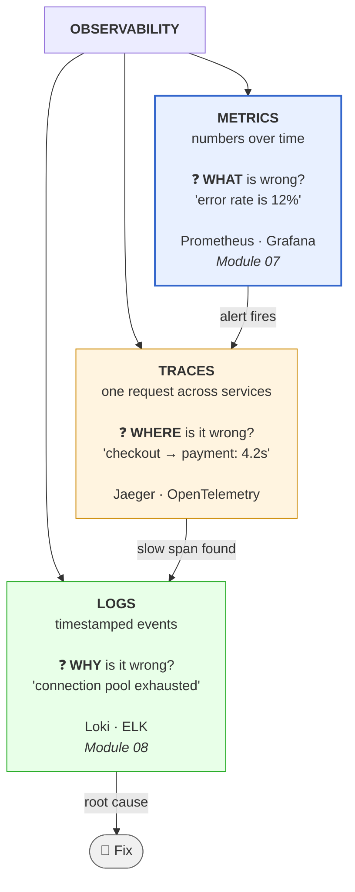
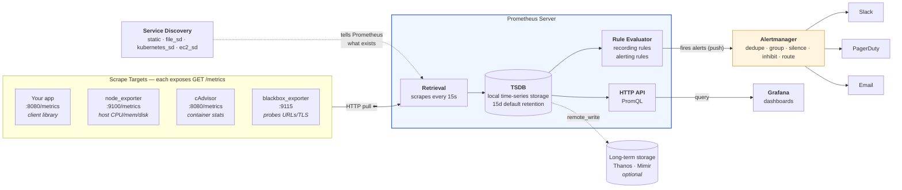
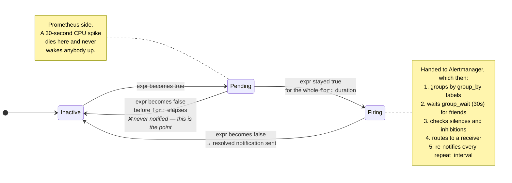
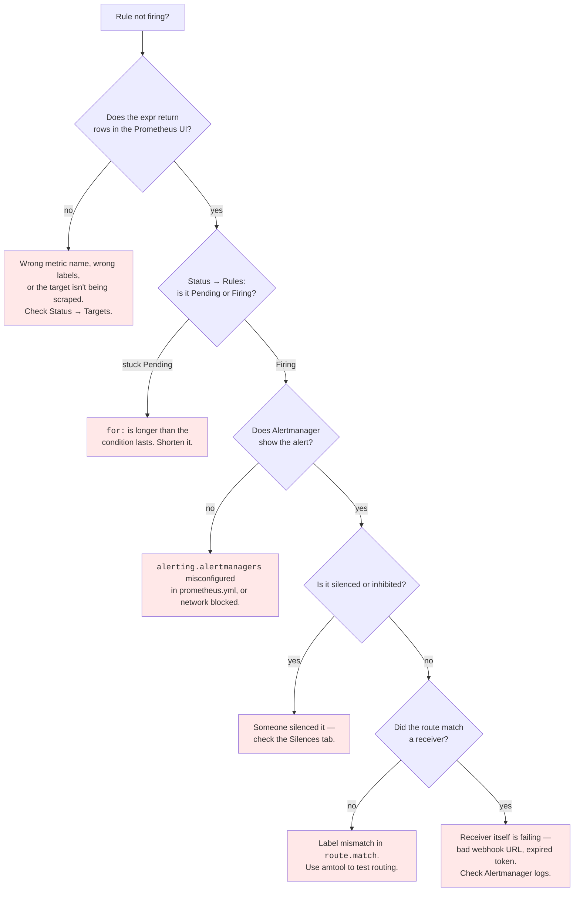

# Module 07: Observability

> *"You can't fix what you can't see." — DevOps Proverb*

---

> 📋 **Command reference**: [`cheatsheet.md`](./cheatsheet.md) — every command in this module, grouped by task, with the gotchas.
>
> ⚡ **Cross-module lookup**: [Quick Reference](../QUICK-REFERENCE.md)

---

## 🎯 Why This Module Matters

Your CI/CD pipeline deploys code to production. But **how do you know it's working?** Observability gives you the eyes and ears to understand what's happening inside your systems — before users complain.

**In real-world DevOps work**, you will:
- Set up Prometheus to collect metrics from every service
- Build Grafana dashboards that tell a story at a glance
- Configure alerts that wake you up only when it matters
- Instrument applications with custom metrics
- Triage production incidents using metrics, logs, and traces
- Distinguish signal from noise during outages

---

## 📚 Table of Contents

1. [Monitoring vs Observability](#1-monitoring-vs-observability)
2. [The Three Pillars](#2-the-three-pillars)
3. [Prometheus — Metrics Engine](#3-prometheus--metrics-engine)
4. [PromQL — Querying Metrics](#4-promql--querying-metrics)
5. [Grafana — Visualization](#5-grafana--visualization)
6. [Alerting with Alertmanager](#6-alerting-with-alertmanager)
7. [Metrics Design Patterns](#7-metrics-design-patterns)
8. [Application Instrumentation](#8-application-instrumentation)
9. [Common Mistakes and Anti-Patterns](#9-common-mistakes-and-anti-patterns)
10. [Debugging Mindset](#10-debugging-mindset)
11. [Interview Insights](#11-interview-insights)

---

## 1. Monitoring vs Observability

### They're Not the Same Thing

```
Monitoring:
  "Is the system up? Is CPU above 90%?"
  Predefined checks for KNOWN failure modes.
  You decide in advance what to watch.

Observability:
  "WHY is the system slow for users in Europe?"
  Ability to ask ARBITRARY questions about your system.
  You explore data to find UNKNOWN problems.
```

| Aspect | Monitoring | Observability |
|--------|-----------|---------------|
| **Approach** | Predefined dashboards & alerts | Explore and query on the fly |
| **Questions** | Known unknowns | Unknown unknowns |
| **Tools** | Nagios, Zabbix, static checks | Prometheus, Grafana, Jaeger |
| **Mindset** | "Alert me when X breaks" | "Help me understand WHY X broke" |
| **Output** | Red/green status | Rich, queryable telemetry data |

> 💡 **Key insight:** Good monitoring is a *subset* of observability. You need both.

---

## 2. The Three Pillars

The three pillars answer three different questions. Debugging a real incident means walking from one to the next — an alert tells you *what*, a trace tells you *where*, a log tells you *why*.



| Pillar | Cardinality cost | Retention | Best for |
|--------|------------------|-----------|----------|
| **Metrics** | Low — aggregated | Months/years cheaply | Alerting, dashboards, trends, SLOs |
| **Traces** | Medium — usually sampled | Days | Latency attribution in distributed systems |
| **Logs** | High — one line per event | Days/weeks (expensive) | Root cause on a specific request |

> **💡 Why the order matters**: you cannot alert on logs cheaply, and you cannot debug from metrics alone. Alert on **metrics** (cheap, aggregate, low noise), then pivot to **traces** to find the slow hop, then read the **logs** for that exact trace ID. Teams that skip metrics and alert on log patterns end up with expensive, flaky alerting.

### Metrics (This Module)
- **What**: Numeric measurements collected over time (counters, gauges, histograms)
- **Example**: `http_requests_total = 14523`, `cpu_usage = 72.3%`
- **Tool**: **Prometheus** + **Grafana**
- **Strength**: Cheap to store, fast to query, great for alerting and trends

### Logs (Module 08)
- **What**: Timestamped text records of discrete events
- **Example**: `2024-01-15 14:23:01 ERROR Failed to connect to database: timeout after 30s`
- **Tool**: ELK Stack, Loki
- **Strength**: Rich context, great for debugging specific issues

### Traces (Mentioned Here, Advanced Topic)
- **What**: The journey of a single request across multiple services
- **Example**: Request → API Gateway (12ms) → Auth Service (45ms) → Database (230ms)
- **Tool**: Jaeger, Zipkin, OpenTelemetry
- **Strength**: Finding bottlenecks in distributed systems

---

## 3. Prometheus — Metrics Engine

### Why Prometheus?

- De facto standard for cloud-native monitoring
- **Pull-based** model — Prometheus scrapes targets (no agents to install)
- Built-in time-series database
- Powerful query language (PromQL)
- Native Kubernetes integration
- CNCF graduated project (same foundation as Kubernetes)

### Architecture

Note the direction of every arrow into Prometheus: it **pulls**. Your application never pushes metrics anywhere — it just exposes an HTTP endpoint and waits.



> **💡 Pull vs push — the consequence that matters**: because Prometheus pulls, a target that disappears is *detectably* down (`up == 0`), and you never need to configure your app with a monitoring endpoint. The tradeoff is that Prometheus must be able to **reach** every target — which is why short-lived batch jobs (that finish before the next scrape) need the **Pushgateway**, and why targets behind NAT need an exporter Prometheus can route to.

### How Prometheus Works

```
1. CONFIGURE targets in prometheus.yml
2. Prometheus SCRAPES /metrics endpoint every N seconds
3. Data stored as TIME SERIES in local TSDB
4. You QUERY with PromQL via Grafana or API
5. ALERT RULES evaluated continuously
6. Alerts sent to ALERTMANAGER → notifications
```

### Prometheus Configuration

```yaml
# prometheus.yml
global:
  scrape_interval: 15s          # How often to scrape targets
  evaluation_interval: 15s      # How often to evaluate alert rules

# Alert rules files
rule_files:
  - "alert_rules.yml"

# Alertmanager configuration
alerting:
  alertmanagers:
    - static_configs:
        - targets: ["alertmanager:9093"]

# Scrape targets
scrape_configs:
  - job_name: "prometheus"       # Monitor Prometheus itself
    static_configs:
      - targets: ["localhost:9090"]

  - job_name: "node"             # Linux host metrics
    static_configs:
      - targets: ["node-exporter:9100"]

  - job_name: "app"              # Your application
    static_configs:
      - targets: ["app:8080"]
    metrics_path: /metrics        # Default path
    scrape_interval: 10s          # Override global interval
```

### Metric Types

```
┌──────────────────────────────────────────────────────────┐
│ COUNTER — only goes UP (or resets to 0)                  │
│   Example: http_requests_total, errors_total             │
│   Use: Total count of events                             │
│   ⚠️ Always use rate() — raw value is meaningless        │
├──────────────────────────────────────────────────────────┤
│ GAUGE — goes UP and DOWN                                 │
│   Example: temperature, cpu_usage, queue_size            │
│   Use: Current state of something                        │
│   ⚠️ Can use directly — no rate() needed                 │
├──────────────────────────────────────────────────────────┤
│ HISTOGRAM — distribution of values in buckets            │
│   Example: http_request_duration_seconds                 │
│   Use: Latency percentiles (p50, p95, p99)               │
│   ⚠️ Define bucket boundaries carefully                  │
├──────────────────────────────────────────────────────────┤
│ SUMMARY — similar to histogram, calculates quantiles     │
│   Example: rpc_duration_seconds                          │
│   Use: Pre-calculated percentiles (client-side)          │
│   ⚠️ Cannot be aggregated across instances               │
└──────────────────────────────────────────────────────────┘
```

### Metrics Endpoint Example

When Prometheus scrapes `/metrics`, it gets plain text:

```
# HELP http_requests_total Total number of HTTP requests
# TYPE http_requests_total counter
http_requests_total{method="GET",path="/api/users",status="200"} 14523
http_requests_total{method="POST",path="/api/users",status="201"} 342
http_requests_total{method="GET",path="/api/users",status="500"} 12

# HELP http_request_duration_seconds HTTP request latency
# TYPE http_request_duration_seconds histogram
http_request_duration_seconds_bucket{le="0.01"} 8923
http_request_duration_seconds_bucket{le="0.05"} 12456
http_request_duration_seconds_bucket{le="0.1"} 13890
http_request_duration_seconds_bucket{le="0.5"} 14400
http_request_duration_seconds_bucket{le="1"} 14510
http_request_duration_seconds_bucket{le="+Inf"} 14523
http_request_duration_seconds_sum 523.42
http_request_duration_seconds_count 14523

# HELP node_cpu_usage Current CPU usage percentage
# TYPE node_cpu_usage gauge
node_cpu_usage 72.3
```

---

## 4. PromQL — Querying Metrics

### Basic Queries

```promql
# Instant vector — current value
http_requests_total

# Filter by label
http_requests_total{method="GET"}
http_requests_total{status=~"5.."}              # Regex match: any 5xx
http_requests_total{path!="/health"}            # Exclude health checks

# Range vector — values over time window
http_requests_total[5m]                          # Last 5 minutes of data
```

### Essential Functions

```promql
# RATE — per-second rate of a counter over time window
# THE most important PromQL function
rate(http_requests_total[5m])
# "How many requests per second, averaged over 5 minutes?"

# INCREASE — total increase of a counter over time window
increase(http_requests_total[1h])
# "How many total requests in the last hour?"

# SUM — aggregate across label values
sum(rate(http_requests_total[5m]))
# "Total request rate across ALL endpoints"

sum by (status) (rate(http_requests_total[5m]))
# "Request rate grouped by status code"

# HISTOGRAM_QUANTILE — calculate percentiles
histogram_quantile(0.95, rate(http_request_duration_seconds_bucket[5m]))
# "95th percentile latency over last 5 minutes"

histogram_quantile(0.99, rate(http_request_duration_seconds_bucket[5m]))
# "99th percentile latency"

# AVG, MAX, MIN
avg(node_cpu_usage)
max(node_memory_usage_bytes)
```

### Real-World PromQL Patterns

```promql
# Error rate (percentage of 5xx responses)
sum(rate(http_requests_total{status=~"5.."}[5m]))
/
sum(rate(http_requests_total[5m]))
* 100

# Availability (percentage of non-5xx responses)
(1 - (
  sum(rate(http_requests_total{status=~"5.."}[5m]))
  /
  sum(rate(http_requests_total[5m]))
)) * 100

# Memory usage percentage
(node_memory_MemTotal_bytes - node_memory_MemAvailable_bytes)
/
node_memory_MemTotal_bytes * 100

# Disk usage percentage
(node_filesystem_size_bytes - node_filesystem_avail_bytes)
/
node_filesystem_size_bytes * 100

# Top 5 endpoints by request rate
topk(5, sum by (path) (rate(http_requests_total[5m])))

# Request rate change (spike detection)
rate(http_requests_total[5m]) / rate(http_requests_total[1h]) > 2
# "Current rate is more than 2x the hourly average"
```

---

## 5. Grafana — Visualization

### Why Grafana?

- **Data-source agnostic** — Prometheus, Elasticsearch, CloudWatch, PostgreSQL, etc.
- Beautiful, interactive dashboards
- Template variables for dynamic dashboards
- Alert integration
- Huge community dashboard library

### Dashboard Design Principles

```
┌─────────────────────────────────────────────────────────┐
│  SERVICE OVERVIEW DASHBOARD                              │
├─────────────────────────────────────────────────────────┤
│  Row 1: The Big Picture (SLIs)                           │
│  ┌──────────┐ ┌──────────┐ ┌──────────┐ ┌──────────┐   │
│  │ Request  │ │ Error    │ │  P95     │ │ Uptime   │   │
│  │ Rate     │ │ Rate     │ │ Latency  │ │          │   │
│  │ 1.2k/s   │ │ 0.3%     │ │ 45ms     │ │ 99.97%   │   │
│  └──────────┘ └──────────┘ └──────────┘ └──────────┘   │
├─────────────────────────────────────────────────────────┤
│  Row 2: Traffic & Errors (time series graphs)            │
│  ┌────────────────────┐  ┌────────────────────┐         │
│  │ Requests/sec       │  │ Error rate by type │         │
│  │ ▁▂▃▅▆▇█▇▆▅▃▂▁     │  │ ▁▁▁▁▂▁▁▁▁▁▁▁▁    │         │
│  └────────────────────┘  └────────────────────┘         │
├─────────────────────────────────────────────────────────┤
│  Row 3: Latency & Saturation                             │
│  ┌────────────────────┐  ┌────────────────────┐         │
│  │ Latency p50/p95/p99│  │ CPU / Memory / Disk│         │
│  │ ▁▂▂▃▃▃▂▂▁▁▂▂▃     │  │ ▅▅▅▅▆▅▅▅▅▆▅▅▅    │         │
│  └────────────────────┘  └────────────────────┘         │
└─────────────────────────────────────────────────────────┘
```

**Key rules:**
- **Top row = stat panels** with the most important numbers (SLIs)
- **Use consistent colors** — green = good, yellow = warning, red = bad
- **Time range selector** — always let users adjust the window
- **Template variables** — dropdown to filter by service, environment, instance

### Grafana Data Source Config

```
1. Go to Configuration → Data Sources → Add data source
2. Select Prometheus
3. URL: http://prometheus:9090
4. Click "Save & Test" — should say "Data source is working"
```

---

## 6. Alerting with Alertmanager

### Alert Rules in Prometheus

```yaml
# alert_rules.yml
groups:
  - name: application
    rules:
      # High error rate
      - alert: HighErrorRate
        expr: |
          sum(rate(http_requests_total{status=~"5.."}[5m]))
          /
          sum(rate(http_requests_total[5m]))
          > 0.05
        for: 5m                    # Must be true for 5 min
        labels:
          severity: critical
        annotations:
          summary: "High error rate detected"
          description: "Error rate is {{ $value | humanizePercentage }} (threshold: 5%)"

      # High latency
      - alert: HighLatency
        expr: |
          histogram_quantile(0.95, rate(http_request_duration_seconds_bucket[5m]))
          > 0.5
        for: 10m
        labels:
          severity: warning
        annotations:
          summary: "P95 latency above 500ms"
          description: "P95 latency is {{ $value }}s"

  - name: infrastructure
    rules:
      # High CPU
      - alert: HighCPU
        expr: 100 - (avg by (instance) (irate(node_cpu_seconds_total{mode="idle"}[5m])) * 100) > 85
        for: 10m
        labels:
          severity: warning
        annotations:
          summary: "High CPU usage on {{ $labels.instance }}"

      # Disk almost full
      - alert: DiskAlmostFull
        expr: |
          (node_filesystem_avail_bytes / node_filesystem_size_bytes) * 100 < 10
        for: 5m
        labels:
          severity: critical
        annotations:
          summary: "Disk space < 10% on {{ $labels.instance }}"

      # Target down
      - alert: TargetDown
        expr: up == 0
        for: 2m
        labels:
          severity: critical
        annotations:
          summary: "{{ $labels.job }} target {{ $labels.instance }} is down"
```

### Alertmanager Configuration

```yaml
# alertmanager.yml
global:
  resolve_timeout: 5m

route:
  receiver: default
  group_by: [alertname, severity]
  group_wait: 30s               # Wait before sending first notification
  group_interval: 5m            # Wait before sending updates
  repeat_interval: 4h           # Re-send if not resolved
  routes:
    - match:
        severity: critical
      receiver: pagerduty
    - match:
        severity: warning
      receiver: slack

receivers:
  - name: default
    webhook_configs:
      - url: "http://localhost:5001/"

  - name: slack
    slack_configs:
      - api_url: "https://hooks.slack.com/services/xxx/yyy/zzz"
        channel: "#alerts"
        title: "{{ .GroupLabels.alertname }}"
        text: "{{ range .Alerts }}{{ .Annotations.description }}\n{{ end }}"

  - name: pagerduty
    pagerduty_configs:
      - service_key: "<your-pagerduty-key>"
```

### Alert Lifecycle

Every alerting rule moves through this state machine on **every rule evaluation** (default: every 15s). The `for:` duration is what separates a real problem from a momentary spike.



**Where an alert can vanish** — check these in order when someone says "the alert didn't fire":



> **💡 Test the whole chain before you need it.** `amtool config routes test --config.file=alertmanager.yml severity=critical` shows which receiver a label set would reach — without waiting for a real outage to find out you had a typo.

---

## 7. Metrics Design Patterns

### The RED Method (Request-Driven Services)

```
For every service, track:
  R — Rate:       requests per second
  E — Errors:     failed requests per second
  D — Duration:   latency (p50, p95, p99)

Best for: APIs, microservices, web servers
```

### The USE Method (Resource-Driven)

```
For every resource (CPU, memory, disk, network), track:
  U — Utilization: % of resource being used
  S — Saturation:  amount of queued/waiting work
  E — Errors:      count of error events

Best for: Infrastructure, hardware, system resources
```

### The Four Golden Signals (Google SRE)

```
1. Latency    — time to serve a request (split success vs error)
2. Traffic    — demand on the system (requests/sec)
3. Errors     — rate of failed requests
4. Saturation — how "full" the system is (CPU, memory, I/O)
```

> 💡 **In practice:** RED for your services, USE for your infrastructure, Golden Signals as your mental model.

---

## 8. Application Instrumentation

### Python (Flask + prometheus_client)

```python
from flask import Flask, request
from prometheus_client import (
    Counter, Histogram, Gauge,
    generate_latest, CONTENT_TYPE_LATEST
)
import time

app = Flask(__name__)

# Define metrics
REQUEST_COUNT = Counter(
    'http_requests_total',
    'Total HTTP requests',
    ['method', 'path', 'status']
)

REQUEST_DURATION = Histogram(
    'http_request_duration_seconds',
    'HTTP request duration in seconds',
    ['method', 'path'],
    buckets=[0.01, 0.05, 0.1, 0.25, 0.5, 1.0, 2.5, 5.0]
)

ACTIVE_REQUESTS = Gauge(
    'http_active_requests',
    'Number of active HTTP requests'
)

@app.before_request
def before_request():
    request.start_time = time.time()
    ACTIVE_REQUESTS.inc()

@app.after_request
def after_request(response):
    duration = time.time() - request.start_time
    REQUEST_COUNT.labels(
        method=request.method,
        path=request.path,
        status=response.status_code
    ).inc()
    REQUEST_DURATION.labels(
        method=request.method,
        path=request.path
    ).observe(duration)
    ACTIVE_REQUESTS.dec()
    return response

@app.route('/metrics')
def metrics():
    return generate_latest(), 200, {'Content-Type': CONTENT_TYPE_LATEST}

@app.route('/api/users')
def get_users():
    return {"users": ["alice", "bob"]}
```

### What to Instrument

```
DO instrument:
  ✅ Request rate, errors, duration (RED)
  ✅ Business metrics (orders placed, logins, signups)
  ✅ Queue depth and processing time
  ✅ Cache hit/miss ratio
  ✅ External dependency latency (DB, API calls)
  ✅ Connection pool usage

DON'T instrument:
  ❌ Every single function (noise)
  ❌ Sensitive data in labels (PII, tokens)
  ❌ High-cardinality labels (user IDs, request IDs)
```

---

## 9. Common Mistakes and Anti-Patterns

### ❌ Alert Fatigue

```
BAD:  50 alerts firing → team ignores ALL alerts → real outage missed
GOOD: 5 actionable alerts → each one means "something needs human attention NOW"

Rule: If an alert fires and nobody needs to act, DELETE the alert.
```

### ❌ High-Cardinality Labels

```
# BAD: user_id creates millions of time series → Prometheus OOM
http_requests_total{user_id="12345", path="/api"}

# GOOD: use bounded labels
http_requests_total{method="GET", path="/api", status="200"}
```

### ❌ Dashboard Sprawl

```
BAD:  30 dashboards that nobody looks at
GOOD: 3-5 well-maintained dashboards:
  1. Service Overview (RED metrics)
  2. Infrastructure (USE metrics)
  3. Business KPIs
  4. On-call / Incident dashboard
```

### ❌ Missing `for` Duration on Alerts

```yaml
# BAD: fires on a single scrape (could be noise)
- alert: HighCPU
  expr: cpu_usage > 80

# GOOD: must be true for 10 minutes (real problem)
- alert: HighCPU
  expr: cpu_usage > 80
  for: 10m
```

---

## 10. Debugging Mindset

### Incident Triage with Observability

```
Alert fires!
│
├─ 1. OVERVIEW DASHBOARD — What's the blast radius?
│     └─ Which services are affected? One or many?
│
├─ 2. CHECK THE RED METRICS
│     ├─ Rate: Did traffic spike? (load issue)
│     ├─ Errors: What's failing? (code issue)
│     └─ Duration: What's slow? (dependency issue)
│
├─ 3. DRILL DOWN — Time correlation
│     ├─ When did it start? (match to deployment?)
│     ├─ What changed? (new deploy, config change, traffic)
│     └─ Which instances? (one = instance issue, all = systemic)
│
├─ 4. CHECK INFRASTRUCTURE (USE)
│     ├─ CPU saturated? → Scale up/out
│     ├─ Memory exhausted? → Memory leak?
│     └─ Disk full? → Clean up, expand
│
└─ 5. GO TO LOGS (Module 08)
      └─ Metrics tell you WHAT, logs tell you WHY
```

---

## 11. Interview Insights

**Q: What is observability and how does it differ from monitoring?**
> Monitoring tells you *when* something is wrong (predefined checks). Observability lets you ask *why* it's wrong (explore data ad hoc). Monitoring watches known failure modes; observability helps you investigate unknown ones. A well-observed system has metrics, logs, and traces that let any engineer diagnose novel issues.

**Q: Explain the three pillars of observability.**
> Metrics (numeric time-series — the "what"), Logs (text events — the "why"), and Traces (request paths across services — the "where"). Metrics are cheap and fast for alerting and dashboards. Logs provide detailed context for debugging. Traces show how a request flows through distributed systems.

**Q: How does Prometheus work?**
> Prometheus uses a pull model — it scrapes HTTP endpoints (/metrics) at configured intervals. Targets expose metrics in a text format. Data is stored in a local time-series database. You query with PromQL. Alert rules are evaluated continuously and fire through Alertmanager for notifications.

**Q: What's the difference between a counter and a gauge?**
> A counter only goes up (or resets to zero on restart) — use for totals like requests or errors. Always apply `rate()` to counters. A gauge goes up and down — use for current state like CPU usage, temperature, queue size. Can be used directly without rate().

**Q: How do you handle alert fatigue?**
> Every alert must be actionable — if it fires, someone must act. Remove noisy alerts. Use `for` duration to avoid transient spikes. Group related alerts. Route by severity (critical → PagerDuty, warning → Slack). Review alerts quarterly and delete ones that are never acted on.

**Q: Describe the RED and USE methods.**
> RED (Rate, Errors, Duration) is for request-driven services like APIs — track how many requests, how many fail, and how long they take. USE (Utilization, Saturation, Errors) is for resources like CPU, memory, disk — track how busy, how queued, and how many errors. Use RED for services, USE for infrastructure.

---

## 🧪 Labs and Projects

Read the sections above first, then work through these **in order**. Every lab ends with a 🧨 **Break It** section — those are not optional; they are where the debugging skill actually comes from.

| # | Lab | What you'll do |
|---|-----|----------------|
| 1 | **[Prometheus + Grafana](./labs/lab-01-prometheus-grafana.md)** | Set up a complete monitoring stack from scratch using Docker Compose. |
| 2 | **[Application Monitoring](./labs/lab-02-application-monitoring.md)** | Instrument a Python Flask application with custom Prometheus metrics. |

**Portfolio project:**

- [Project: Metrics Dashboard and Alert](./projects/project-01-dashboard-alert.md) — Build a small monitoring setup that scrapes an application or service, visualizes key metrics, and fires one useful alert.

**Reference code** for every lab: [`code/`](./code/) — real files, validated in CI.

---
## Practical Checkpoint

Before moving on, you should be able to:

- Explain the difference between metrics, dashboards, and alerts.
- Run Prometheus and Grafana, scrape a target, and build a basic operational dashboard.
- Investigate a service issue using symptoms, metrics, and alert context.

Portfolio evidence to keep:

- Prometheus scrape configuration.
- Grafana dashboard notes or exported JSON.
- One alert test with the trigger, observed signal, and response.

Suggested project: [Metrics Dashboard and Alert](./projects/project-01-dashboard-alert.md)

---

## ➡️ What's Next?

With observability in place, you can now see your systems. Next, you'll learn to capture and analyze the detailed event data — logs.

**[Module 08: Logging →](../08-logging/)**

---

<div align="center">

**Module 07 Complete** ✅

[← Back to CI/CD](../06-ci-cd/) | [📋 Cheat Sheet](./cheatsheet.md) | [Next: Logging →](../08-logging/)

</div>
