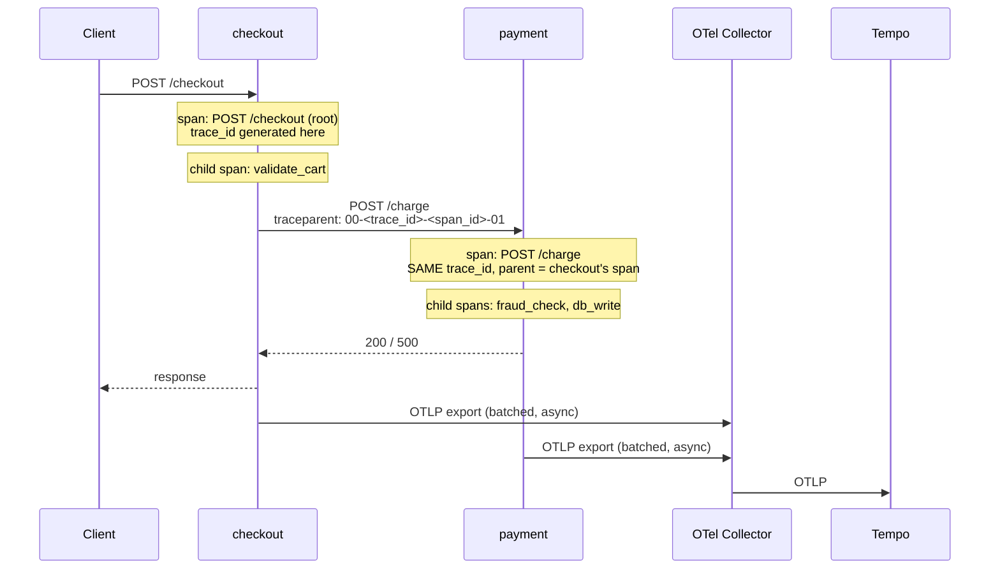

# Lab 03: Distributed Tracing with OpenTelemetry

## 🎯 Objective

Trace one request across two services with OpenTelemetry, ship the spans through a collector into Tempo, and read the waterfall in Grafana.

Metrics told you the error rate went up. Logs told you what one service printed. Neither tells you *which hop in a request was slow* — that's the question traces answer, and it's the one that matters once more than one service is involved.

You'll also correlate a slow trace with the exact log lines it produced, then break the pipeline in the four ways tracing is normally broken — every one of which leaves you looking at traces that seem fine.

---

## 📋 Prerequisites

- Completed [Lab 02: Application Monitoring](./lab-02-application-monitoring.md)
- Docker and Docker Compose, and ~2 GB free for the stack
- Python basics (Module 04) — you'll read instrumentation code, not write it from scratch

```bash
docker --version && docker compose version
curl -s -o /dev/null -w '%{http_code}\n' https://pypi.org   # the build needs PyPI
```

---

## 📦 Deliverables and Evidence

- A running trace pipeline: two instrumented services → OTel Collector → Tempo → Grafana
- A screenshot or copied span list of one trace crossing both services, with the slow span identified
- The `trace_id` of a slow request, and the log lines carrying that same id
- A TraceQL query that finds only the failed traces
- `failure-notes.md` covering all four Break It scenarios

---

## 📂 Lab Files

Reference copies are in [`../code/lab-03/`](../code/lab-03/).

```bash
cp -r /path/to/the-devops-handbook/07-observability/code/lab-03/. .
```

---

## 🔬 Exercise 1: The Pipeline

### Step 1: What You're Building

A trace is a tree of **spans**. One span per unit of work, each with a start time, a duration, a parent, and attributes. What makes it *distributed* is that the parent can live in another process.



> **💡 DevOps Impact**: the entire distributed part of distributed tracing is that one HTTP header — `traceparent`. Every "our traces are broken" incident is a place where that header was not passed on: a service that rebuilds requests by hand, a queue with no message attributes, a proxy stripping unknown headers. Spans are the easy part; propagation is what breaks.

### Step 2: Read the Instrumentation

The whole tracing setup is these lines in `app/app.py`:

```python
provider = TracerProvider(
    resource=Resource.create({"service.name": SERVICE_NAME})   # ⭐ who emitted this span
)
provider.add_span_processor(
    BatchSpanProcessor(OTLPSpanExporter())      # endpoint from OTEL_EXPORTER_OTLP_ENDPOINT
)
trace.set_tracer_provider(provider)

FlaskInstrumentor().instrument_app(app)   # ⭐ READS traceparent from incoming requests
RequestsInstrumentor().instrument()       # ⭐ WRITES traceparent onto outgoing ones
```

Four things worth noticing before you run it:

| Piece | Why it's there |
|-------|----------------|
| `service.name` | The one attribute every backend groups by. Miss it and your spans arrive as `unknown_service` |
| `BatchSpanProcessor` | Exports in the background, so a slow collector never slows the request. It **drops** spans when the queue fills — silently, by design |
| `FlaskInstrumentor` | A span per request, *and* continuation of an existing trace when the header is present |
| `RequestsInstrumentor` | A span per outgoing call, *and* injection of the header. This is the propagation |

Manual spans are for work worth attributing on its own:

```python
with tracer.start_as_current_span("fraud_check") as fraud:
    fraud.set_attribute("fraud.slow_path", slow)      # bounded values only — see scenario 3
    time.sleep(2.0 if slow else random.uniform(0.01, 0.05))
```

### Step 3: Start the Stack

```bash
docker compose up -d --build
docker compose ps
```

```text
NAME             IMAGE                                            STATUS         PORTS
checkout         lab-03-checkout                                  Up 20 seconds  0.0.0.0:8080->8080/tcp
grafana          grafana/grafana:10.3.1                           Up 21 seconds  0.0.0.0:3000->3000/tcp
otel-collector   otel/opentelemetry-collector-contrib:0.104.0      Up 22 seconds  0.0.0.0:4317->4317/tcp, ...
payment          lab-03-payment                                   Up 20 seconds  0.0.0.0:8081->8080/tcp
tempo            grafana/tempo:2.5.0                              Up 22 seconds  0.0.0.0:3200->3200/tcp
```

Generate traffic:

```bash
for i in $(seq 1 40); do curl -s -o /dev/null -X POST localhost:8080/checkout; done
```

Confirm the collector is actually receiving spans before you go looking in a UI — this one habit saves an hour every time:

```bash
docker compose logs otel-collector | grep -i 'traces\|spans' | tail -5
curl -s localhost:8888/metrics | grep -E 'otelcol_receiver_accepted_spans|otelcol_exporter_sent_spans'
```

```text
otelcol_receiver_accepted_spans{...} 240
otelcol_exporter_sent_spans{exporter="otlp/tempo",...} 240
```

Accepted equals sent. Every number in that pair matters, and scenario 4 is what happens when they diverge.

### Step 4: Read a Trace

Open <http://localhost:3000> (admin / admin) → **Explore** → the **Tempo** datasource → **Search**.

Set Service Name to `checkout` and run it. Click a trace with a duration over two seconds.

```text
POST /checkout                 checkout   2.11s   ████████████████████████
├── validate_cart              checkout    14ms   ▌
└── POST /charge               checkout   2.09s   ███████████████████████
    └── POST /charge            payment   2.08s   ███████████████████████
        ├── fraud_check         payment   2.03s   ██████████████████████
        └── db_write            payment    31ms   ▌
```

That is the answer metrics could not give you. `checkout` is slow, but nothing in `checkout` is slow — it is waiting on `payment`, and inside `payment` it is `fraud_check`, not the database. On a real incident this is the difference between an afternoon of guessing and a ten-second read.

Note what the shape tells you:

- Nested spans with a gap at the start mean queueing or connection setup, not work
- Sibling spans that overlap are concurrent; sequential ones are your latency budget added up
- A parent much longer than the sum of its children means time spent somewhere nobody instrumented

---

## 🔬 Exercise 2: Correlate a Trace With Its Logs

### Step 1: Find the Trace ID

The apps stamp every log line with the trace it belongs to (`TraceContextFilter` in `app.py`). Look at one:

```bash
docker compose logs --no-log-prefix payment | tail -3
```

```json
{"ts": "2026-08-05 17:42:11,204", "level": "ERROR", "service": "payment", "trace_id": "4bf92f3577b34da6a3ce929d0e0e4736", "msg": "charge failed: card processor rejected the transaction"}
```

### Step 2: Go From Log to Trace

Paste that `trace_id` into Grafana → Explore → Tempo → **TraceQL** tab:

```traceql
4bf92f3577b34da6a3ce929d0e0e4736
```

You now have the full request path for one specific error line — every service it touched, how long each took, and which span carried the exception.

### Step 3: Go From Trace to Logs

The other direction is the one you'll use during an incident. Find a slow trace in the Search tab, copy its trace ID, then:

```bash
docker compose logs --no-log-prefix | grep <trace-id>
```

```json
{"ts": "...", "level": "INFO",  "service": "checkout", "trace_id": "a1b2...", "msg": "calling payment service"}
{"ts": "...", "level": "ERROR", "service": "payment",  "trace_id": "a1b2...", "msg": "charge failed: ..."}
```

> ⭐ In production this pairing is a datasource link, not a `grep`: Grafana's Tempo datasource can be configured with `tracesToLogsV2` so every span has a button that opens the matching Loki query. The mechanism is the same thing you just did by hand — the trace id in the log line. Nothing else in observability is this cheap to add or this valuable during an outage. Module 08 is where the log side lives.

### Step 4: Query by What Went Wrong

TraceQL filters on spans, so you can go looking for a failure class rather than a request:

```traceql
{ status = error }                              // every failed span
{ resource.service.name = "payment" && duration > 500ms }
{ span.fraud.slow_path = true }                 // ⭐ the attribute we set in code
{ name = "db_write" && duration > 100ms }
```

That third query is why attributes exist. You cannot ask "which requests took the slow fraud path" unless something recorded that they did.

---

## 🧨 Break It: Four Ways Traces Lie

Each scenario restores state before the next. All four are silent — the dashboard stays green and the traces look plausible.

### Scenario 1: The Trace That Stops at the Service Boundary

**Break it.** Comment out one line in `app/app.py` — the one that injects the header:

```python
FlaskInstrumentor().instrument_app(app)
# RequestsInstrumentor().instrument()      # ← the propagation, disabled
```

```bash
docker compose up -d --build checkout payment
for i in $(seq 1 20); do curl -s -o /dev/null -X POST localhost:8080/checkout; done
```

**Symptom.** Search Tempo for `checkout` traces. Every one is now 100 ms long, tidy, and fast:

```text
POST /checkout          checkout   112ms   ████
└── validate_cart       checkout    14ms   ▌
```

Search for `payment` and its traces are there too — separately, as their own roots. Nothing errors. Nothing warns. The `checkout` service now reports beautiful latency, because the two seconds it spends waiting on `payment` are in a different trace.

**Investigate.**

```bash
# Is the header going out at all?
docker compose exec checkout python -c "
import requests
print(requests.post('http://payment:8080/charge', json={}).status_code)"

# Count roots: if payment has its own root spans, the chain is broken
curl -s localhost:8888/metrics | grep otelcol_receiver_accepted_spans
```

In Tempo, the tell is structural: **two traces with the same wall-clock time, one per service, neither containing the other.** Any time a downstream service's spans are roots, propagation is broken upstream.

**Root cause.** Instrumenting the server side gives you spans. Instrumenting the *client* side is what carries `traceparent` to the next hop. Half-instrumented systems produce per-service traces that individually look healthy — which is exactly why nobody notices for months.

**Fix.** Restore the line and rebuild:

```python
RequestsInstrumentor().instrument()
```

```bash
docker compose up -d --build checkout payment
for i in $(seq 1 20); do curl -s -o /dev/null -X POST localhost:8080/checkout; done   # one trace again
```

> ⭐ The same failure with different clothing: an HTTP client built with `urllib` while you instrumented `requests`; a background worker pulling from a queue that carries no trace context; a proxy or API gateway with a header allowlist. Ask "what carries the context across this boundary?" at every boundary.

### Scenario 2: The Incident That Wasn't Sampled

**Break it.** Sample 10% of traces at the source — the most common production setting there is:

```yaml
# docker-compose.yml, on BOTH app services
    environment:
      OTEL_TRACES_SAMPLER: traceidratio
      OTEL_TRACES_SAMPLER_ARG: "0.1"
```

```bash
docker compose up -d checkout payment
for i in $(seq 1 40); do curl -s -o /dev/null -X POST localhost:8080/checkout; done
```

**Symptom.** Roughly four traces arrive out of forty. That is the deal you signed. The problem is *which* four:

```bash
docker compose logs --no-log-prefix payment | grep -c 'charge failed'    # e.g. 4 errors
```

Now search Tempo with `{ status = error }`. Most of those failures have no trace at all. A user reports a specific slow checkout, you have their timestamp, and there is nothing to look at. Meanwhile every dashboard built on traces looks *better* than reality, because slow and failed requests were discarded at the same rate as healthy ones.

**Investigate.**

```bash
curl -s localhost:8888/metrics | grep otelcol_receiver_accepted_spans   # far below the request count
docker compose exec checkout env | grep OTEL_TRACES_SAMPLER
```

**Root cause.** **Head sampling** decides at the start of a trace, before anything interesting has happened — it cannot know the request will fail or take two seconds. It is cheap and it is blind.

**Fix.** Sample at the *tail*, in the collector, after the whole trace has arrived. Uncomment the `tail_sampling` processor in `otel-collector/config.yml` and add it to the pipeline:

```yaml
processors:
  tail_sampling:
    decision_wait: 5s
    policies:
      - name: keep-errors
        type: status_code
        status_code: { status_codes: [ERROR] }
      - name: keep-slow
        type: latency
        latency: { threshold_ms: 500 }
      - name: keep-a-sample-of-the-rest
        type: probabilistic
        probabilistic: { sampling_percentage: 10 }

service:
  pipelines:
    traces:
      processors: [tail_sampling, batch]
```

Then set the apps back to sampling everything and let the collector decide:

```bash
# remove the two OTEL_TRACES_SAMPLER lines from docker-compose.yml
docker compose up -d checkout payment otel-collector
for i in $(seq 1 40); do curl -s -o /dev/null -X POST localhost:8080/checkout; done
```

Every error and every slow trace is kept; the boring 90% is dropped. You pay for the traces you would actually open.

### Scenario 3: The Span Name That Ate the Service Map

**Break it.** Name a span after the thing it operated on — an entirely natural mistake:

```python
# in charge(), replace the fraud_check span
order_id = random.randint(1, 100000)
with tracer.start_as_current_span(f"fraud_check order {order_id}") as fraud:
    ...
```

```bash
docker compose up -d --build payment
for i in $(seq 1 60); do curl -s -o /dev/null -X POST localhost:8080/checkout; done
```

**Symptom.** Individual traces still look perfect. What breaks is every view built by *aggregating* them:

```bash
curl -s 'localhost:3200/api/search/tag/name/values' | head -c 400
```

```json
{"tagValues":["fraud_check order 40197","fraud_check order 8823","fraud_check order 61044", ...
```

Sixty requests, sixty distinct operation names. There is no "p99 of fraud_check" any more, because there is no `fraud_check` — there are sixty operations with one sample each. Span-metrics and service-graph features that aggregate by span name now generate one time series per request, which is how a tracing backend takes your metrics backend down with it.

**Investigate.**

```bash
curl -s 'localhost:3200/api/search/tag/name/values' | python3 -c "
import json,sys; print(len(json.load(sys.stdin)['tagValues']), 'distinct span names')"
```

Two dozen is a healthy service. Hundreds means something unbounded is in a name.

**Root cause.** Span names are the low-cardinality dimension — the equivalent of a Prometheus metric name. Unique per-request values belong in **attributes**, which are indexed for search but never aggregated into series.

**Fix.**

```python
with tracer.start_as_current_span("fraud_check") as fraud:
    fraud.set_attribute("order.id", order_id)     # ⭐ searchable, not aggregated
```

```bash
docker compose up -d --build payment
```

You can still find one order's trace (`{ span.order.id = 40197 }`) and you can once again ask what `fraud_check` normally costs.

> ⭐ The same trap in HTTP frameworks: a span named `GET /order/12345` instead of `GET /order/{id}`. Framework instrumentation gets this right by using the route template — hand-rolled instrumentation usually gets it wrong.

### Scenario 4: The Collector That Silently Dropped Everything

**Break it.** Point the exporter somewhere that isn't listening:

```yaml
# otel-collector/config.yml
exporters:
  otlp/tempo:
    endpoint: tempo:4318 # ← wrong port. 4318 is OTLP/HTTP; this exporter speaks gRPC
```

```bash
docker compose restart otel-collector
for i in $(seq 1 30); do curl -s -o /dev/null -X POST localhost:8080/checkout; done
```

**Symptom.** Both applications are perfectly healthy. Every request returns normally, latency is unchanged, no error appears in any application log. And Tempo has no new traces.

This is the failure mode that teaches people not to trust tracing: it fails *outside* the application, so nothing the application owns reports a problem. If you only look at your services, the pipeline can be down for a week.

**Investigate.**

```bash
# The collector's own metrics tell you exactly where it stopped
curl -s localhost:8888/metrics | grep -E 'otelcol_(receiver_accepted|exporter_sent|exporter_send_failed)_spans'
```

```text
otelcol_receiver_accepted_spans{...} 180        ← spans arriving fine
otelcol_exporter_sent_spans{...} 0              ← nothing leaving
otelcol_exporter_send_failed_spans{...} 180     ← ⭐ this is the alert you were missing
```

```bash
docker compose logs otel-collector | grep -i 'error\|refused' | tail -3
```

```text
error   exporterhelper/queue_sender.go   Exporting failed. Dropping data.
        {"error": "rpc error: code = Unavailable desc = connection refused", "dropped_items": 512}
```

**Root cause.** Every layer here drops data rather than blocking — the SDK's batch processor when its queue fills, the collector's exporter when the backend is unreachable. That is the correct engineering decision (telemetry must never take down the service it observes) and it means **absence of traces is not a signal you get for free.**

**Fix.**

```yaml
exporters:
  otlp/tempo:
    endpoint: tempo:4317
```

```bash
docker compose restart otel-collector
for i in $(seq 1 20); do curl -s -o /dev/null -X POST localhost:8080/checkout; done
curl -s localhost:8888/metrics | grep otelcol_exporter_send_failed_spans   # back to 0
```

Then monitor the pipeline like anything else in production: scrape the collector's `:8888` endpoint with Prometheus and alert on `rate(otelcol_exporter_send_failed_spans[5m]) > 0` and on receiver throughput dropping to zero.

### Summary

| Failure | How you detect it | How you prevent it |
|---------|------------------|--------------------|
| Propagation broken at a boundary | Downstream spans appear as their own roots; upstream latency looks impossibly good | Instrument clients as well as servers; ask what carries context across every queue, proxy, and hand-built request |
| Head sampling dropped the incident | `{ status = error }` returns far fewer traces than the error count in logs | Tail sampling in the collector: keep all errors and slow traces, sample the rest |
| Unbounded span names | Hundreds of distinct values in the span-name tag; no usable p99 per operation | Names are low-cardinality; unique values go in attributes |
| Pipeline dropping spans | `otelcol_exporter_send_failed_spans` climbing while apps stay healthy | Scrape the collector's own `:8888` metrics and alert on send failures and on zero receiver throughput |

⭐ **The theme of this lab**: tracing fails *quietly*, and in three of these four cases the traces that survive look completely normal. A trace pipeline is production infrastructure — it needs its own monitoring, and "we have traces" is a claim you should be able to check with a number rather than a screenshot.

**Write this up** in `failure-notes.md`.

---

## 🧹 Cleanup

```bash
docker compose down -v
docker image rm lab-03-checkout lab-03-payment 2>/dev/null || true
docker image rm otel/opentelemetry-collector-contrib:0.104.0 grafana/tempo:2.5.0 2>/dev/null || true
```

Traces were never persisted outside the containers, so there is nothing else to clean up — which is itself worth noticing about this stack.

---

## ✅ Validation

- [ ] Explain what a span is, what makes a trace distributed, and what `traceparent` carries
- [ ] Name the two instrumentation calls and say which one reads the header and which one writes it
- [ ] Read a waterfall and say which service and which span own the latency
- [ ] Explain why `service.name` matters and what happens without it
- [ ] Go from a log line to its trace, and from a trace to its log lines
- [ ] Write TraceQL for: failed spans, slow spans in one service, and a custom attribute
- [ ] Explain head versus tail sampling, and why head sampling loses the incident you care about
- [ ] Explain why span names must be low-cardinality and where unique values belong instead
- [ ] Find dropped spans using the collector's own metrics, and name the alert you'd write

---

## 📝 What to Commit

- `docker-compose.yml`, `otel-collector/config.yml`, `tempo/tempo.yml`, and the datasource provisioning
- `app/app.py` with the instrumentation, including the trace-id log filter
- The span list (or a screenshot) of one cross-service trace with the slow span identified
- One `trace_id` and the log lines that carry it — the correlation, demonstrated
- Your `tail_sampling` policy, with a sentence on why those three policies
- `failure-notes.md` covering all four scenarios

---

[← Previous Lab: Application Monitoring](./lab-02-application-monitoring.md) | [Back to Module README](../README.md) | [Module 08: Logging →](../../08-logging/)
