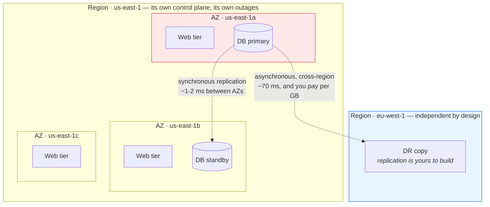
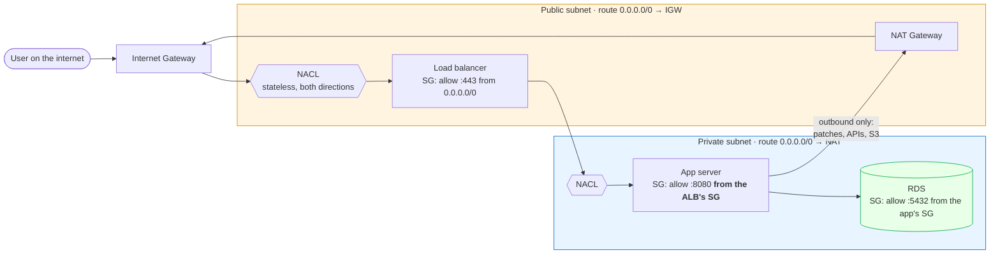
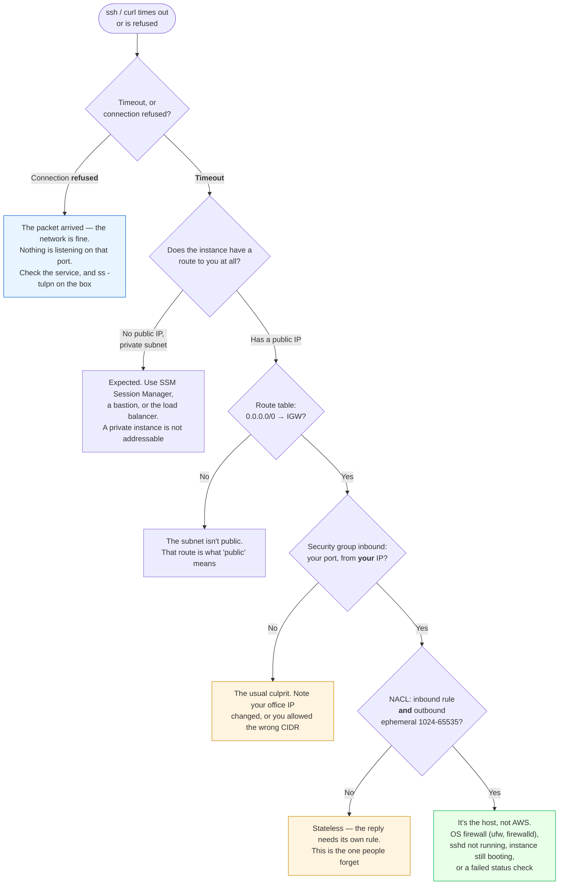
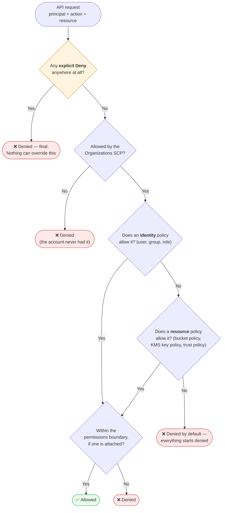

# Module 09: Cloud Fundamentals

> *"The cloud is just someone else's computer — but understanding HOW it works is what separates a DevOps engineer from everyone else."*

---

> 📋 **Command reference**: [`cheatsheet.md`](./cheatsheet.md) — every command in this module, grouped by task, with the gotchas.
>
> ⚡ **Cross-module lookup**: [Quick Reference](../QUICK-REFERENCE.md)

---

## 🎯 Why This Module Matters

Every DevOps role requires cloud knowledge. Whether it's AWS, GCP, or Azure, the **concepts are the same** — compute, storage, networking, IAM, and managed services. This module teaches cloud-agnostic fundamentals first, then maps them to AWS (the market leader).

**In real-world DevOps work**, you will:

- Provision virtual machines, networks, and storage in the cloud
- Configure IAM roles, policies, and security groups
- Deploy applications to cloud compute services
- Manage DNS, load balancers, and CDNs
- Understand cloud billing and cost optimization
- Design for high availability and disaster recovery

---

## 📚 Table of Contents

1. [Cloud Computing Fundamentals](#1-cloud-computing-fundamentals)
2. [Cloud Service Models](#2-cloud-service-models)
3. [AWS Core Services](#3-aws-core-services)
4. [Compute — EC2](#4-compute--ec2)
5. [Networking — VPC](#5-networking--vpc)
6. [Storage — S3, EBS, EFS](#6-storage--s3-ebs-efs)
7. [Identity & Access Management (IAM)](#7-identity--access-management-iam)
8. [DNS & Load Balancing](#8-dns--load-balancing)
9. [Managed Services Overview](#9-managed-services-overview)
10. [Cost Management and FinOps](#10-cost-management-and-finops)
11. [Common Mistakes and Anti-Patterns](#11-common-mistakes-and-anti-patterns)
12. [Interview Insights](#12-interview-insights)

---

## 1. Cloud Computing Fundamentals

### What Is Cloud Computing?

```
Traditional (On-Premise):
  Buy servers → Rack them → Cable them → Install OS → Wait 6 weeks
  You own and maintain EVERYTHING.

Cloud Computing:
  Click a button → Server ready in 60 seconds → Pay per hour
  Someone else owns the hardware. You rent what you need.
```

### Five Characteristics of Cloud (NIST Definition)

```
1. ON-DEMAND SELF-SERVICE
   Provision resources without human interaction (API/console)

2. BROAD NETWORK ACCESS
   Access from anywhere over the internet

3. RESOURCE POOLING
   Provider's resources shared across many customers (multi-tenant)

4. RAPID ELASTICITY
   Scale up/down instantly based on demand

5. MEASURED SERVICE
   Pay only for what you use (metered billing)
```

### Cloud Providers Market Share

```
┌──────────────────────────────────────────────┐
│  AWS          ████████████████████  ~31%      │
│  Azure        ████████████████     ~25%      │
│  Google Cloud ████████████         ~12%      │
│  Alibaba      ██████               ~4%      │
│  Others       ██████████████████   ~28%      │
└──────────────────────────────────────────────┘
```

> 💡 **Why we focus on AWS:** Largest market share, most job listings, and concepts transfer directly to Azure/GCP.

---

## 2. Cloud Service Models

```
┌────────────────────────────────────────────────────────────┐
│                    YOU MANAGE ↑ / PROVIDER MANAGES ↓        │
├──────────────┬───────────────┬──────────────┬──────────────┤
│  On-Premise  │     IaaS      │    PaaS      │    SaaS      │
├──────────────┼───────────────┼──────────────┼──────────────┤
│ Applications │ Applications  │ Applications │              │
│ Data         │ Data          │ Data         │              │
│ Runtime      │ Runtime       │              │              │
│ Middleware   │ Middleware    │              │    Provider   │
│ OS           │ OS            │   Provider   │    manages   │
│ Virtualize   │               │   manages    │   EVERYTHING │
│ Servers      │   Provider    │   these      │              │
│ Storage      │   manages     │              │              │
│ Networking   │   these       │              │              │
└──────────────┴───────────────┴──────────────┴──────────────┘
```

| Model | What You Get | AWS Example | When to Use |
|-------|-------------|-------------|-------------|
| **IaaS** | Virtual machines, networks, storage | EC2, VPC, S3 | Full control needed, custom apps |
| **PaaS** | Runtime environment, auto-scaling | Elastic Beanstalk, Lambda | Deploy code, don't manage servers |
| **SaaS** | Ready-to-use application | Gmail, Slack, Salesforce | End-user tools |

### Deployment Models

```
PUBLIC CLOUD:   AWS, Azure, GCP — shared infrastructure, pay-per-use
PRIVATE CLOUD:  Your own data center with cloud-like features (OpenStack)
HYBRID CLOUD:   Mix of on-premise + public cloud (most enterprises)
MULTI-CLOUD:    Using multiple providers (AWS + GCP for redundancy)
```

---

## 3. AWS Core Services

### The Services That Matter for DevOps

```
┌─────────────────────────────────────────────────────────┐
│                    AWS SERVICE MAP                        │
├──────────┬──────────────────────────────────────────────┤
│ COMPUTE  │ EC2, Lambda, ECS, EKS                        │
│ STORAGE  │ S3, EBS, EFS                                 │
│ DATABASE │ RDS, DynamoDB, ElastiCache                    │
│ NETWORK  │ VPC, Route 53, CloudFront, ELB               │
│ SECURITY │ IAM, KMS, Security Groups, WAF               │
│ MONITOR  │ CloudWatch, CloudTrail, X-Ray                 │
│ CI/CD    │ CodePipeline, CodeBuild, CodeDeploy           │
│ IaC      │ CloudFormation (→ we use Terraform instead)   │
│ CONTAIN  │ ECR, ECS, EKS (→ covered in K8s module)      │
└──────────┴──────────────────────────────────────────────┘
```

### AWS Global Infrastructure

```
REGIONS (30+):
  Geographically isolated areas (us-east-1, eu-west-1, ap-south-1)
  Each region is fully independent.

AVAILABILITY ZONES (90+):
  2-6 data centers per region, connected by low-latency links.
  Deploy across AZs for high availability.

EDGE LOCATIONS (400+):
  CDN/caching points for CloudFront (content delivery).

  Region: us-east-1 (N. Virginia)
  ├── AZ: us-east-1a
  ├── AZ: us-east-1b
  ├── AZ: us-east-1c
  ├── AZ: us-east-1d
  ├── AZ: us-east-1e
  └── AZ: us-east-1f
```

The hierarchy only matters because of what it means when a piece of it fails. This is a blast radius diagram, not an org chart:



**Read the red box as "this AZ is gone".** With the layout above you lose a third of the web tier and fail the database over to `us-east-1b` — a blip. With everything in `us-east-1a`, which is the default a beginner builds, you lose the application entirely.

| Failure | What survives | What it costs you to be ready |
|---------|---------------|-------------------------------|
| One instance | Everything, if the tier is behind a load balancer with health checks | Nothing — this is table stakes |
| One AZ | Everything, if each tier spans ≥2 AZs | Roughly 2× the instances and a cross-AZ data transfer bill |
| A whole region | Only what you replicated somewhere else | A second environment, cross-region replication, and a tested failover plan |

⭐ **Multi-AZ is a normal architecture; multi-region is a project.** Regions share nothing on purpose — no automatic replication, no shared VPC, separate service quotas, and even IAM's global endpoints have regional failure characteristics. Treat "go multi-region" as a quarter of work with an ongoing bill, not a checkbox, and be able to say which of RTO or RPO is forcing it (Module 14 §9).

---

## 4. Compute — EC2

### What is EC2?

**Elastic Compute Cloud** — virtual servers (instances) in the cloud. You choose the OS, size, and configuration.

### Instance Types

```
NAMING: m5.xlarge
         │ │  │
         │ │  └─ Size (nano → metal)
         │ └──── Generation (higher = newer)
         └────── Family (purpose)

FAMILIES:
  t3/t4g  — Burstable (web servers, dev/test)     💰 Cheapest
  m5/m6i  — General purpose (balanced)             ⚖️  Default choice
  c5/c6i  — Compute optimized (CPU-heavy)          🔥 Processing
  r5/r6i  — Memory optimized (databases, caching)  🧠 RAM-heavy
  g5      — GPU (ML, video encoding)                🎮 Specialized
```

### Key Concepts

```
AMI (Amazon Machine Image):
  Template for the instance — OS + preinstalled software.
  Like a Docker image but for entire VMs.
  Common: Amazon Linux 2023, Ubuntu 22.04

Key Pairs:
  SSH access to instances. Create once, use for many instances.
  NEVER lose your private key — no recovery!

Security Groups:
  Virtual firewall for instances. Controls inbound/outbound traffic.
  Default: all inbound BLOCKED, all outbound ALLOWED.

Elastic IP:
  Static public IP that persists across instance stop/start.
  Free when attached to a running instance.
```

### EC2 Pricing Models

| Model | Discount | Commitment | Use Case |
|-------|----------|-----------|----------|
| **On-Demand** | None (full price) | None | Dev/test, unpredictable workloads |
| **Reserved** | Up to 72% | 1 or 3 years | Production, steady-state workloads |
| **Spot** | Up to 90% | None (can be interrupted) | Batch processing, CI/CD runners |
| **Savings Plans** | Up to 72% | $/hour commitment | Flexible reserved pricing |

---

## 5. Networking — VPC

### What is a VPC?

**Virtual Private Cloud** — your own isolated network in AWS. You control the IP ranges, subnets, routing, and security.

### VPC Architecture

```
┌─────────────────── VPC (10.0.0.0/16) ──────────────────┐
│                                                          │
│  ┌──── AZ: us-east-1a ────┐  ┌──── AZ: us-east-1b ────┐│
│  │                         │  │                         ││
│  │  ┌─ Public Subnet ──┐  │  │  ┌─ Public Subnet ──┐  ││
│  │  │  10.0.1.0/24     │  │  │  │  10.0.2.0/24     │  ││
│  │  │  • Web Server    │  │  │  │  • Web Server    │  ││
│  │  │  • NAT Gateway   │  │  │  │  • Load Balancer │  ││
│  │  └──────────────────┘  │  │  └──────────────────┘  ││
│  │                         │  │                         ││
│  │  ┌─ Private Subnet ─┐  │  │  ┌─ Private Subnet ─┐  ││
│  │  │  10.0.3.0/24     │  │  │  │  10.0.4.0/24     │  ││
│  │  │  • App Server    │  │  │  │  • App Server    │  ││
│  │  │  • Database      │  │  │  │  • Database      │  ││
│  │  └──────────────────┘  │  │  └──────────────────┘  ││
│  └─────────────────────────┘  └─────────────────────────┘│
│                                                          │
│  Internet Gateway ──── Route Tables ──── NAT Gateway     │
└──────────────────────────────────────────────────────────┘
```

That is the layout. What you actually debug is the **path a packet takes** and the four things that can stop it:



**What each layer is actually for**, in the order a packet meets them:

| Layer | Scope | Stateful? | The mistake people make |
|-------|-------|-----------|-------------------------|
| **Route table** | Subnet | n/a | A subnet is "public" *only* because its route table points `0.0.0.0/0` at an IGW — nothing else makes it public |
| **NACL** | Subnet | ❌ **Stateless** | Allowing inbound `:443` and forgetting the outbound ephemeral range `1024-65535`, so replies are dropped |
| **Security group** | ENI (instance) | ✅ Stateful | Opening `0.0.0.0/0` instead of referencing the *source SG* — SGs can reference each other, and that's the whole point |
| **Public IP** | Instance | n/a | A private instance has no public IP and never will; reaching it means a bastion, SSM, or the load balancer |

⭐ **The NAT Gateway is one-way and that is deliberate.** It lets private instances fetch patches and call APIs; it gives nobody a path in. It is also billed per hour *and* per GB processed, which is why "why is our NAT bill £400?" is usually an S3 download loop that should have gone through a VPC endpoint instead.

⚠️ **Security groups are stateful, NACLs are not.** If you allow something inbound on an SG, the reply is automatically allowed out. Do the same on a NACL and the reply is dropped unless you wrote a second rule for it. Reach for SGs by default and leave NACLs at their permissive default until you have a specific reason — most "the VPC is broken" incidents are a hand-edited NACL.

### Key Components

```
SUBNET:
  A segment of the VPC's IP range. Exists in ONE Availability Zone.
  Public subnet  → has route to Internet Gateway (internet access)
  Private subnet → NO direct internet (uses NAT Gateway for outbound)

INTERNET GATEWAY (IGW):
  Allows resources in PUBLIC subnets to reach the internet.

NAT GATEWAY:
  Allows resources in PRIVATE subnets to reach the internet
  (outbound only — no inbound from internet).

ROUTE TABLE:
  Rules that determine where network traffic goes.
  Public RT:  0.0.0.0/0 → Internet Gateway
  Private RT: 0.0.0.0/0 → NAT Gateway

SECURITY GROUP:
  Stateful firewall at the instance level.
  If you allow inbound, the response is automatically allowed out.

NACL (Network ACL):
  Stateless firewall at the subnet level. Second layer of defense.
```

### 🔧 Troubleshooting: "I Can't Reach My Instance"

The most common cloud ticket there is, and the layers are checked in a fixed order because each one is cheaper to rule out than the next:



⭐ **Split on the error message first.** "Connection refused" means your packet reached the machine and something answered — the entire network half of this tree is already ruled out, so anyone who starts editing security groups is debugging the wrong layer. "Timeout" means nothing came back, which is when route tables, SGs and NACLs are in scope.

**Two AWS tools make this near-instant** once you know they exist: the **VPC Reachability Analyzer** tests a source-to-destination path and names the exact component that blocks it, and **VPC Flow Logs** show whether the packet arrived and was `REJECT`ed (a rule) or never appeared at all (routing). Reach for those before hand-inspecting rules.

---

## 6. Storage — S3, EBS, EFS

### Storage Types Compared

| Service | Type | Analogy | Use Case |
|---------|------|---------|----------|
| **S3** | Object storage | Google Drive | Static files, backups, logs, data lakes |
| **EBS** | Block storage | Hard drive | Attached to EC2 — databases, OS disk |
| **EFS** | File storage | NFS share | Shared across multiple EC2 instances |

### S3 (Simple Storage Service)

```
S3 CONCEPTS:
  Bucket:  Top-level container (globally unique name)
  Object:  File + metadata (key-value)
  Key:     Object path (e.g., "images/logo.png")

STORAGE CLASSES (cost vs access speed):
  Standard         → Frequent access         💰💰💰💰
  Standard-IA      → Infrequent access       💰💰💰
  Glacier Instant  → Archive, instant access  💰💰
  Glacier Deep     → Long-term archive        💰

VERSIONING:
  Keep all versions of an object. Protects against accidental deletion.

LIFECYCLE POLICIES:
  Auto-move objects to cheaper storage after N days.
  Example: Move to IA after 30 days, Glacier after 90, delete after 365.
```

---

## 7. Identity & Access Management (IAM)

### The Most Important AWS Service

> 🔐 IAM misconfigurations are the #1 cause of cloud security breaches.

```
IAM ENTITIES:
  USER:   A person (dev, admin) with long-term credentials
  GROUP:  Collection of users (developers, admins, readonly)
  ROLE:   Temporary credentials for services (EC2 → S3 access)
  POLICY: JSON document defining permissions

GOLDEN RULE: LEAST PRIVILEGE
  Grant only the minimum permissions needed. Never use root for daily work.
```

### How a Request Is Evaluated

Every API call runs this gauntlet. Memorise the shape — it is the most-asked IAM interview question, and it is also how you debug an `AccessDenied` without guessing:



**Three rules do all the work here:**

1. **Default deny.** No policy anywhere means denied. There is no "unset" that leaks access.
2. **Explicit deny always wins.** An `Effect: Deny` in *any* applicable policy ends the evaluation — you cannot out-allow it from another policy, and this is what makes a guardrail SCP trustworthy.
3. **Identity *or* resource policy is enough** (within the same account). This is why an S3 bucket policy can grant access to a role that has no S3 permissions of its own — and why auditing only IAM roles misses half of your real access graph.

> ⭐ **Debugging `AccessDenied` in order**: read the error — it names the action and often the policy type. Then `aws sts get-caller-identity` to confirm *who* you actually are (usually the surprise), then the IAM Policy Simulator, then check for an SCP if the account is in an Organization. Ninety percent of the time it is a role you did not think you were using.

### IAM Policy Anatomy

```json
{
  "Version": "2012-10-17",
  "Statement": [
    {
      "Sid": "AllowS3ReadOnly",
      "Effect": "Allow",
      "Action": [
        "s3:GetObject",
        "s3:ListBucket"
      ],
      "Resource": [
        "arn:aws:s3:::my-bucket",
        "arn:aws:s3:::my-bucket/*"
      ]
    }
  ]
}
```

### IAM Best Practices

```
✅ Enable MFA on root account and all human users
✅ Use ROLES for services (not access keys)
✅ Use GROUPS to manage permissions (not individual users)
✅ Use AWS Organizations for multi-account strategy
✅ Rotate access keys regularly
✅ Use IAM Access Analyzer to find unused permissions
❌ NEVER use the root account for daily work
❌ NEVER put access keys in code or git
❌ NEVER use wildcard (*) permissions in production
```

---

## 8. DNS & Load Balancing

### Route 53 (DNS)

```
RECORD TYPES:
  A      → Domain → IPv4 address (example.com → 93.184.216.34)
  AAAA   → Domain → IPv6 address
  CNAME  → Domain → another domain (www.example.com → example.com)
  ALIAS  → Domain → AWS resource (example.com → ALB DNS name)

ROUTING POLICIES:
  Simple       → One destination
  Weighted     → Split traffic (80% v1, 20% v2) — canary deploys!
  Latency      → Route to lowest-latency region
  Failover     → Primary/secondary (disaster recovery)
  Geolocation  → Route by user's location
```

### Elastic Load Balancer (ELB)

```
                   Internet
                      │
               ┌──────▼──────┐
               │ Load Balancer│  ← Distributes traffic
               └──┬───┬───┬──┘
                  │   │   │
            ┌─────▼┐ ┌▼───┐ ┌▼─────┐
            │EC2 a │ │EC2 b│ │EC2 c │
            └──────┘ └─────┘ └──────┘

TYPES:
  ALB (Application LB) → HTTP/HTTPS, path-based routing   ← Most common
  NLB (Network LB)     → TCP/UDP, ultra-low latency
  CLB (Classic LB)     → Legacy, don't use for new projects
```

---

## 9. Managed Services Overview

### Why Managed Services?

```
SELF-MANAGED (EC2 + install MySQL):
  ✅ Full control
  ❌ You handle: patching, backups, replication, failover, scaling

MANAGED (RDS for MySQL):
  ✅ Auto: patching, backups, replication, failover, scaling
  ❌ Less control, slightly higher cost
  ✅ You focus on your application, not database operations
```

| Self-Managed | Managed Service | Benefit |
|-------------|-----------------|---------|
| MySQL on EC2 | RDS | Auto backups, multi-AZ, read replicas |
| Redis on EC2 | ElastiCache | Auto failover, scaling |
| Kubernetes on EC2 | EKS | Managed control plane |
| Docker on EC2 | ECS/Fargate | No server management |
| Jenkins on EC2 | CodePipeline | No CI/CD server to maintain |

> 💡 **DevOps principle:** Use managed services when possible. Your job is to deliver value, not babysit databases.

### Serverless — When DevOps Engineers Encounter Lambda

Serverless (AWS Lambda, Azure Functions, GCP Cloud Functions) runs code **without any server to manage** — no OS, no patching, no scaling configuration. You pay only when your code executes.

```
WHEN DEVOPS ENGINEERS USE LAMBDA:
  ✅ Scheduled tasks       — rotate secrets, clean up old snapshots, run reports
  ✅ Webhook handlers      — receive GitHub/Slack webhooks, trigger pipelines
  ✅ Event-driven ops      — process S3 upload → resize image → store result
  ✅ Custom CI/CD steps    — Lambda-backed custom actions or post-deploy hooks
  ✅ CloudWatch alarms     — trigger Lambda to auto-remediate (restart service, scale)
  ✅ Lightweight APIs      — internal tooling endpoints (status page, health aggregator)

WHEN TO USE CONTAINERS INSTEAD:
  ❌ Long-running processes (Lambda timeout: 15 min max)
  ❌ Consistent, high-traffic workloads (containers are cheaper at scale)
  ❌ Complex multi-service applications (use ECS/EKS)
  ❌ Workloads needing persistent connections (WebSockets, databases)
```

```
Lambda mental model for DevOps:
  Traditional:  Server always running → you pay 24/7 → you patch it
  Lambda:       Code runs on trigger → you pay per invocation → AWS patches it

  EXAMPLE: S3 backup cleanup
    EventBridge (cron: daily) → Lambda → delete S3 objects older than 90 days
    Cost: ~$0.01/month vs running an EC2 instance 24/7
```

> 💡 **You don't need to be a Lambda developer**, but you need to understand when serverless is the right tool for operational automation tasks. Many DevOps teams use Lambda for "glue" code between services.

---

## 10. Cost Management and FinOps

### Cost Optimization Strategies

```
1. RIGHT-SIZING
   Don't use m5.2xlarge when t3.medium is enough.
   Use CloudWatch metrics to check actual CPU/memory usage.

2. RESERVED / SAVINGS PLANS
   Commit for 1-3 years for steady workloads → up to 72% savings.

3. SPOT INSTANCES
   Use for fault-tolerant workloads → up to 90% savings.
   CI/CD runners, batch jobs, dev environments.

4. CLEANUP
   Delete unused resources: unattached EBS volumes, old snapshots,
   idle EC2 instances, orphaned Elastic IPs.

5. S3 LIFECYCLE POLICIES
   Move old data to cheaper storage classes automatically.

6. AUTO SCALING
   Scale down during low-traffic periods (nights, weekends).
```

### Key Tools

```
AWS Cost Explorer     → Visualize spending trends
AWS Budgets           → Set alerts when spending exceeds threshold
AWS Trusted Advisor   → Recommendations for cost, security, performance
Billing Dashboard     → Monthly cost breakdown by service
```

### FinOps — Cost as an Engineering Metric

The list above is a set of *tactics*. FinOps is the practice of making them happen continuously, by treating spend the same way you treat latency: measured, attributed to an owner, and reviewed. The cloud moved cost from a procurement decision made yearly to an engineering decision made on every pull request, and nobody in that loop is a finance person.

```
THE FINOPS LOOP
  1. INFORM    Everyone can see what their own thing costs.
               No allocation → no accountability → no change.
  2. OPTIMIZE  Rightsize, commit, tier, delete. The tactics above.
  3. OPERATE   Budgets, anomaly alerts, cost in the definition of done,
               and a monthly review that has an owner.
```

> **💡 DevOps Impact**: the single highest-leverage step is step 1. An engineer who can see that their staging environment costs £400/month will usually fix it that week; a central team asking them to "reduce cloud spend" achieves nothing, because the person who can act cannot see the number.

### Allocation: Tag or Guess

You cannot attribute cost without tags, and tags applied after the fact never get applied. Enforce them at creation:

| Tag | Answers | Enforced by |
|-----|---------|-------------|
| `owner` / `team` | Who do I ask about this? | Terraform `default_tags` + a policy that blocks untagged creation |
| `env` | Is this production, or a lab someone forgot? | Same |
| `service` | Which service's unit cost does this belong to? | Same |
| `cost-center` | Which budget does this land in? | Same |

```hcl
# Set it once per provider and every resource inherits it
provider "aws" {
  region = var.region
  default_tags {
    tags = {
      env        = var.environment
      team       = var.team
      service    = var.service
      managed-by = "terraform"          # ⭐ instantly separates IaC from console clicks
    }
  }
}
```

Then measure **allocation coverage** — the share of spend that lands in a tagged bucket. Below about 90% your reports are fiction, and untagged spend is where the waste hides.

### Unit Economics

Total spend is almost useless as a signal: it goes up when the business grows, which is fine, and it goes up when you get less efficient, which is not. The number that separates the two is **cost per unit of work**:

```
cost per 1,000 requests        cost per active customer per month
cost per build minute          cost per GB ingested into logs
cost per tenant                cost per completed order
```

A doubling of spend alongside a falling cost-per-order is a success. Flat spend with a rising cost-per-order is a regression you would otherwise never notice. Pick one unit that matches how your service is used, put it on a dashboard next to latency, and it becomes an engineering metric rather than a finance complaint.

### Commitments, Without Getting Trapped

Discounts come from promising to spend. The trap is promising for capacity you later re-architect away:

| Instrument | Discount | Risk |
|-----------|---------:|------|
| On-demand | 0% | None — the baseline you measure against |
| Savings Plans / flexible commitments | ~30–50% | You are committed for 1–3 years, even if you move to containers or serverless |
| Reserved Instances (specific) | ~40–60% | Highest discount, least flexible — tied to family and region |
| Spot | ~70–90% | ⭐ Interruptible with ~2 minutes' notice. Excellent for CI runners, batch, dev; wrong for a database primary |

The sane pattern: cover your **verified steady-state floor** with flexible commitments (usually 60–80% of baseline, not 100%), run bursty and fault-tolerant work on spot, and leave headroom on demand. Commit to the floor you have measured over months, never to a forecast.

### Operating It

```bash
# Where did the money go? Group by tag, not by service, once tagging is in place
aws ce get-cost-and-usage --time-period Start=2026-07-01,End=2026-08-01 \
  --granularity MONTHLY --metrics UnblendedCost \
  --group-by Type=TAG,Key=service

# Untagged spend — the number to drive toward zero
aws ce get-cost-and-usage --time-period Start=2026-07-01,End=2026-08-01 \
  --granularity MONTHLY --metrics UnblendedCost \
  --filter '{"Tags":{"Key":"service","MatchOptions":["ABSENT"]}}'

# Commitment efficiency: unused commitment is money already spent
aws ce get-savings-plans-utilization --time-period Start=2026-07-01,End=2026-08-01

# The three that are almost always pure waste
aws ec2 describe-volumes --filters Name=status,Values=available   # unattached disks
aws ec2 describe-addresses --query 'Addresses[?AssociationId==null]'
aws logs describe-log-groups --query 'logGroups[?!retentionInDays].logGroupName'  # kept forever
```

Automate the parts humans forget: a **budget with an alert** per environment (not one for the whole account), **cost anomaly detection** so a 3× jump pages someone the same day rather than appearing on next month's invoice, **log and snapshot retention** set at creation, and a **scheduled shutdown** for non-production out of hours — an 8×5 dev environment costs roughly a quarter of a 24×7 one for identical work.

> ⭐ **The interview answer**: "Cost is a non-functional requirement like latency. I'd start with allocation — enforced tags through Terraform `default_tags`, so every team sees its own bill — then pick one unit-cost metric like cost per thousand requests and track it next to the golden signals. Optimisation is the easy part; the hard part is that nobody acts on a number they can't see, and nobody notices efficiency regressions if you only watch total spend."

---

## 11. Common Mistakes and Anti-Patterns

### ❌ Using Root Account for Daily Work

```
BAD:  Login as root → full access to everything → one mistake = disaster
GOOD: Create IAM users with limited permissions, enable MFA on root
```

### ❌ Public S3 Buckets

```
BAD:  S3 bucket with public access → data breach headline
GOOD: Block public access by default, use presigned URLs for temporary access
```

### ❌ Single AZ Deployment

```
BAD:  Everything in one AZ → AZ goes down → total outage
GOOD: Deploy across 2+ AZs with a load balancer
```

### ❌ Hardcoded Credentials

```
BAD:  Access keys in code, environment variables, or config files
GOOD: Use IAM roles for EC2/Lambda/ECS — no credentials to manage
```

---

## 12. Interview Insights

**Q: What's the difference between IaaS, PaaS, and SaaS?**
> IaaS gives you virtual infrastructure (compute, storage, network) — you manage the OS and everything above. PaaS gives you a platform to deploy code — the provider manages the OS and runtime. SaaS is a complete application you use as-is. AWS EC2 is IaaS, Elastic Beanstalk is PaaS, Gmail is SaaS.

**Q: Explain the difference between a public and private subnet.**
> A public subnet has a route to an Internet Gateway, so resources can be reached from the internet (with a public IP). A private subnet has no direct internet route — resources can reach the internet through a NAT Gateway for outbound traffic only. Databases and app servers go in private subnets; load balancers go in public subnets.

**Q: What is the principle of least privilege?**
> Grant only the minimum permissions required to perform a task. An EC2 instance running a web app should have permission to read from S3 and write to CloudWatch — nothing else. This limits the blast radius if credentials are compromised.

**Q: How do you design for high availability in AWS?**
> Deploy across multiple Availability Zones. Use an Application Load Balancer to distribute traffic. Use Auto Scaling Groups to replace failed instances. Use RDS Multi-AZ for database failover. Use S3 for durable storage (99.999999999% durability). Design every component to handle the failure of one AZ.

**Q: What's the difference between Security Groups and NACLs?**
> Security Groups are stateful firewalls at the instance level — if inbound is allowed, outbound response is auto-allowed. NACLs are stateless firewalls at the subnet level — you must explicitly allow both inbound and outbound. Security Groups are your primary tool; NACLs are a second defense layer.

**Q: How do you manage costs in AWS?**
> Right-size instances using CloudWatch metrics. Use Reserved Instances or Savings Plans for steady workloads. Use Spot Instances for fault-tolerant jobs. Set up AWS Budgets for alerts. Clean up unused resources regularly. Use S3 lifecycle policies for storage optimization. Tag everything for cost allocation.

---

## 🧪 Labs and Projects

Read the sections above first, then work through these **in order**. Every lab ends with a 🧨 **Break It** section — those are not optional; they are where the debugging skill actually comes from.

| # | Lab | What you'll do |
|---|-----|----------------|
| 1 | **[AWS Fundamentals](./labs/lab-01-aws-fundamentals.md)** | Get hands-on with the four foundational AWS services. |
| 2 | **[IAM and Least Privilege](./labs/lab-02-iam-least-privilege.md)** | Write IAM policies that grant exactly what's needed and nothing more — and, more importantly, learn to **test** them before they reach production. |
| 3 | **[FinOps](./labs/lab-03-finops-cost-review.md)** | Do a cost review the way it should happen: on the plan, before apply, with a number attributable to a team. |

**Portfolio project:**

- [Project: Small Cloud Environment Walkthrough](./projects/project-01-small-cloud-environment.md) — Create a minimal cloud environment and document the core building blocks: network, compute, access control, security boundary, validation, cost, and…

**Reference code** for every lab: [`code/`](./code/) — real files, validated in CI.

---

## ✅ Self-Check

Answer these from memory before you expand them. If more than two give you trouble, re-read the sections they come from — the labs assume this material is solid.

<details>
<summary><strong>1. Under the shared responsibility model, who patches what in IaaS, PaaS, and SaaS?</strong></summary>

IaaS: you own the OS and everything above it. PaaS: you own your application and its configuration. SaaS: you own your data and who can reach it. The provider secures the cloud; you are always responsible for what you put in it and for the access you grant.

</details>

<details>
<summary><strong>2. What actually makes a subnet public or private?</strong></summary>

The route table. A public subnet has a route to an internet gateway; a private one sends egress through a NAT gateway or has no path out at all. Nothing about the subnet's own definition is public or private — and an instance in a public subnet without a public IP still cannot be reached.

</details>

<details>
<summary><strong>3. Security group versus NACL?</strong></summary>

A security group is stateful, attaches to an interface, and holds allow rules only — return traffic is automatic. A NACL is stateless and subnet-wide, supports deny rules, and needs both directions written out. Forgetting the return rule on a NACL is a classic silent-timeout cause.

</details>

<details>
<summary><strong>4. Why prefer an IAM role over an access key?</strong></summary>

A role hands a workload short-lived credentials that rotate automatically and cannot be copied into a laptop or a repository. Long-lived keys leak, stay valid indefinitely, and are the root cause of a large share of cloud breaches. Use instance profiles for compute and OIDC federation for CI.

</details>

<details>
<summary><strong>5. S3, EBS, or EFS?</strong></summary>

S3 is object storage over HTTP: unlimited scale, versioning, lifecycle rules, and not a filesystem. EBS is a block volume attached to one instance in one availability zone. EFS is a managed NFS filesystem several instances can share, at several times the price per gigabyte. Most "we need shared storage" turns out to be S3.

</details>

<details>
<summary><strong>6. Where do surprise cloud bills come from on a learning account?</strong></summary>

Resources you forgot: an idle NAT gateway, unattached elastic IPs and volumes, orphaned snapshots, a load balancer with no targets. Then data transfer — cross-AZ and egress — which no one estimates. Tag everything, set a budget alert on day one, and run the destroy step of every lab.

</details>

<details>
<summary><strong>7. Spend doubled this quarter. What do you look at before touching a single instance size?</strong></summary>

Allocation and unit cost. Total spend rising is meaningless on its own — it goes up when the business grows and when you get less efficient, and only cost per unit of work (per 1,000 requests, per order, per tenant) separates the two. Which requires enforced tags: `owner`, `env`, `service`, applied at creation via Terraform `default_tags`, because tags added later never get added. Nobody fixes a number they cannot see, which is why "inform" is the first phase of the FinOps loop and rightsizing is the last.

</details>

---

## Practical Checkpoint

Before moving on, you should be able to:

- Explain core cloud building blocks: compute, networking, IAM, storage, and regions.
- Create a small environment and validate reachability, access, and security boundaries.
- Clean up resources and reason about cost before leaving a lab.

Portfolio evidence to keep:

- Architecture notes for the cloud lab.
- Validation output for network and instance access.
- Cleanup proof and cost notes.

Suggested project: [Small Cloud Environment Walkthrough](./projects/project-01-small-cloud-environment.md)

---

## ➡️ What's Next?

With cloud fundamentals understood, you're ready to automate cloud infrastructure using code — Infrastructure as Code with Terraform.

**[Module 10: Terraform →](../10-terraform/)**

---

<div align="center">

**Module 09 Complete** ✅

[← Back to Logging](../08-logging/) | [📋 Cheat Sheet](./cheatsheet.md) | [Next: Terraform →](../10-terraform/)

</div>
