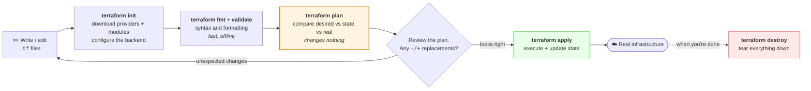
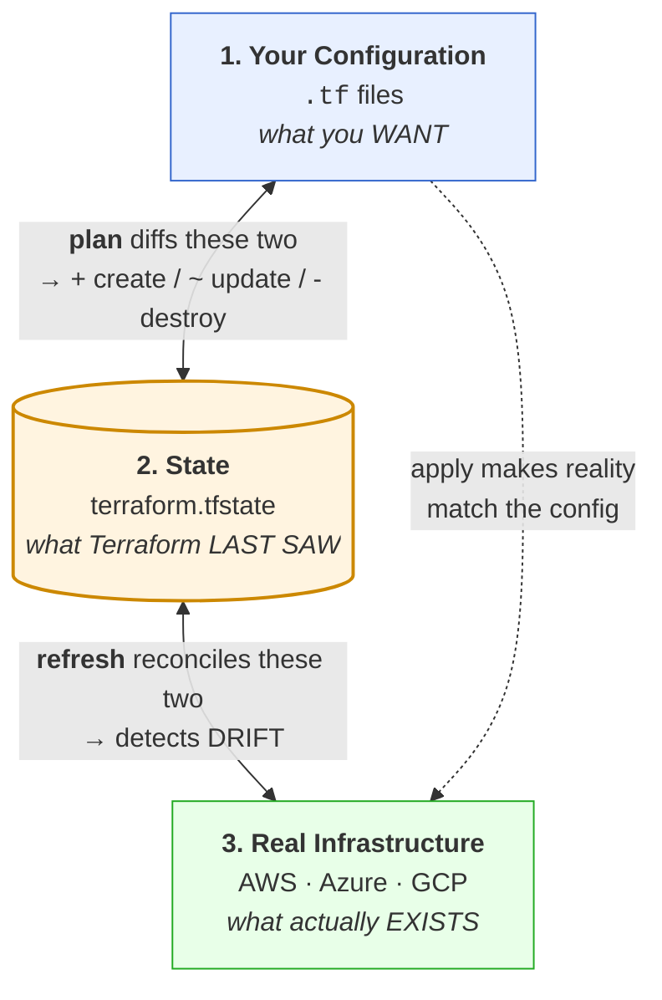
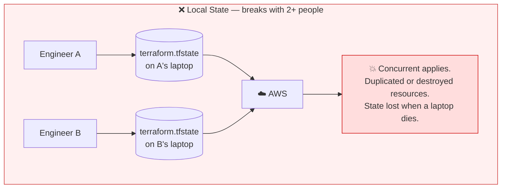
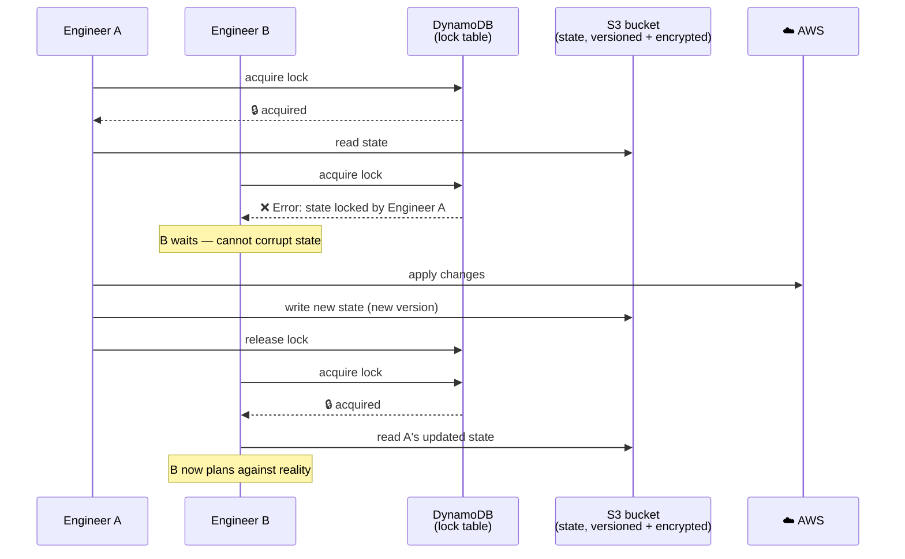

# Module 10: Terraform

> *"Infrastructure as Code means your infrastructure is version-controlled, reviewed, and reproducible — just like your application."*

---

> 📋 **Command reference**: [`cheatsheet.md`](./cheatsheet.md) — every command in this module, grouped by task, with the gotchas.
>
> ⚡ **Cross-module lookup**: [Quick Reference](../QUICK-REFERENCE.md)

---

## 🎯 Why This Module Matters

Clicking through the AWS console doesn't scale. When you manage 50 servers, 3 environments, and multiple regions, you need to **define infrastructure as code** — repeatable, reviewable, and automated. Terraform is the industry standard for this.

**In real-world DevOps work**, you will:
- Write Terraform configurations to provision cloud infrastructure
- Manage state files and collaborate with teams
- Build reusable modules for common patterns
- Plan and apply changes safely with review workflows
- Handle multiple environments (dev, staging, production)
- Import existing infrastructure into Terraform

---

## 📚 Table of Contents

1. [Infrastructure as Code Concepts](#1-infrastructure-as-code-concepts)
2. [Terraform Fundamentals](#2-terraform-fundamentals)
3. [HCL — HashiCorp Configuration Language](#3-hcl--hashicorp-configuration-language)
4. [Core Workflow](#4-core-workflow)
5. [State Management](#5-state-management)
6. [Variables and Outputs](#6-variables-and-outputs)
7. [Modules](#7-modules)
8. [Managing Multiple Environments](#8-managing-multiple-environments)
9. [Common Mistakes and Anti-Patterns](#9-common-mistakes-and-anti-patterns)
10. [Debugging Mindset](#10-debugging-mindset)
11. [Interview Insights](#11-interview-insights)

---

## 1. Infrastructure as Code Concepts

### Why IaC?

```
MANUAL (Console/CLI):
  ❌ No record of what was done
  ❌ Can't reproduce exactly
  ❌ No code review for infrastructure changes
  ❌ Drift between environments (staging ≠ production)
  ❌ "Who changed this security group last Thursday?"

INFRASTRUCTURE AS CODE:
  ✅ Version controlled (Git)
  ✅ Reproducible (same config = same infrastructure)
  ✅ Reviewable (PRs for infra changes)
  ✅ Testable (validate before apply)
  ✅ Self-documenting (the code IS the documentation)
```

### Declarative vs Imperative

```
IMPERATIVE (scripting):
  "Create a VPC. Then create a subnet. Then create an instance."
  You describe the STEPS. (Bash, Python, AWS CLI scripts)

DECLARATIVE (Terraform):
  "I want a VPC with a subnet and an instance."
  You describe the DESIRED STATE. Terraform figures out the steps.
```

| Tool | Approach | Language | State | Cloud Support |
|------|----------|----------|-------|---------------|
| **Terraform** | Declarative | HCL | External state file | Multi-cloud |
| **CloudFormation** | Declarative | JSON/YAML | Managed by AWS | AWS only |
| **Pulumi** | Declarative | Python/TS/Go | Managed service | Multi-cloud |
| **Ansible** | Imperative/Declarative | YAML | Stateless | Multi-cloud |

---

## 2. Terraform Fundamentals

### How Terraform Works

```
┌──────────┐     ┌──────────────┐     ┌───────────────┐
│  .tf     │     │  TERRAFORM   │     │  CLOUD API    │
│  files   │────▶│  ENGINE      │────▶│  (AWS, GCP,   │
│  (code)  │     │              │     │   Azure)      │
└──────────┘     └──────┬───────┘     └───────────────┘
                        │
                 ┌──────▼───────┐
                 │  STATE FILE  │
                 │  (.tfstate)  │
                 │  Tracks what │
                 │  exists      │
                 └──────────────┘
```

### Key Concepts

```
PROVIDER:     Plugin that talks to a cloud API (aws, azurerm, google)
RESOURCE:     A piece of infrastructure (aws_instance, aws_s3_bucket)
DATA SOURCE:  Read existing infrastructure (look up an AMI ID)
VARIABLE:     Input parameter (instance type, region)
OUTPUT:       Exported value (IP address, DNS name)
MODULE:       Reusable group of resources (VPC module, app module)
STATE:        Record of what Terraform has created (terraform.tfstate)
```

### Installation

```bash
# macOS
brew install terraform

# Debian/Ubuntu
wget -O- https://apt.releases.hashicorp.com/gpg | sudo gpg --dearmor -o /usr/share/keyrings/hashicorp-archive-keyring.gpg
echo "deb [signed-by=/usr/share/keyrings/hashicorp-archive-keyring.gpg] https://apt.releases.hashicorp.com $(lsb_release -cs) main" | sudo tee /etc/apt/sources.list.d/hashicorp.list
sudo apt update && sudo apt install terraform

# RHEL-compatible
sudo dnf install -y dnf-plugins-core
sudo dnf config-manager --add-repo https://rpm.releases.hashicorp.com/RHEL/hashicorp.repo
sudo dnf install -y terraform

# Verify
terraform version
```

---

## 3. HCL — HashiCorp Configuration Language

### Basic Syntax

```hcl
# Provider configuration
terraform {
  required_version = ">= 1.5.0"
  required_providers {
    aws = {
      source  = "hashicorp/aws"
      version = "~> 5.0"
    }
  }
}

provider "aws" {
  region = "us-east-1"
}

# Resource: Create an EC2 instance
resource "aws_instance" "web" {
  ami           = "ami-0c55b159cbfafe1f0"
  instance_type = "t3.micro"

  tags = {
    Name        = "web-server"
    Environment = "dev"
    ManagedBy   = "terraform"
  }
}

# Data source: Look up the latest Amazon Linux AMI
data "aws_ami" "amazon_linux" {
  most_recent = true
  owners      = ["amazon"]

  filter {
    name   = "name"
    values = ["al2023-ami-*-x86_64"]
  }
}

# Output: Export the public IP
output "instance_ip" {
  value       = aws_instance.web.public_ip
  description = "Public IP of the web server"
}
```

### Resource References

```hcl
# Resources reference each other — Terraform builds a dependency graph
resource "aws_vpc" "main" {
  cidr_block = "10.0.0.0/16"
}

resource "aws_subnet" "public" {
  vpc_id     = aws_vpc.main.id          # References VPC above
  cidr_block = "10.0.1.0/24"
}

resource "aws_instance" "web" {
  subnet_id = aws_subnet.public.id      # References subnet above
  ami       = data.aws_ami.amazon_linux.id
  # Terraform knows: VPC → Subnet → Instance (creates in order)
}
```

---

## 4. Core Workflow

### The Three Commands



> **💡 `plan` is the whole point of Terraform.** Every other IaC failure mode — the accidental database deletion, the surprise downtime, the resource replaced instead of updated — is a plan someone didn't read. In CI, run `terraform plan -out=tfplan` on the PR, post the output as a comment, and have `apply` consume **that exact saved plan file** so nobody applies something different from what was reviewed.

### What Each Command Does

```bash
# 1. Initialize — download providers, set up backend
terraform init
# Downloads the AWS provider plugin
# Sets up state backend (local or remote)
# Only needed once, or when adding new providers/modules

# 2. Plan — preview changes (SAFE — changes nothing)
terraform plan
# Shows: + create, ~ modify, - destroy
# ALWAYS review the plan before applying!

# 3. Apply — make the changes
terraform apply
# Shows the plan again, asks for confirmation
# Creates/modifies/destroys resources

# Other important commands:
terraform destroy            # Tear down ALL resources
terraform fmt                # Format .tf files consistently
terraform validate           # Check syntax and configuration
terraform output             # Show output values
terraform state list         # List resources in state
terraform import             # Import existing infrastructure
```

### Plan Output Reading

```
Terraform will perform the following actions:

  # aws_instance.web will be created
  + resource "aws_instance" "web" {
      + ami           = "ami-0c55b159cbfafe1f0"
      + instance_type = "t3.micro"
      + id            = (known after apply)
      + public_ip     = (known after apply)
    }

  # aws_security_group.web will be updated in-place
  ~ resource "aws_security_group" "web" {
      ~ ingress {
          - from_port = 80    → 443     # Changed
        }
    }

  # aws_instance.old will be destroyed
  - resource "aws_instance" "old" {
      - ami           = "ami-old123"
      - instance_type = "t2.micro"
    }

Plan: 1 to add, 1 to change, 1 to destroy.
```

```
SYMBOLS:
  +  = CREATE (new resource)
  ~  = MODIFY in-place (update existing)
  -  = DESTROY (delete resource)
  -/+ = REPLACE (destroy and recreate)
      ⚠️ This means DOWNTIME — watch for these!
```

---

## 5. State Management

### What Is State?

The state file is a JSON index that maps the names in your code to real resource IDs in the cloud. Without it, Terraform has no idea that `aws_instance.web` is `i-0abc123def456` — it would create a second one.

**Every Terraform operation is a comparison between three things:**



**Every state problem is one of these three getting out of sync** — and each has its own fix:

| Symptom | What broke | Fix |
|---------|-----------|-----|
| Plan wants to **create** something that already exists | Real ✅, State ❌ — resource made outside Terraform | `import` block, then write matching config |
| Plan wants to **destroy and recreate** after you renamed a resource | Code ✅, State has the old name | `moved` block — updates state only, no downtime |
| Plan shows changes you didn't make | **Drift** — someone edited it in the console | Either revert manually, or update the config to match |
| Plan wants to **destroy** something you want to keep | Code ❌, State ✅ — you deleted the block | `terraform state rm` to forget it without deleting it |
| `Error: state lock` | Another apply is running (or crashed holding the lock) | Wait; if truly stale, `terraform force-unlock <ID>` |

> **⚠️ State contains secrets in plaintext.** Database passwords, generated private keys, and any sensitive output land in `terraform.tfstate` unencrypted. Never commit it to Git; always use an encrypted remote backend; add `*.tfstate*` to `.gitignore` on day one.

### Local vs Remote State

**Local state** is a file on one laptop. The moment a second engineer runs `apply`, you have two divergent views of production and no lock to stop them colliding.



**Remote state** puts the file in shared, versioned, encrypted storage and adds a **lock** so only one apply can run at a time.



| | Local | Remote (S3 + DynamoDB, or Terraform Cloud) |
|---|-------|--------------------------------------------|
| **Collaboration** | ❌ One person only | ✅ Whole team |
| **Locking** | ❌ None | ✅ Concurrent applies blocked |
| **Durability** | ❌ Dies with the laptop | ✅ Versioned, backed up |
| **Encryption at rest** | ❌ Plaintext on disk | ✅ SSE-KMS |
| **Use for** | Learning, throwaway experiments | Anything real |

### Remote State Backend (S3)

```hcl
terraform {
  backend "s3" {
    bucket         = "my-terraform-state"
    key            = "prod/infrastructure/terraform.tfstate"
    region         = "us-east-1"
    dynamodb_table = "terraform-locks"    # State locking
    encrypt        = true
  }
}
```

### State Commands

```bash
# List all resources in state
terraform state list

# Show details of a specific resource
terraform state show aws_instance.web

# Remove a resource from state (without destroying it)
terraform state rm aws_instance.web

# Move/rename a resource in state
terraform state mv aws_instance.old aws_instance.new

# Import existing infrastructure into state (CLI method)
terraform import aws_instance.web i-0abc123def456
```

### Modern Import and Refactoring (Terraform 1.5+)

The CLI `terraform import` command works, but has limitations — it doesn't generate configuration and can't be reviewed in a PR. Terraform 1.5+ introduced **declarative import** and **moved** blocks that are safer and version-controlled.

**Import Block** — Import existing resources via config (not just CLI):

```hcl
# import.tf — bring an existing EC2 instance under Terraform management
import {
  to = aws_instance.web
  id = "i-0abc123def456"
}

# 1. Add the import block
# 2. Write the matching resource block
# 3. Run: terraform plan (shows what will be imported, no changes)
# 4. Run: terraform apply (imports into state)
# 5. Remove the import block (it's a one-time operation)

# Why this is better than CLI import:
#   ✅ Reviewable in PRs (the import is in code, not a CLI command)
#   ✅ Can generate config: terraform plan -generate-config-out=generated.tf
#   ✅ Safe — plan shows exactly what will happen before you apply
```

**Moved Block** — Safely rename or refactor resources without destroy/recreate:

```hcl
# You renamed a resource from "old" to "new" in your code.
# Without moved block: Terraform destroys "old" and creates "new" (DOWNTIME!)
# With moved block: Terraform updates state only (no infrastructure change)

moved {
  from = aws_instance.old
  to   = aws_instance.new
}

# Also works when moving resources into or out of modules:
moved {
  from = aws_instance.web
  to   = module.compute.aws_instance.web
}

# Run terraform plan → shows "moved" instead of destroy+create
# After successful apply, you can remove the moved block
```

> 💡 **Use `import` and `moved` blocks instead of CLI state commands whenever possible** — they're reviewable, auditable, and safer for team workflows.

---

## 6. Variables and Outputs

### Input Variables

```hcl
# variables.tf
variable "environment" {
  description = "Deployment environment"
  type        = string
  default     = "dev"

  validation {
    condition     = contains(["dev", "staging", "prod"], var.environment)
    error_message = "Environment must be dev, staging, or prod."
  }
}

variable "instance_type" {
  description = "EC2 instance type"
  type        = string
  default     = "t3.micro"
}

variable "allowed_cidrs" {
  description = "CIDRs allowed to access the app"
  type        = list(string)
  default     = ["0.0.0.0/0"]
}

variable "tags" {
  description = "Common resource tags"
  type        = map(string)
  default = {
    ManagedBy = "terraform"
    Project   = "devops-handbook"
  }
}
```

### Using Variables

```hcl
# main.tf
resource "aws_instance" "web" {
  ami           = data.aws_ami.amazon_linux.id
  instance_type = var.instance_type

  tags = merge(var.tags, {
    Name        = "web-${var.environment}"
    Environment = var.environment
  })
}
```

### Setting Variable Values

```bash
# 1. terraform.tfvars file (auto-loaded)
# terraform.tfvars
environment   = "prod"
instance_type = "t3.small"

# 2. Environment-specific files
# prod.tfvars
environment   = "prod"
instance_type = "t3.large"

terraform plan -var-file="prod.tfvars"

# 3. Command line
terraform plan -var="environment=staging"

# 4. Environment variables
export TF_VAR_environment="staging"
terraform plan
```

### Outputs

```hcl
# outputs.tf
output "instance_id" {
  value       = aws_instance.web.id
  description = "EC2 instance ID"
}

output "public_ip" {
  value       = aws_instance.web.public_ip
  description = "Public IP address"
}

output "database_password" {
  value       = random_password.db.result
  sensitive   = true                        # Hidden in CLI output
  description = "Generated database password"
}
```

---

## 7. Modules

### Why Modules?

```
WITHOUT MODULES:
  Copy-paste the same VPC config for dev, staging, prod → drift, bugs

WITH MODULES:
  Write the VPC config ONCE, use it 3 times with different parameters
  Like functions in programming
```

### Module Structure

```
modules/
└── vpc/
    ├── main.tf          # Resources
    ├── variables.tf     # Inputs
    ├── outputs.tf       # Outputs
    └── README.md        # Documentation
```

### Creating a Module

```hcl
# modules/vpc/variables.tf
variable "vpc_cidr" {
  description = "VPC CIDR block"
  type        = string
}

variable "environment" {
  description = "Environment name"
  type        = string
}

# modules/vpc/main.tf
resource "aws_vpc" "main" {
  cidr_block           = var.vpc_cidr
  enable_dns_hostnames = true

  tags = {
    Name        = "${var.environment}-vpc"
    Environment = var.environment
  }
}

resource "aws_subnet" "public" {
  vpc_id                  = aws_vpc.main.id
  cidr_block              = cidrsubnet(var.vpc_cidr, 8, 1)
  map_public_ip_on_launch = true

  tags = {
    Name = "${var.environment}-public"
  }
}

# modules/vpc/outputs.tf
output "vpc_id" {
  value = aws_vpc.main.id
}

output "public_subnet_id" {
  value = aws_subnet.public.id
}
```

### Using a Module

```hcl
# environments/prod/main.tf
module "vpc" {
  source      = "../../modules/vpc"
  vpc_cidr    = "10.0.0.0/16"
  environment = "prod"
}

resource "aws_instance" "web" {
  subnet_id     = module.vpc.public_subnet_id   # Use module output
  ami           = data.aws_ami.amazon_linux.id
  instance_type = "t3.small"
}
```

---

## 8. Managing Multiple Environments

### Directory Structure

```
terraform/
├── modules/
│   ├── vpc/
│   ├── ec2/
│   └── rds/
├── environments/
│   ├── dev/
│   │   ├── main.tf
│   │   ├── variables.tf
│   │   ├── terraform.tfvars
│   │   └── backend.tf
│   ├── staging/
│   │   ├── main.tf
│   │   ├── variables.tf
│   │   ├── terraform.tfvars
│   │   └── backend.tf
│   └── prod/
│       ├── main.tf
│       ├── variables.tf
│       ├── terraform.tfvars
│       └── backend.tf
```

### Workspaces (Alternative Approach)

```bash
# Create and switch workspaces
terraform workspace new dev
terraform workspace new staging
terraform workspace new prod

# Switch workspace
terraform workspace select prod

# List workspaces
terraform workspace list

# Use in config
resource "aws_instance" "web" {
  instance_type = terraform.workspace == "prod" ? "t3.large" : "t3.micro"
  tags = { Environment = terraform.workspace }
}
```

> 💡 **Recommendation:** Use separate directories for environments (not workspaces) — clearer separation, independent state, safer.

---

## 9. Common Mistakes and Anti-Patterns

### ❌ Committing State Files

```bash
# BAD: state file in git (contains secrets, resource IDs)
git add terraform.tfstate

# GOOD: .gitignore
echo "*.tfstate*" >> .gitignore
echo ".terraform/" >> .gitignore
```

### ❌ Hardcoding Values

```hcl
# BAD
resource "aws_instance" "web" {
  ami           = "ami-0c55b159cbfafe1f0"   # Which AMI? Which region?
  instance_type = "t3.large"                 # Same for dev and prod?
}

# GOOD
resource "aws_instance" "web" {
  ami           = data.aws_ami.amazon_linux.id
  instance_type = var.instance_type
}
```

### ❌ No State Locking

```
Two engineers run "terraform apply" at the same time:
  Engineer A: Creating instance → state updated
  Engineer B: Creating instance → OVERWRITES state
  Result: Orphaned resources, corrupted state

FIX: Use remote state with DynamoDB locking.
```

### ❌ Massive Monolithic Configs

```
BAD:  One giant main.tf with 500 resources
GOOD: Split into modules, use separate state per component
      VPC state, App state, Database state — independent lifecycles
```

---

## 10. Debugging Mindset

### Terraform Troubleshooting

```
terraform plan fails?
│
├─ 1. READ THE ERROR (Terraform errors are usually clear)
│     └─ Syntax error? → terraform fmt + terraform validate
│
├─ 2. CHECK PROVIDER AUTH
│     └─ AWS credentials configured? → aws sts get-caller-identity
│
├─ 3. STATE ISSUES
│     ├─ Resource exists but not in state? → terraform import
│     ├─ Resource in state but deleted? → terraform state rm
│     └─ State locked? → terraform force-unlock <LOCK_ID>
│
├─ 4. DEPENDENCY ISSUES
│     └─ Circular dependency? → Use depends_on explicitly
│
└─ 5. ENABLE DEBUG LOGGING
      export TF_LOG=DEBUG
      terraform plan
```

---

## 11. Interview Insights

**Q: What is Terraform and why use it over CloudFormation?**
> Terraform is a declarative IaC tool that provisions infrastructure across any cloud provider. Unlike CloudFormation (AWS-only), Terraform is multi-cloud — the same workflow works for AWS, GCP, Azure, and hundreds of other providers. It has a larger community, reusable modules on the Terraform Registry, and the plan/apply workflow provides safe change management.

**Q: Explain Terraform state. Why is it important?**
> State maps your code to real cloud resources. When you write `resource "aws_instance" "web"`, the state records that "web" = instance `i-0abc123`. Without state, Terraform would try to create duplicates on every apply. State must be stored remotely (S3 + DynamoDB) for team collaboration and locking.

**Q: What happens if two people run terraform apply simultaneously?**
> Without state locking, they can corrupt the state file. With DynamoDB locking, the second person gets a "state locked" error and must wait. This is why remote state with locking is essential for teams.

**Q: How do you manage multiple environments?**
> Separate directories per environment (dev/, staging/, prod/) with shared modules. Each environment has its own state file and variable values. Modules ensure consistency — same infrastructure pattern, different parameters. Some teams use workspaces, but separate directories provide better isolation.

**Q: How do you handle secrets in Terraform?**
> Never hardcode secrets in .tf files. Use AWS Secrets Manager or SSM Parameter Store as data sources. Mark sensitive outputs with `sensitive = true`. Use remote state with encryption. Pass secrets via environment variables (TF_VAR_*) in CI/CD, never in tfvars files committed to git.

---

## 🧪 Labs and Projects

Read the sections above first, then work through these **in order**. Every lab ends with a 🧨 **Break It** section — those are not optional; they are where the debugging skill actually comes from.

| # | Lab | What you'll do |
|---|-----|----------------|
| 1 | **[Terraform Basics](./labs/lab-01-terraform-basics.md)** | Write your first Terraform configurations, provision real AWS resources, understand state, and practice the plan/apply/destroy workflow. |
| 2 | **[Remote State and Locking](./labs/lab-02-remote-state-and-locking.md)** | Move Terraform state off your laptop and into shared, versioned, encrypted, **locked** storage — the change that makes Terraform usable by more than… |
| 3 | **[Modules, Environments, and Drift](./labs/lab-03-modules-and-environments.md)** | Stop copy-pasting `.tf` files between environments. |

**Portfolio project:**

- [Project: Reproducible Infrastructure with Terraform](./projects/project-01-reproducible-infrastructure.md) — Use Terraform to provision a small piece of infrastructure and prove that it can be planned, applied, validated, and destroyed repeatably.

**Reference code** for every lab: [`code/`](./code/) — real files, validated in CI.

---
## Practical Checkpoint

Before moving on, you should be able to:

- Write Terraform configuration using providers, resources, variables, outputs, and state.
- Use `terraform plan` to explain what will change before applying it.
- Safely destroy lab infrastructure and understand what state is tracking.

Portfolio evidence to keep:

- Terraform code and variable examples.
- `plan`, `apply`, and validation notes.
- Destroy proof and a short state-management explanation.

Suggested project: [Reproducible Infrastructure with Terraform](./projects/project-01-reproducible-infrastructure.md)

---

## ➡️ What's Next?

Terraform provisions infrastructure. Ansible configures it — installing packages, managing configs, and ensuring desired state on running systems.

**[Module 11: Ansible →](../11-ansible/)**

---

<div align="center">

**Module 10 Complete** ✅

[← Back to Cloud Fundamentals](../09-cloud-fundamentals/) | [📋 Cheat Sheet](./cheatsheet.md) | [Next: Ansible →](../11-ansible/)

</div>
