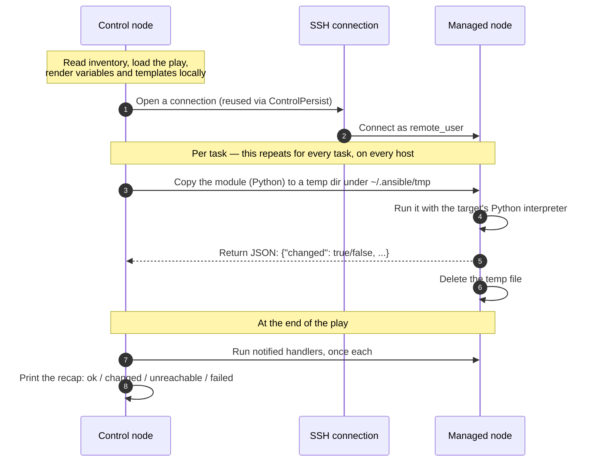
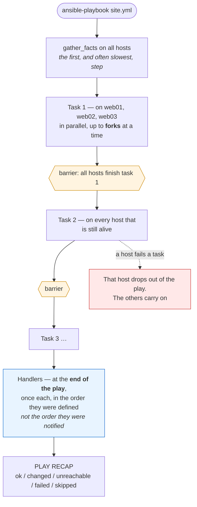
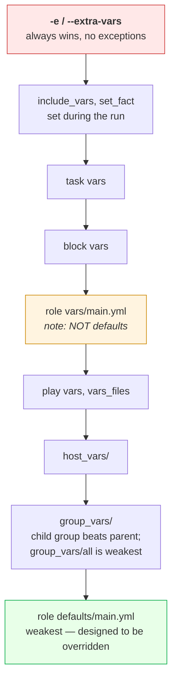
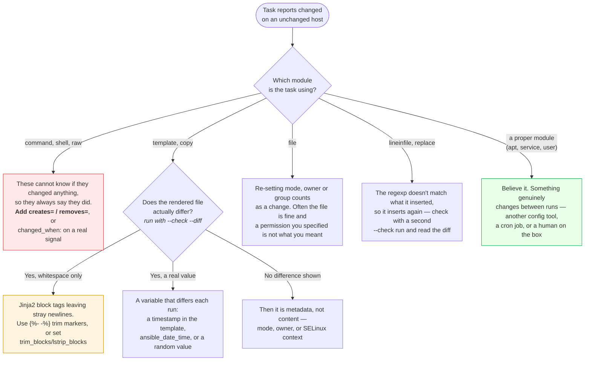

# Module 11: Ansible

> *"Terraform provisions the server. Ansible configures it."*

---

> 📋 **Command reference**: [`cheatsheet.md`](./cheatsheet.md) — every command in this module, grouped by task, with the gotchas.
>
> ⚡ **Cross-module lookup**: [Quick Reference](../QUICK-REFERENCE.md)

---

## 🎯 Why This Module Matters

Terraform creates infrastructure (VMs, networks, databases). But who installs packages, configures Nginx, deploys your app, and manages config files? **Ansible** — the agentless configuration management tool that turns manual server setup into repeatable, version-controlled automation.

**In real-world DevOps work**, you will:

- Write playbooks to configure servers consistently
- Manage fleets of servers from a single control node
- Build reusable roles for common patterns (web server, database, monitoring)
- Orchestrate multi-server deployments
- Enforce desired state across environments

---

## 📚 Table of Contents

1. [Configuration Management Concepts](#1-configuration-management-concepts)
2. [Ansible Fundamentals](#2-ansible-fundamentals)
3. [Inventory](#3-inventory)
4. [Ad-Hoc Commands](#4-ad-hoc-commands)
5. [Playbooks](#5-playbooks)
6. [Variables and Facts](#6-variables-and-facts)
7. [Roles](#7-roles)
8. [Handlers and Templates](#8-handlers-and-templates)
9. [Common Mistakes and Anti-Patterns](#9-common-mistakes-and-anti-patterns)
10. [Debugging Mindset](#10-debugging-mindset)
11. [Interview Insights](#11-interview-insights)

---

## 1. Configuration Management Concepts

### Why Configuration Management?

```
WITHOUT CONFIG MANAGEMENT:
  SSH into server 1 → install nginx → edit config → restart
  SSH into server 2 → install nginx → edit config (slightly different) → restart
  SSH into server 3 → forgot to restart
  Server 4: "Wait, did I do this one already?"
  Result: CONFIGURATION DRIFT — every server is slightly different

WITH ANSIBLE:
  Write a playbook ONCE → Run on ALL servers → Guaranteed identical config
  Run it again? → No changes (IDEMPOTENT) — only fixes what's wrong
```

### Ansible vs Other Tools

| Feature | Ansible | Chef | Puppet |
|---------|---------|------|--------|
| **Agent** | Agentless (SSH) | Agent required | Agent required |
| **Language** | YAML | Ruby DSL | Puppet DSL |
| **Learning curve** | Low | High | Medium |
| **Push/Pull** | Push (you run it) | Pull (agent polls) | Pull (agent polls) |
| **Architecture** | Simple (SSH) | Server + agents | Server + agents |
| **Best for** | DevOps, simple to medium | Complex environments | Large enterprises |

> 💡 **Why Ansible wins for DevOps:** No agents to install, YAML is easy, and it works over SSH which you already have.

---

## 2. Ansible Fundamentals

### Architecture

```
┌────────────────┐                  ┌──────────────┐
│ CONTROL NODE   │     SSH          │ MANAGED NODE │
│ (your laptop   │─────────────────▶│ (server 1)   │
│  or CI/CD)     │                  └──────────────┘
│                │     SSH          ┌──────────────┐
│ • ansible      │─────────────────▶│ (server 2)   │
│ • playbooks    │                  └──────────────┘
│ • inventory    │     SSH          ┌──────────────┐
│                │─────────────────▶│ (server 3)   │
└────────────────┘                  └──────────────┘

No agents on managed nodes — just Python + SSH
```

### What "Agentless" Actually Does

"No agent" does not mean magic over SSH. Ansible ships the code to the target for every single task, runs it, and cleans up — and knowing that explains most of the errors you will hit:



**Three things follow directly from that picture**, and each is a common failure:

| Requirement | What breaks without it | The fix |
|-------------|------------------------|---------|
| **Python on the target** | `/usr/bin/python: not found` on minimal images | Set `ansible_python_interpreter`, or use the `raw` module to bootstrap it |
| **A writable temp directory** | Tasks fail on hosts with `noexec` on `/tmp` or a read-only home | `remote_tmp` in `ansible.cfg`, or fix the mount |
| **The module returns JSON** | Anything printed to stdout by a login shell (a banner, a `.bashrc` echo) corrupts the reply and every task fails weirdly | Keep `.bashrc` silent for non-interactive shells |

⭐ **`changed: true/false` is the module's own judgement, not Ansible's.** The `apt` module knows whether it installed anything; the `command` module has no idea and therefore reports `changed` every single time. That difference is the whole of idempotency in practice, and it's why `command` and `shell` need `creates=`, `removes=`, or `changed_when:` before they belong in a playbook you run twice.

### Key Concepts

```
CONTROL NODE:   Where you run Ansible (your machine or CI/CD runner)
MANAGED NODE:   Servers being configured (targets)
INVENTORY:      List of managed nodes (IPs, hostnames, groups)
MODULE:         Unit of work (apt, yum, copy, template, service, etc.)
TASK:           One action using a module ("install nginx")
PLAY:           Group of tasks applied to a set of hosts
PLAYBOOK:       YAML file containing one or more plays
ROLE:           Reusable, structured collection of tasks/templates/vars
HANDLER:        Task that runs only when notified (restart service)
```

### Installation

```bash
# pip (recommended)
pip install ansible

# Debian/Ubuntu
sudo apt update && sudo apt install ansible

# RHEL-compatible/Fedora
sudo dnf install ansible

# Verify
ansible --version
```

---

## 3. Inventory

### Static Inventory

```ini
# inventory.ini
[webservers]
web1 ansible_host=10.0.1.10
web2 ansible_host=10.0.1.11

[databases]
db1 ansible_host=10.0.2.10

[monitoring]
monitor1 ansible_host=10.0.3.10

# Group of groups
[production:children]
webservers
databases
monitoring

# Variables for a group
[webservers:vars]
ansible_user=ubuntu
ansible_ssh_private_key_file=~/.ssh/prod-key.pem
http_port=80
```

### YAML Inventory (Alternative)

```yaml
# inventory.yml
all:
  children:
    webservers:
      hosts:
        web1:
          ansible_host: 10.0.1.10
        web2:
          ansible_host: 10.0.1.11
      vars:
        http_port: 80
    databases:
      hosts:
        db1:
          ansible_host: 10.0.2.10
```

---

## 4. Ad-Hoc Commands

### Quick One-Off Tasks

```bash
# Ping all hosts (test connectivity)
ansible all -i inventory.ini -m ping

# Run a command on all web servers
ansible webservers -i inventory.ini -m command -a "uptime"

# Install a package
ansible webservers -i inventory.ini -m apt -a "name=nginx state=present" --become

# Copy a file
ansible webservers -i inventory.ini -m copy -a "src=index.html dest=/var/www/html/"

# Restart a service
ansible webservers -i inventory.ini -m service -a "name=nginx state=restarted" --become

# Check disk space
ansible all -i inventory.ini -m command -a "df -h"

# Gather facts
ansible web1 -i inventory.ini -m setup
```

> 💡 `--become` = run with sudo. `-m` = module. `-a` = arguments.

---

## 5. Playbooks

### How a Play Runs Across Hosts

The order surprises people: Ansible does not finish one host and move to the next. It runs **task 1 on every host, waits for all of them, then task 2** — the default `linear` strategy, and the reason a single slow host holds up the entire fleet:



**Four consequences worth knowing before you write a rolling deploy:**

- **`forks` (default 5) is your parallelism**, not your host count. Fifty hosts with the default means ten sequential waves per task — raise it in `ansible.cfg` before blaming Ansible for being slow.
- **Handlers run at the end, not where they were notified.** A play that changes the config and then depends on the restart having happened needs `meta: flush_handlers`, or it tests the old process.
- **A failed host silently leaves the play**, and the recap is the only place that says so. In CI, treat any non-zero `failed` or `unreachable` as a pipeline failure — and check `any_errors_fatal` if a partial rollout is worse than none.
- **`serial: 1` turns this into a rolling deploy**: the whole play runs on one host (or batch) at a time, which is what you want with a load balancer in front. Without it, "restart nginx" happens everywhere simultaneously.

### Your First Playbook

```yaml
# webserver.yml
---
- name: Configure Web Servers
  hosts: webservers
  become: true                     # Run as root

  tasks:
    - name: Update apt cache
      apt:
        update_cache: true
        cache_valid_time: 3600     # Don't update if < 1 hour old

    - name: Install Nginx
      apt:
        name: nginx
        state: present             # Ensure installed

    - name: Start and enable Nginx
      service:
        name: nginx
        state: started
        enabled: true              # Start on boot

    - name: Deploy custom index page
      copy:
        content: |
          <h1>Hello from Ansible!</h1>
          <p>Server: {{ inventory_hostname }}</p>
          <p>IP: {{ ansible_default_ipv4.address }}</p>
        dest: /var/www/html/index.html
        owner: www-data
        group: www-data
        mode: "0644"

    - name: Ensure firewall allows HTTP on Debian/Ubuntu
      ufw:
        rule: allow
        port: "80"
        proto: tcp
      when: ansible_os_family == "Debian"

    - name: Ensure firewall allows HTTP on RHEL-compatible systems
      ansible.posix.firewalld:
        service: http
        permanent: true
        immediate: true
        state: enabled
      when: ansible_os_family == "RedHat"
```

### Running Playbooks

```bash
# Run the playbook
ansible-playbook -i inventory.ini webserver.yml

# Dry run (check mode — no changes made)
ansible-playbook -i inventory.ini webserver.yml --check

# Verbose output
ansible-playbook -i inventory.ini webserver.yml -v    # or -vv, -vvv

# Limit to specific hosts
ansible-playbook -i inventory.ini webserver.yml --limit web1

# Run with extra variables
ansible-playbook -i inventory.ini webserver.yml -e "http_port=8080"
```

### Playbook Output

```
PLAY [Configure Web Servers] ************************************************

TASK [Gathering Facts] ******************************************************
ok: [web1]
ok: [web2]

TASK [Update apt cache] *****************************************************
changed: [web1]
changed: [web2]

TASK [Install Nginx] ********************************************************
changed: [web1]
ok: [web2]              ← Already installed (idempotent!)

TASK [Start and enable Nginx] ***********************************************
ok: [web1]
ok: [web2]

TASK [Deploy custom index page] *********************************************
changed: [web1]
changed: [web2]

PLAY RECAP ******************************************************************
web1  : ok=5  changed=3  unreachable=0  failed=0  skipped=0
web2  : ok=5  changed=2  unreachable=0  failed=0  skipped=0
```

```
STATUS MEANINGS:
  ok      = Already in desired state (no change needed)
  changed = Modified to reach desired state
  failed  = Task failed (playbook stops for that host)
  skipped = Task condition was false (when: clause)
```

---

## 6. Variables and Facts

### Variable Precedence (Simplified)

```
LOWEST PRIORITY ──────────────────────────── HIGHEST PRIORITY
defaults → inventory → playbook vars → -e command line

# In practice, use:
  role defaults     → sensible defaults
  group_vars/       → environment-specific overrides
  host_vars/        → host-specific overrides
  -e "var=value"    → one-off overrides from CLI
```

Ansible has 22 precedence levels. These are the eight you will actually collide with, weakest at the bottom — the value that wins is the highest one that defines the variable:



⭐ **The trap is `defaults/` versus `vars/` inside a role**, and it catches everyone once. `defaults/main.yml` sits at the very bottom, so anything can override it — that is where a role's tunables belong. `vars/main.yml` sits *above* `group_vars` and `host_vars`, so a value you put there silently ignores the inventory the user carefully wrote. Rule of thumb: **role authors put almost everything in `defaults/`**, and reserve `vars/` for internal constants nobody should change.

**When a variable is not what you expect**, stop guessing and ask the host:

```bash
ansible web01 -m debug -a "var=app_port"          # the effective value for that host
ansible-inventory --host web01                     # every inventory var, merged
ansible-playbook site.yml --check -vvv | grep app_port
```

⚠️ **`-e` beating everything is a feature that becomes a footgun in CI.** A pipeline that passes `-e env=prod` overrides the `group_vars/staging` a developer relies on locally, so the same playbook behaves differently in the two places. Pass as few extra-vars as you can, and treat each one as part of the interface.

### Ansible Facts

```yaml
# Facts are automatically gathered about each host
- name: Show system info
  debug:
    msg: |
      Hostname: {{ ansible_hostname }}
      OS: {{ ansible_distribution }} {{ ansible_distribution_version }}
      CPU: {{ ansible_processor_cores }} cores
      RAM: {{ ansible_memtotal_mb }} MB
      IP: {{ ansible_default_ipv4.address }}
```

### Conditionals

```yaml
- name: Install on Debian-based systems
  apt:
    name: nginx
    state: present
  when: ansible_os_family == "Debian"

- name: Install on RedHat-based systems
  yum:
    name: nginx
    state: present
  when: ansible_os_family == "RedHat"
```

### Loops

```yaml
- name: Install multiple packages
  apt:
    name: "{{ item }}"
    state: present
  loop:
    - nginx
    - git
    - curl
    - htop

- name: Create multiple users
  user:
    name: "{{ item.name }}"
    groups: "{{ item.groups }}"
    state: present
  loop:
    - { name: "deployer", groups: "sudo" }
    - { name: "monitor", groups: "www-data" }
```

---

## 7. Roles

### Why Roles?

```
WITHOUT ROLES:
  One giant playbook with 200 tasks → unmaintainable

WITH ROLES:
  nginx role + app role + monitoring role → composable, reusable, testable
```

### Role Directory Structure

```
roles/
└── nginx/
    ├── tasks/
    │   └── main.yml        # Tasks to execute
    ├── handlers/
    │   └── main.yml        # Restart/reload handlers
    ├── templates/
    │   └── nginx.conf.j2   # Jinja2 config templates
    ├── files/
    │   └── index.html      # Static files to copy
    ├── vars/
    │   └── main.yml        # Role-specific variables
    ├── defaults/
    │   └── main.yml        # Default values (overridable)
    └── meta/
        └── main.yml        # Role metadata and dependencies
```

### Creating a Role

```bash
# Generate role skeleton
ansible-galaxy init roles/nginx
```

```yaml
# roles/nginx/defaults/main.yml
nginx_port: 80
nginx_server_name: localhost

# roles/nginx/tasks/main.yml
---
- name: Install Nginx
  apt:
    name: nginx
    state: present

- name: Deploy Nginx config
  template:
    src: nginx.conf.j2
    dest: /etc/nginx/sites-available/default
  notify: Restart Nginx

- name: Start Nginx
  service:
    name: nginx
    state: started
    enabled: true

# roles/nginx/handlers/main.yml
---
- name: Restart Nginx
  service:
    name: nginx
    state: restarted
```

### Using Roles in a Playbook

```yaml
# site.yml
---
- name: Configure production
  hosts: webservers
  become: true
  roles:
    - nginx
    - app
    - monitoring
```

---

## 8. Handlers and Templates

### Handlers — Run Only When Notified

```yaml
tasks:
  - name: Update Nginx config
    template:
      src: nginx.conf.j2
      dest: /etc/nginx/nginx.conf
    notify: Restart Nginx           # Only triggers if this task CHANGES

handlers:
  - name: Restart Nginx
    service:
      name: nginx
      state: restarted
    # Runs ONCE at end of play, even if notified multiple times
```

### Jinja2 Templates

```nginx
# templates/nginx.conf.j2
server {
    listen {{ nginx_port }};
    server_name {{ nginx_server_name }};

    location / {
        proxy_pass http://127.0.0.1:{{ app_port }};
        proxy_set_header Host $host;
        proxy_set_header X-Real-IP $remote_addr;
    }


    listen 443 ssl;
    ssl_certificate     /etc/ssl/{{ domain }}.crt;
    ssl_certificate_key /etc/ssl/{{ domain }}.key;


    access_log /var/log/nginx/{{ nginx_server_name }}_access.log;
    error_log  /var/log/nginx/{{ nginx_server_name }}_error.log;
}
```

---

## 9. Common Mistakes and Anti-Patterns

### ❌ Not Using Idempotent Modules

```yaml
# BAD: shell/command are NOT idempotent (runs every time)
- name: Install package
  shell: apt-get install -y nginx

# GOOD: apt module is idempotent (skips if already installed)
- name: Install package
  apt:
    name: nginx
    state: present
```

### ❌ Hardcoding Values

```yaml
# BAD
- name: Deploy config
  template:
    src: app.conf.j2
    dest: /etc/myapp/app.conf
  vars:
    db_host: "10.0.2.15"    # What about staging?

# GOOD: Use group_vars
# group_vars/production.yml
db_host: "10.0.2.15"
# group_vars/staging.yml
db_host: "10.0.2.25"
```

### ❌ Not Using Handlers

```yaml
# BAD: Restarts Nginx every single run (even if nothing changed)
- name: Deploy config
  template:
    src: nginx.conf.j2
    dest: /etc/nginx/nginx.conf

- name: Restart Nginx
  service:
    name: nginx
    state: restarted

# GOOD: Only restarts when config actually changes
- name: Deploy config
  template:
    src: nginx.conf.j2
    dest: /etc/nginx/nginx.conf
  notify: Restart Nginx
```

---

## 10. Debugging Mindset

### Ansible Troubleshooting

```
Playbook failed?
│
├─ 1. READ THE ERROR MESSAGE
│     └─ Ansible errors show exactly which task, host, and module failed
│
├─ 2. CHECK CONNECTIVITY
│     ├─ ansible all -m ping (SSH working?)
│     └─ SSH key permissions? (chmod 400)
│
├─ 3. RUN IN VERBOSE MODE
│     └─ ansible-playbook site.yml -vvv
│
├─ 4. RUN IN CHECK MODE (dry run)
│     └─ ansible-playbook site.yml --check --diff
│
├─ 5. DEBUG SPECIFIC VARIABLES
│     └─ Add: - debug: var=ansible_default_ipv4
│
└─ 6. COMMON ISSUES
      ├─ Permission denied → add --become
      ├─ Module not found → check ansible version
      ├─ Template error → validate Jinja2 syntax
      └─ Host unreachable → check inventory, SSH config
```

### 🔧 Troubleshooting: "It Reports changed Every Single Run"

A playbook that is never green on a second run has lost the property you adopted Ansible for. You can no longer tell "something drifted" from "this playbook always says that":



⭐ **`--check --diff` is the tool for this, and it answers the question in one run.** It shows you the exact bytes Ansible intends to change, which instantly separates "a real drift" from "a trailing newline in a template" — the two causes that look identical in the recap.

⚠️ **Never fix this with `changed_when: false` unless the task genuinely cannot change anything** (a read-only check, a `curl` for a health probe). Slapping it on a task that *does* change things buys you a green run and throws away the signal — you'll then need `--diff` to answer questions the recap used to answer for free.

---

## 11. Interview Insights

**Q: What is Ansible and why is it agentless?**
> Ansible automates configuration management, application deployment, and orchestration. It's agentless — it connects to managed nodes over SSH (Linux) or WinRM (Windows) and runs Python modules remotely. No daemon or agent to install, update, or secure on every server. This simplifies architecture and reduces the attack surface.

**Q: What is idempotency and why does it matter?**
> Idempotency means running a playbook multiple times produces the same result — no unintended side effects. If Nginx is already installed, the `apt` module reports "ok" and skips it. This is critical because you should be able to run your playbooks any time without fear of breaking things. It's what makes Ansible safe to run repeatedly.

**Q: Explain the difference between roles and playbooks.**
> A playbook is a YAML file with plays and tasks — the "script" you run. A role is a structured, reusable collection of tasks, templates, handlers, and variables. Playbooks use roles. Think of playbooks as the recipe and roles as pre-made ingredients. You compose roles to build playbooks for different environments.

**Q: How does Ansible differ from Terraform?**
> Terraform provisions infrastructure (creates VMs, networks, databases) — it's about "what exists." Ansible configures infrastructure (installs packages, manages config files, deploys apps) — it's about "what's running on it." In practice, you use Terraform to create an EC2 instance and Ansible to configure it. They're complementary, not competing.

**Q: How do you manage secrets in Ansible?**
> Use Ansible Vault to encrypt sensitive variables (passwords, API keys). Run `ansible-vault encrypt vars/secrets.yml` to encrypt a file. Reference it normally in playbooks — Ansible decrypts at runtime with `--ask-vault-pass` or a vault password file. Never commit unencrypted secrets.

---

## 🧪 Labs and Projects

Read the sections above first, then work through these **in order**. Every lab ends with a 🧨 **Break It** section — those are not optional; they are where the debugging skill actually comes from.

| # | Lab | What you'll do |
|---|-----|----------------|
| 1 | **[Ansible Basics](./labs/lab-01-ansible-basics.md)** | Write and run Ansible playbooks against Docker containers as managed nodes. |
| 2 | **[Roles, Vault, and Testing](./labs/lab-02-roles-vault-and-testing.md)** | Turn a working playbook into something a team can maintain. |

**Portfolio project:**

- [Project: Idempotent Service Configuration](./projects/project-01-idempotent-service-config.md) — Use Ansible to configure a service on a local VM, container, or remote host in a repeatable way.

**Reference code** for every lab: [`code/`](./code/) — real files, validated in CI.

---

## ✅ Self-Check

Answer these from memory before you expand them. If more than two give you trouble, re-read the sections they come from — the labs assume this material is solid.

<details>
<summary><strong>1. Ansible is agentless — so what does a managed node actually need?</strong></summary>

SSH access and Python. The control node copies a module over, runs it, and removes it. Nothing to install, upgrade, or open a firewall port for, which is the main reason Ansible gets adopted into environments that will not tolerate an agent.

</details>

<details>
<summary><strong>2. What does idempotence mean here, and why do `command` and `shell` break it?</strong></summary>

A module converges toward a declared state, so the second run reports `ok` rather than `changed`. Raw commands cannot know whether the work was already done, so they always report `changed` unless you add `creates:` or `changed_when:` — and since `changed` is what triggers handlers, a careless `shell` task restarts your services on every run.

</details>

<details>
<summary><strong>3. When does a handler run?</strong></summary>

Only if a task that notified it reported `changed`, and by default at the end of the play rather than at the point of notification. That is precisely how you restart a service once after any of five configuration files changed — and nothing at all when none of them did.

</details>

<details>
<summary><strong>4. Where does a variable's value come from when it is defined in four places?</strong></summary>

Precedence runs roughly from role defaults (weakest) through inventory, group_vars, host_vars, and play vars, up to `-e` extra vars, which beat everything. The practical rule: overridable defaults go in `defaults/`, environment differences in `group_vars/`, and `-e` is for a deliberate one-off — not for normal configuration.

</details>

<details>
<summary><strong>5. What does the role directory structure buy you?</strong></summary>

Fixed places for `tasks/`, `handlers/`, `templates/`, `files/`, `defaults/`, `vars/`, and `meta/`, so anyone can find and reuse a role without reading all of it. The distinction that matters: `defaults/` is the weakest precedence and meant to be overridden, `vars/` is high precedence and meant not to be.

</details>

<details>
<summary><strong>6. How do you rehearse a play safely?</strong></summary>

`--check` runs it without making changes and `--diff` shows what would change in files and templates. Modules that cannot predict their result skip in check mode, and a play built out of `shell` tasks cannot be dry-run at all — which is a design smell, not a limitation of the tool.

</details>

---

## Practical Checkpoint

Before moving on, you should be able to:

- Write an inventory and playbook that configure a host repeatably.
- Use variables, handlers, templates, and idempotent tasks.
- Validate a configuration change and roll back or fix a broken service.

Portfolio evidence to keep:

- Inventory, playbook, and template files.
- Before/after validation output.
- Notes from one failed playbook run and the fix.

Suggested project: [Idempotent Service Configuration](./projects/project-01-idempotent-service-config.md)

---

## ➡️ What's Next?

With Terraform provisioning infrastructure and Ansible configuring it, you're ready for the most powerful orchestration tool — Kubernetes.

**[Module 12: Kubernetes →](../12-kubernetes/)**

---

<div align="center">

**Module 11 Complete** ✅

[← Back to Terraform](../10-terraform/) | [📋 Cheat Sheet](./cheatsheet.md) | [Next: Kubernetes →](../12-kubernetes/)

</div>
