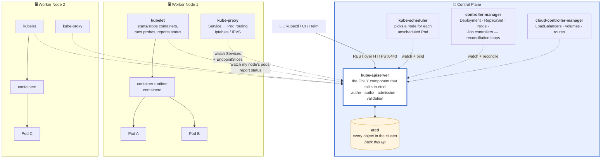
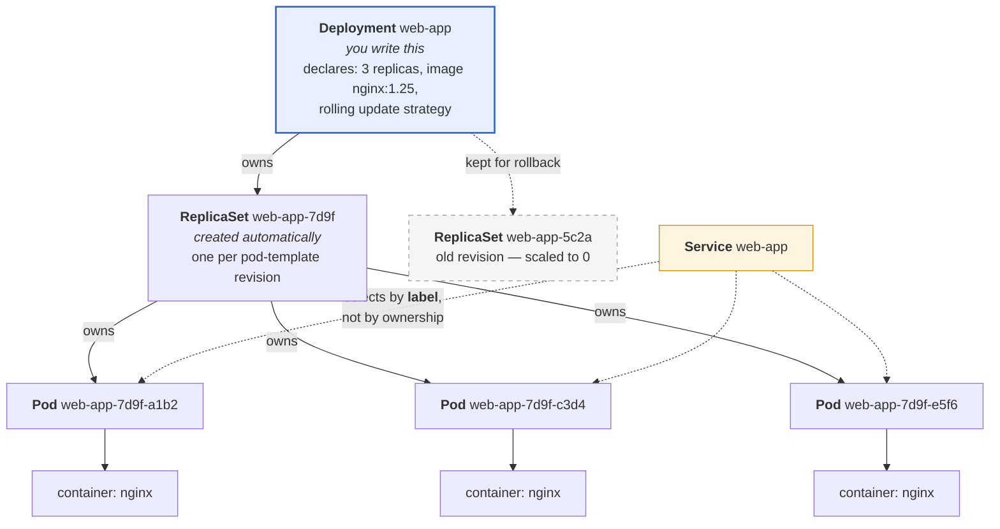
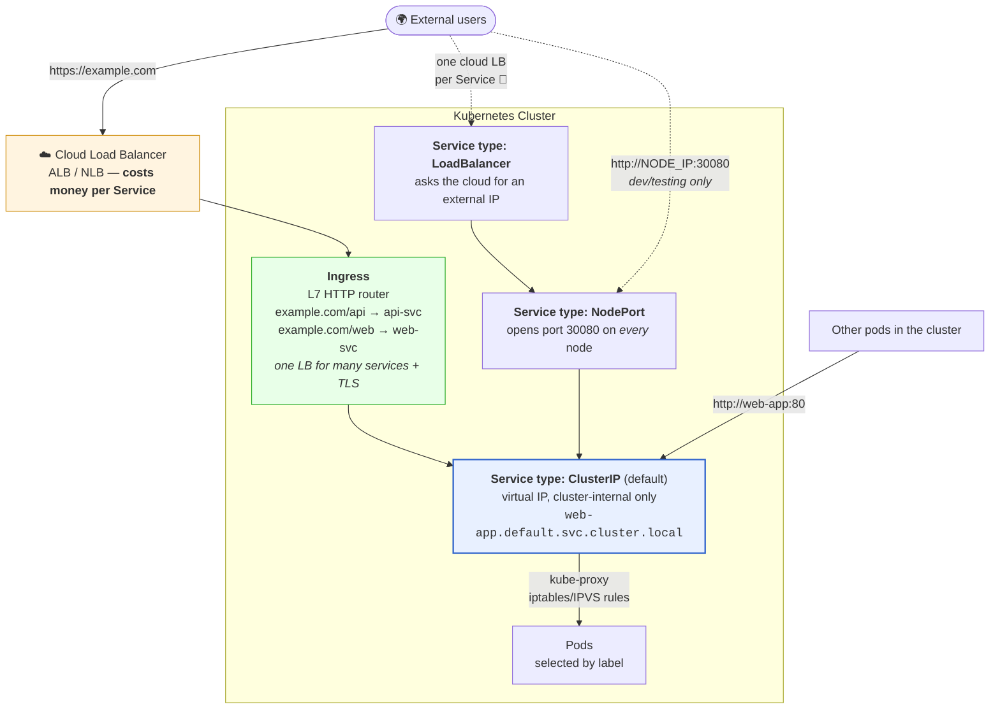
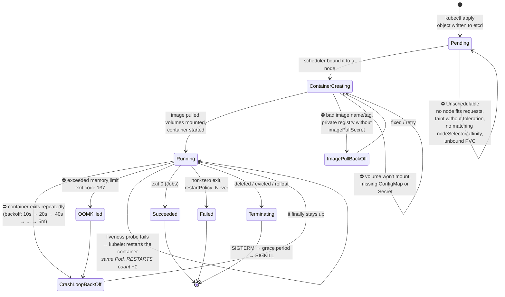
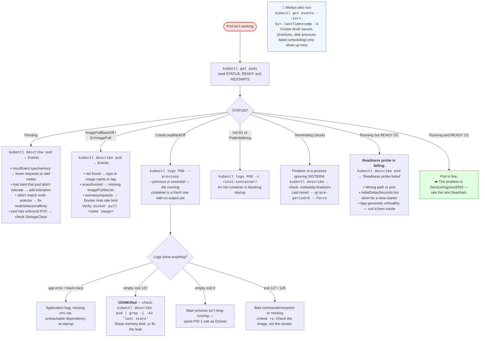
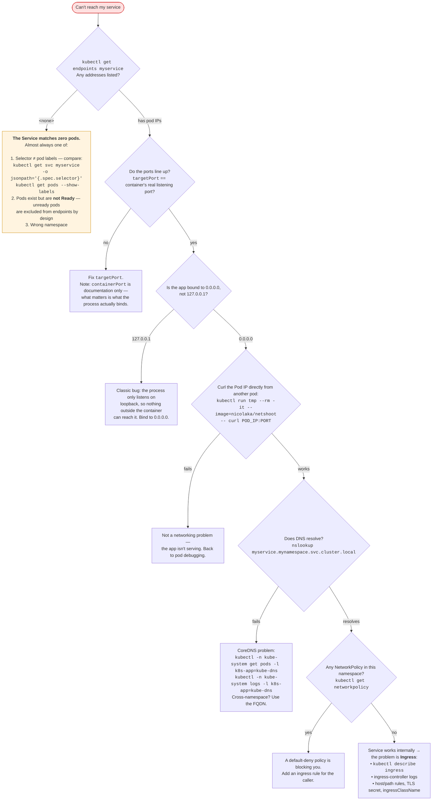

# Module 12: Kubernetes

> *"Kubernetes doesn't make simple things simple. It makes impossible things possible." — Kelsey Hightower*

---

> 📋 **Command reference**: [`cheatsheet.md`](./cheatsheet.md) — every command in this module, grouped by task, with the gotchas.
>
> ⚡ **Cross-module lookup**: [Quick Reference](../QUICK-REFERENCE.md)

---

## 🎯 Why This Module Matters

You can containerize an app with Docker. But how do you run 50 containers across 10 servers, handle failures, scale on demand, and do zero-downtime deployments? **Kubernetes** — the industry-standard container orchestration platform.

**In real-world DevOps work**, you will:

- Deploy applications as Pods, Deployments, and Services
- Scale applications horizontally based on load
- Perform zero-downtime rolling updates and rollbacks
- Configure networking, storage, and secrets
- Debug failing pods and cluster issues
- Manage Kubernetes with Helm charts

---

## 📚 Table of Contents

1. [Why Kubernetes?](#1-why-kubernetes)
2. [Architecture](#2-architecture)
3. [Core Objects](#3-core-objects)
4. [kubectl — The Essential Tool](#4-kubectl--the-essential-tool)
5. [Deployments and Scaling](#5-deployments-and-scaling)
6. [Services and Networking](#6-services-and-networking)
7. [ConfigMaps and Secrets](#7-configmaps-and-secrets)
8. [Storage](#8-storage)
9. [Helm — Package Manager](#9-helm--package-manager)
10. [Common Mistakes and Anti-Patterns](#10-common-mistakes-and-anti-patterns)
11. [Debugging Mindset](#11-debugging-mindset)
12. [Interview Insights](#12-interview-insights)

---

## 1. Why Kubernetes?

### The Problem It Solves

```
WITHOUT ORCHESTRATION:
  "Container crashed at 3am" → You get paged, manually restart
  "Traffic spiked 10x" → You manually spin up more containers
  "New version deploy" → Stop old, start new → DOWNTIME
  "Server died" → All containers on that server are gone

WITH KUBERNETES:
  Container crashed → K8s auto-restarts it (self-healing)
  Traffic spiked → K8s auto-scales (HPA)
  New version → Rolling update (zero downtime)
  Server died → K8s reschedules containers to healthy nodes
```

### When to Use Kubernetes

```
USE K8S WHEN:
  ✅ Running multiple microservices
  ✅ Need auto-scaling and self-healing
  ✅ Multiple environments (dev, staging, prod)
  ✅ Team size > 5 engineers
  ✅ High availability is critical

DON'T USE K8S WHEN:
  ❌ Single monolithic app
  ❌ Small team (1-3 people)
  ❌ Simple deployment needs (use Docker Compose)
  ❌ You don't have the expertise to operate it
```

---

## 2. Architecture

### Cluster Components



> **💡 The one idea that explains all of Kubernetes**: nothing gives orders. Every component **watches the API server** for the state it cares about and works to close the gap between desired and actual. `kubectl apply` doesn't create a pod — it writes a record to etcd, and then a chain of independent controllers notices and reacts. This is why the answer to "why isn't my thing running?" is always `kubectl describe` → **read the events**: the events are the controllers telling you where the chain stalled.
>
> Two operational corollaries: **etcd is the entire cluster** — lose it unbacked-up and the cluster is gone; and **the API server is the only path to etcd**, which is why API server availability, not node count, defines your control-plane SLO.

### Component Roles

| Component | Role |
|-----------|------|
| **API Server** | Front door to the cluster. kubectl talks to this |
| **etcd** | Key-value database storing ALL cluster state |
| **Scheduler** | Decides which node to place a new pod on |
| **Controller Manager** | Ensures desired state = actual state (reconciliation loop) |
| **kubelet** | Agent on each node — manages pods on that node |
| **kube-proxy** | Networking — routes traffic to the right pods |

---

## 3. Core Objects

### Pod — Smallest Deployable Unit

```yaml
# pod.yml — You rarely create Pods directly (use Deployments)
apiVersion: v1
kind: Pod
metadata:
  name: nginx
  labels:
    app: nginx
spec:
  containers:
    - name: nginx
      image: nginx:1.25
      ports:
        - containerPort: 80
      resources:
        requests:
          memory: "64Mi"
          cpu: "100m"
        limits:
          memory: "128Mi"
          cpu: "250m"
```

### Deployment — Manages Pods

```yaml
# deployment.yml
apiVersion: apps/v1
kind: Deployment
metadata:
  name: web-app
  labels:
    app: web-app
spec:
  replicas: 3                          # Run 3 copies
  selector:
    matchLabels:
      app: web-app
  template:                            # Pod template
    metadata:
      labels:
        app: web-app
    spec:
      containers:
        - name: web
          image: nginx:1.25
          ports:
            - containerPort: 80
          resources:
            requests:
              memory: "64Mi"
              cpu: "100m"
            limits:
              memory: "128Mi"
              cpu: "250m"
          livenessProbe:               # Is the container alive?
            httpGet:
              path: /
              port: 80
            initialDelaySeconds: 5
            periodSeconds: 10
          readinessProbe:              # Is it ready for traffic?
            httpGet:
              path: /
              port: 80
            initialDelaySeconds: 3
            periodSeconds: 5
```

#### Who Owns What

You create a Deployment. Kubernetes creates everything below it. Knowing this chain tells you **which object to edit** and **which one to look at when something's wrong**.



Three rules that follow from this picture:

1. **Never edit a Pod or a ReplicaSet directly.** The controller above will overwrite you, or your change vanishes on the next rollout. Edit the Deployment.
2. **Deleting a Pod doesn't remove it** — the ReplicaSet immediately makes a new one. That's the feature. To actually stop it, scale or delete the Deployment.
3. **The Service is connected by labels only**, not ownership. This is why a typo in `spec.selector` produces a Service with zero endpoints and a very confusing outage. Check it with `kubectl get endpoints web-app` — if it's `<none>`, your selector doesn't match your pod labels.

### Service — Expose Pods to Network

```yaml
# service.yml
apiVersion: v1
kind: Service
metadata:
  name: web-app
spec:
  selector:
    app: web-app                       # Routes to pods with this label
  type: ClusterIP                      # Internal only (default)
  ports:
    - port: 80                         # Service port
      targetPort: 80                   # Container port
---
# NodePort — accessible from outside cluster
apiVersion: v1
kind: Service
metadata:
  name: web-app-external
spec:
  selector:
    app: web-app
  type: NodePort
  ports:
    - port: 80
      targetPort: 80
      nodePort: 30080                  # Accessible at <NodeIP>:30080
---
# LoadBalancer — cloud provider creates an external LB
apiVersion: v1
kind: Service
metadata:
  name: web-app-lb
spec:
  selector:
    app: web-app
  type: LoadBalancer
  ports:
    - port: 80
      targetPort: 80
```

### Service Types

The types **stack**: LoadBalancer builds on NodePort, which builds on ClusterIP. Each one adds a layer of external reach on top of the last.



| Type | Reachable from | Cost | Use it for |
|------|----------------|------|------------|
| **ClusterIP** | Inside the cluster only | Free | Service-to-service. **The default and the right answer 90% of the time.** |
| **NodePort** | `<any-node-IP>:30000–32767` | Free | Local clusters, quick tests, bare metal behind your own LB |
| **LoadBalancer** | Public internet | 💸 One cloud LB **per Service** | A single TCP/UDP service that must be exposed directly |
| **Ingress** | Public internet, HTTP/S only | 💸 One cloud LB **for all services** | Normal web traffic — host/path routing and TLS termination |
| **ExternalName** | n/a — CNAME to an outside host | Free | Pointing an in-cluster name at an external database |

> **💡 The cost trap**: giving ten microservices `type: LoadBalancer` provisions ten cloud load balancers and ten bills. Use one Ingress in front of ten ClusterIP Services instead. Ingress is HTTP/S only, though — non-HTTP protocols (Postgres, gRPC streaming over raw TCP, game servers) still need LoadBalancer or a Gateway API implementation.

---

## 4. kubectl — The Essential Tool

### Must-Know Commands

```bash
# ─── VIEWING RESOURCES ───
kubectl get pods                        # List pods
kubectl get pods -o wide                # Show node, IP
kubectl get deployments                 # List deployments
kubectl get services                    # List services
kubectl get all                         # Everything in namespace
kubectl get nodes                       # List cluster nodes

# ─── DETAILED INFO ───
kubectl describe pod <name>             # Detailed pod info + events
kubectl describe deployment <name>      # Deployment details
kubectl logs <pod-name>                 # Container logs
kubectl logs <pod-name> -f              # Follow logs (tail)
kubectl logs <pod-name> --previous      # Logs from crashed container

# ─── CREATING / APPLYING ───
kubectl apply -f deployment.yml         # Create/update from file
kubectl apply -f ./k8s/                 # Apply all files in directory
kubectl delete -f deployment.yml        # Delete resources from file

# ─── SCALING ───
kubectl scale deployment web-app --replicas=5

# ─── UPDATES ───
kubectl set image deployment/web-app web=nginx:1.26
kubectl rollout status deployment/web-app
kubectl rollout undo deployment/web-app   # Rollback!
kubectl rollout history deployment/web-app

# ─── DEBUGGING ───
kubectl exec -it <pod-name> -- /bin/bash  # Shell into pod
kubectl port-forward <pod-name> 8080:80   # Local port forwarding
kubectl top pods                          # Resource usage
kubectl get events --sort-by='.lastTimestamp'
```

### Namespaces

```bash
# Namespaces isolate resources (like folders)
kubectl get namespaces
kubectl create namespace staging
kubectl get pods -n staging              # Pods in staging namespace
kubectl apply -f app.yml -n staging      # Deploy to staging

# Common namespaces:
#   default     — where your stuff goes if unspecified
#   kube-system — Kubernetes system components
#   kube-public — Publicly readable resources
```

---

## 5. Deployments and Scaling

### Rolling Update (Default)

```
Deployment update: nginx:1.25 → nginx:1.26

Step 1: [v1] [v1] [v1]           ← 3 pods running v1
Step 2: [v1] [v1] [v1] [v2]     ← New v2 pod created
Step 3: [v1] [v1] [v2] [v2]     ← Old v1 pod terminated
Step 4: [v1] [v2] [v2] [v2]     ← Continue rolling
Step 5: [v2] [v2] [v2]          ← All running v2

Zero downtime — at least some pods always running!
```

### Update Strategy Configuration

```yaml
spec:
  strategy:
    type: RollingUpdate
    rollingUpdate:
      maxSurge: 1            # Max extra pods during update
      maxUnavailable: 0      # Don't kill old before new is ready
```

### Horizontal Pod Autoscaler (HPA)

```yaml
apiVersion: autoscaling/v2
kind: HorizontalPodAutoscaler
metadata:
  name: web-app
spec:
  scaleTargetRef:
    apiVersion: apps/v1
    kind: Deployment
    name: web-app
  minReplicas: 2
  maxReplicas: 10
  metrics:
    - type: Resource
      resource:
        name: cpu
        target:
          type: Utilization
          averageUtilization: 70    # Scale up when CPU > 70%
```

```bash
# Or create via CLI
kubectl autoscale deployment web-app --min=2 --max=10 --cpu-percent=70
```

---

## 6. Services and Networking

### Ingress — HTTP Routing

```yaml
apiVersion: networking.k8s.io/v1
kind: Ingress
metadata:
  name: app-ingress
  annotations:
    nginx.ingress.kubernetes.io/rewrite-target: /
spec:
  rules:
    - host: myapp.example.com
      http:
        paths:
          - path: /api
            pathType: Prefix
            backend:
              service:
                name: api-service
                port:
                  number: 80
          - path: /
            pathType: Prefix
            backend:
              service:
                name: web-service
                port:
                  number: 80
```

### DNS Inside the Cluster

```
Every Service gets a DNS name:
  <service-name>.<namespace>.svc.cluster.local

  web-app.default.svc.cluster.local
  database.production.svc.cluster.local

  Short form (same namespace): web-app
  Cross-namespace: web-app.other-namespace
```

---

## 7. ConfigMaps and Secrets

### ConfigMap — Non-Sensitive Configuration

```yaml
apiVersion: v1
kind: ConfigMap
metadata:
  name: app-config
data:
  APP_ENV: "production"
  LOG_LEVEL: "info"
  DATABASE_HOST: "db.default.svc.cluster.local"
  config.json: |
    {
      "feature_flags": {
        "new_ui": true
      }
    }
---
# Use in a Deployment
spec:
  containers:
    - name: app
      envFrom:
        - configMapRef:
            name: app-config        # All keys as env vars
      volumeMounts:
        - name: config-volume
          mountPath: /app/config
  volumes:
    - name: config-volume
      configMap:
        name: app-config
        items:
          - key: config.json
            path: config.json       # Mounted as file
```

### Secret — Sensitive Data

```bash
# Create from CLI
kubectl create secret generic db-creds \
  --from-literal=DB_USER=admin \
  --from-literal=DB_PASS=supersecret

# Create from YAML (values must be base64 encoded)
echo -n 'admin' | base64        # YWRtaW4=
echo -n 'supersecret' | base64  # c3VwZXJzZWNyZXQ=
```

```yaml
apiVersion: v1
kind: Secret
metadata:
  name: db-creds
type: Opaque
data:
  DB_USER: YWRtaW4=              # base64 encoded
  DB_PASS: c3VwZXJzZWNyZXQ=
---
# Use in a Deployment
spec:
  containers:
    - name: app
      env:
        - name: DB_USER
          valueFrom:
            secretKeyRef:
              name: db-creds
              key: DB_USER
        - name: DB_PASS
          valueFrom:
            secretKeyRef:
              name: db-creds
              key: DB_PASS
```

> ⚠️ **Kubernetes Secrets are NOT encrypted by default** — they're base64 encoded (not encryption!). Enable encryption at rest or use external secret stores (Vault, AWS Secrets Manager).

---

## 8. Storage

### PersistentVolume and PersistentVolumeClaim

```yaml
# PVC — request storage
apiVersion: v1
kind: PersistentVolumeClaim
metadata:
  name: db-storage
spec:
  accessModes:
    - ReadWriteOnce               # One node can mount
  resources:
    requests:
      storage: 10Gi
  storageClassName: standard      # Cloud provider manages provisioning
---
# Use in a Pod
spec:
  containers:
    - name: postgres
      image: postgres:15
      volumeMounts:
        - name: db-data
          mountPath: /var/lib/postgresql/data
  volumes:
    - name: db-data
      persistentVolumeClaim:
        claimName: db-storage
```

---

## 9. Helm — Package Manager

### Why Helm?

```
WITHOUT HELM:
  10 YAML files per app × 3 environments = 30 files to maintain
  Copy-paste, find-and-replace "staging" → "production" 😱

WITH HELM:
  1 chart (template) + values files per environment
  helm install myapp ./chart -f prod-values.yml
```

### Helm Basics

```bash
# Install Helm
curl https://raw.githubusercontent.com/helm/helm/main/scripts/get-helm-3 | bash

# Add a chart repository
helm repo add bitnami https://charts.bitnami.com/bitnami
helm repo update

# Search for charts
helm search repo nginx

# Install a chart
helm install my-nginx bitnami/nginx

# List installed releases
helm list

# Upgrade with new values
helm upgrade my-nginx bitnami/nginx --set replicaCount=3

# Rollback
helm rollback my-nginx 1

# Uninstall
helm uninstall my-nginx
```

### Chart Structure

```
my-app/
├── Chart.yaml          # Chart metadata (name, version)
├── values.yaml         # Default configuration values
├── templates/
│   ├── deployment.yaml # Deployment template with {{ .Values.* }}
│   ├── service.yaml    # Service template
│   ├── ingress.yaml    # Ingress template
│   └── _helpers.tpl    # Template helper functions
└── charts/             # Sub-chart dependencies
```

---

## 10. Common Mistakes and Anti-Patterns

### ❌ No Resource Limits

```yaml
# BAD: Pod can consume unlimited resources → starves other pods
containers:
  - name: app
    image: myapp:latest

# GOOD: Set requests AND limits
containers:
  - name: app
    image: myapp:v1.2.3
    resources:
      requests:
        memory: "128Mi"
        cpu: "100m"
      limits:
        memory: "256Mi"
        cpu: "500m"
```

### ❌ Using `latest` Tag

```yaml
# BAD: What version is "latest"? Different on every pull
image: myapp:latest

# GOOD: Pin to a specific version
image: myapp:v1.2.3
# or SHA: myapp@sha256:abc123...
```

### ❌ No Health Checks

```yaml
# BAD: K8s can't tell if app is healthy → sends traffic to broken pods

# GOOD: Liveness + Readiness probes
livenessProbe:
  httpGet:
    path: /healthz
    port: 8080
  initialDelaySeconds: 10
readinessProbe:
  httpGet:
    path: /ready
    port: 8080
  initialDelaySeconds: 5
```

### ❌ Secrets in ConfigMaps

```
BAD:  Database password in a ConfigMap (visible to anyone)
GOOD: Use Kubernetes Secrets + external secret management (Vault)
```

---

## 11. Debugging Mindset

### The Pod Lifecycle

Before you can debug a pod, you need to know **which stage it is stuck at**. Each stalled state has a different owner and a different fix.



> **💡 Ready ≠ Running.** A pod shows `1/1 Running` only when its **readiness** probe passes. `0/1 Running` means the container is up but failing readiness — so the Service is deliberately not sending it traffic. That's the single most misread line in `kubectl get pods`.

### K8s Debugging Framework



### Service Not Reachable?

The pod is healthy but nothing can reach it. Work **outside-in**, and check `endpoints` early — it splits the problem in half.



> **💡 `kubectl get endpoints` is the fastest triage command in Kubernetes.** Empty means the problem is *above* the Service — labels or readiness. Populated means the problem is *below* it — ports, binding, DNS, policy, or ingress. One command, half the search space gone.

### `kubectl debug` — Debugging Minimal and Distroless Images

`kubectl exec` only works if the container has a shell. Modern production images (distroless, scratch, Alpine-based) often have **no shell, no curl, no tools at all**. `kubectl debug` (GA since Kubernetes 1.25) solves this by attaching an **ephemeral debug container** to a running pod.

```bash
# Problem: Your production pod uses a distroless image — no shell inside
kubectl exec -it my-pod -- /bin/sh
# Error: OCI runtime exec failed: exec failed: unable to start container process

# Solution: Attach a debug container with tools to the running pod
kubectl debug -it my-pod --image=busybox:latest --target=my-container
# --image     = the debug image (busybox, nicolaka/netshoot, ubuntu)
# --target    = the container to share process namespace with (see its processes)
# You're now inside a debug container with tools, alongside your running app

# Inside the debug container, you can:
#   ps aux              → see processes in the target container
#   cat /proc/1/environ → read environment variables of the app process
#   wget localhost:8080  → test the app internally
#   nslookup myservice   → test DNS resolution

# For network debugging, use nicolaka/netshoot (has curl, dig, tcpdump, etc.)
kubectl debug -it my-pod --image=nicolaka/netshoot --target=my-container

# Debug a node (creates a privileged pod on the node)
kubectl debug node/my-node -it --image=ubuntu
# Useful for: checking node disk, checking kubelet logs, host networking

# Create a copy of the pod with a different command (for crash loops)
kubectl debug my-pod -it --copy-to=my-pod-debug --container=my-container -- /bin/sh
# This creates a copy of the pod where you can override the entrypoint
```

> 💡 **In production, `kubectl debug` is often the ONLY way to troubleshoot** distroless images (common in Go/Java microservices). Learn to reach for it when `exec` fails.

---

## 12. Interview Insights

**Q: Explain Kubernetes architecture.**
> A K8s cluster has a control plane and worker nodes. The control plane runs the API server (entry point), etcd (state store), scheduler (pod placement), and controller manager (reconciliation loops). Worker nodes run kubelet (manages pods), kube-proxy (networking), and the container runtime. Users interact via kubectl which talks to the API server.

**Q: What's the difference between a Pod and a Deployment?**
> A Pod is the smallest deployable unit — one or more containers that share networking and storage. A Deployment manages Pods — it ensures the desired number of replicas are running, handles rolling updates, and enables rollbacks. You almost never create Pods directly; you create Deployments.

**Q: How does Kubernetes handle a node failure?**
> When a node stops responding, the controller manager detects it via the kubelet heartbeat. After a timeout (default 5 minutes), pods on that node are marked for rescheduling. The scheduler places them on healthy nodes. If using Deployments, the replica count is maintained automatically. This is self-healing.

**Q: Explain the difference between ClusterIP, NodePort, and LoadBalancer.**
> ClusterIP is internal-only — services talk to each other within the cluster. NodePort exposes a service on every node's IP at a static port (30000-32767) — accessible from outside. LoadBalancer integrates with a cloud provider to create an external load balancer that routes to the service. In production, you typically use LoadBalancer or Ingress.

**Q: How do you do zero-downtime deployments in Kubernetes?**
> Use Deployments with RollingUpdate strategy. Set maxUnavailable to 0 so no old pods are killed until new ones are ready. Add readiness probes so traffic only goes to pods that are actually ready. K8s creates new pods, waits for readiness, then terminates old pods — users see no interruption.

**Q: What is a Helm chart?**
> Helm is a package manager for Kubernetes. A chart is a collection of templated YAML manifests with configurable values. Instead of maintaining separate YAML files for each environment, you have one chart with different values files (dev.yaml, prod.yaml). Helm also handles versioning, upgrades, and rollbacks of deployments.

---

## 🧪 Labs and Projects

Read the sections above first, then work through these **in order**. Every lab ends with a 🧨 **Break It** section — those are not optional; they are where the debugging skill actually comes from.

| # | Lab | What you'll do |
|---|-----|----------------|
| 1 | **[Kubernetes Basics](./labs/lab-01-kubernetes-basics.md)** | Set up a local Kubernetes cluster, deploy applications, expose them with Services, scale horizontally, perform rolling updates and rollbacks — the… |
| 2 | **[Configuration and Health](./labs/lab-02-configuration-and-health.md)** | Separate configuration from code the way Kubernetes intends, and make your workloads honestly report their own health. |
| 3 | **[Services, Ingress, and Network Policy](./labs/lab-03-networking-and-ingress.md)** | Understand how a packet actually reaches a pod. |
| 4 | **[Scaling and Resource Tuning](./labs/lab-04-scaling-and-resources.md)** | Get resource requests and limits right — and learn what each kind of "wrong" looks like from the outside. |
| 5 | **[RBAC and Pod Security](./labs/lab-05-rbac-and-security.md)** | Lock down a cluster the way a real one is locked down. |
| 6 | **[GitOps with Argo CD](./labs/lab-06-gitops-argocd.md)** | Stop deploying with `kubectl` — put a workload's desired state in Git and let a controller inside the cluster reconcile toward it. |

**Portfolio project:**

- [Project: Kubernetes Rollout and Rollback](./projects/project-01-rollout-rollback.md) — Deploy a small application to Kubernetes, update it, intentionally break it, and recover with a rollback.

**Reference code** for every lab: [`code/`](./code/) — real files, validated in CI.

---

## ✅ Self-Check

Answer these from memory before you expand them. If more than two give you trouble, re-read the sections they come from — the labs assume this material is solid.

<details>
<summary><strong>1. What does each control plane component do?</strong></summary>

The API server is the only component that talks to etcd, and every change goes through it. etcd stores cluster state. The scheduler decides which node an unassigned pod lands on. The controller manager runs the loops that drive actual state toward desired. On each node, the kubelet starts and watches containers and kube-proxy programs service routing.

</details>

<details>
<summary><strong>2. What follows from Kubernetes being a reconciliation loop rather than a command runner?</strong></summary>

You declare desired state and controllers work continuously to match it. Delete a pod owned by a Deployment and you get a replacement — the pod was never the thing you asked for. To stop something you change the desired state, and if it keeps coming back, some controller still wants it.

</details>

<details>
<summary><strong>3. Deployment, StatefulSet, or DaemonSet?</strong></summary>

Deployment for interchangeable stateless replicas. StatefulSet when pods need stable identity, stable per-pod storage, and ordered rollout — databases and quorum systems. DaemonSet when you want exactly one pod per node, which is what agents, log shippers, and CNI plugins need.

</details>

<details>
<summary><strong>4. A pod is in CrashLoopBackOff. What are your first three commands?</strong></summary>

`kubectl describe pod` for events, last state, and exit code; `kubectl logs --previous` for what the crashed container printed before it died; then look at the probes and resource limits. Exit code 137 means OOMKilled, so raise the memory limit or fix the leak. A liveness probe that fails during a slow startup produces the identical symptom.

</details>

<details>
<summary><strong>5. Liveness, readiness, and startup probes — what breaks if you confuse them?</strong></summary>

Liveness restarts a container it considers hung. Readiness only removes the pod from Service endpoints, without restarting it. Startup gives a slow starter time before liveness applies. Using a liveness probe where you needed readiness restart-loops an application that was merely busy, which turns a load spike into an outage.

</details>

<details>
<summary><strong>6. Requests or limits — which one does the scheduler use?</strong></summary>

Requests. They are what the scheduler reserves and what your workload is actually guaranteed. Limits are the ceiling: exceed CPU and you are throttled, exceed memory and you are OOMKilled. A pod with no requests gets scheduled on a guess, which is how nodes end up overcommitted.

</details>

<details>
<summary><strong>7. Is a Kubernetes Secret encrypted?</strong></summary>

No — it is base64-encoded, which is encoding, not encryption. Anyone with `get secret` in the namespace can read it, and it sits in etcd in plain text unless you enable encryption at rest. Real protection comes from RBAC, encryption at rest, and for anything valuable an external secret store.

</details>

---

## Practical Checkpoint

Before moving on, you should be able to:

- Deploy workloads with Deployments, Services, ConfigMaps, Secrets, probes, and resource limits.
- Use `kubectl get`, `describe`, `logs`, `events`, and rollout commands to debug failures.
- Perform a rolling update and rollback while preserving service availability.

Portfolio evidence to keep:

- Kubernetes manifests.
- Rollout and rollback command output.
- Debug notes for one failed pod, bad image, or readiness problem.

Suggested project: [Kubernetes Rollout and Rollback](./projects/project-01-rollout-rollback.md)

---

## ➡️ What's Next?

With Kubernetes mastered, you've completed the core production skills. Next, you'll consolidate security practices across the entire stack.

**[Module 13: Security Basics →](../13-security-basics/)**

---

<div align="center">

**Module 12 Complete** ✅

[← Back to Ansible](../11-ansible/) | [📋 Cheat Sheet](./cheatsheet.md) | [Next: Security Basics →](../13-security-basics/)

</div>
