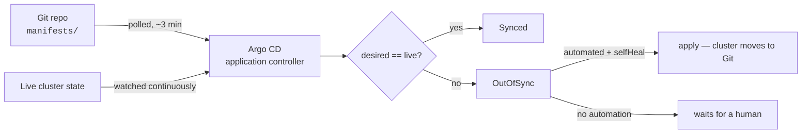

# Lab 06: GitOps with Argo CD

## 🎯 Objective

Stop deploying with `kubectl` — put a workload's desired state in Git and let a controller inside the cluster reconcile toward it.

You'll install Argo CD, hand it a repository, and then spend the second half finding out exactly which parts of "GitOps means the cluster matches Git" are true only when you configured them.

By the end you'll be able to say what `Synced` does and does not prove, which is the difference between using Argo CD and trusting it.

---

## 📋 Prerequisites

- Completed [Lab 05: RBAC and Pod Security](./lab-05-rbac-and-security.md)
- A running cluster with cluster-admin access, and ~2 GB of headroom for Argo CD's own pods
- A GitHub account and `git` configured (Module 03) — GitOps needs a real remote
- The concepts section in [Module 14 §9: GitOps](../../14-system-design-devops/README.md) — push vs pull, and when it's overkill

```bash
kubectl config current-context                   # ⭐ minikube, not anything real
kubectl auth can-i '*' '*' --all-namespaces      # should print: yes
kubectl top nodes                                # confirm you have room
```

---

## 📦 Deliverables and Evidence

- A running Argo CD install, and the `argocd app get` output for two Applications
- A `gitops-demo` repository of your own that is the only place the workload's desired state exists
- Evidence of a change reaching the cluster with no `kubectl apply`: the commit, and the sync it triggered
- Evidence of self-healing: your manual `kubectl scale`, and Argo CD undoing it
- A rollback performed as `git revert`
- `failure-notes.md` covering all four Break It scenarios

---

## 📂 Lab Files

Reference copies are in [`../code/lab-06/`](../code/lab-06/).

```bash
cp -r /path/to/the-devops-handbook/12-kubernetes/code/lab-06/. .
```

The `.example` files carry a placeholder for your GitHub username — copy each to the real
filename and edit it.

---

## 🔬 Exercise 1: Install Argo CD and Sync Something You Don't Own

### Step 1: The Model You're Installing

Every deployment you've done so far in this module was **push**: you held the credentials, you ran `kubectl apply`, and the cluster changed because you told it to. Argo CD inverts that. A controller inside the cluster watches a Git repository, compares it to live state, and closes the gap itself.



> **💡 DevOps Impact**: The arrow from Git to the cluster is a *pull*, which means no CI system needs cluster credentials — the single most valuable thing a compromised pipeline could steal. It also means `git log` on the manifests repo is your deployment history, for free and without anyone having to remember to write it down.

### Step 2: Install

```bash
kubectl create namespace argocd

# ⭐ Pin the version. `stable` is a moving branch, and an install that changes under you is
# not reproducible. Check https://github.com/argoproj/argo-cd/releases and use that tag.
ARGOCD_VERSION=v3.0.6        # ← replace with the current release
kubectl apply -n argocd -f \
  "https://raw.githubusercontent.com/argoproj/argo-cd/$ARGOCD_VERSION/manifests/install.yaml"

# This pulls several images — give it a minute
kubectl wait --for=condition=available --timeout=300s \
  deployment/argocd-server deployment/argocd-repo-server -n argocd
kubectl get pods -n argocd
```

```text
NAME                                               READY   STATUS    RESTARTS   AGE
argocd-application-controller-0                    1/1     Running   0          92s
argocd-applicationset-controller-7d4b8f9c6-x2kqz   1/1     Running   0          92s
argocd-dex-server-5f9b7c8d4-p7rml                  1/1     Running   0          92s
argocd-notifications-controller-...                1/1     Running   0          92s
argocd-redis-6b8f9d5c7-w4nzt                       1/1     Running   0          92s
argocd-repo-server-...                             1/1     Running   0          92s
argocd-server-...                                  1/1     Running   0          92s
```

Three of those matter for this lab: the **application controller** runs the reconciliation loop, the **repo server** clones Git and renders manifests, and the **server** serves the API and UI.

### Step 3: Get In

```bash
# The initial admin password is in a Secret, generated at install time
kubectl -n argocd get secret argocd-initial-admin-secret \
  -o jsonpath='{.data.password}' | base64 -d; echo

# In a second terminal — leave it running
kubectl port-forward svc/argocd-server -n argocd 8080:443
```

Open <https://localhost:8080> and accept the self-signed certificate warning. Log in as `admin`.

Install the CLI too — the UI is genuinely good, but the CLI is what you'll put in scripts and what shows you the fields the UI summarises:

```bash
# Linux
curl -sSL -o argocd \
  "https://github.com/argoproj/argo-cd/releases/download/$ARGOCD_VERSION/argocd-linux-amd64"
sudo install -m 555 argocd /usr/local/bin/argocd && rm argocd
argocd version --client

argocd login localhost:8080 --username admin --insecure
#                                            ↑ self-signed cert on a port-forward
```

> ⚠️ Change the admin password (`argocd account update-password`) and delete `argocd-initial-admin-secret` on anything that isn't a throwaway cluster. The Secret is not removed automatically.

### Step 4: Your First Application

An `Application` is a Kubernetes object that says *this Git path, into this namespace, on this cluster*. Start with Argo CD's own public example repo, so nothing depends on your Git setup yet:

```yaml
# application-public.yml
apiVersion: argoproj.io/v1alpha1
kind: Application
metadata:
  name: guestbook
  namespace: argocd          # ⭐ Applications live in the Argo CD namespace, always
spec:
  project: default
  source:
    repoURL: https://github.com/argoproj/argocd-example-apps.git
    targetRevision: HEAD
    path: guestbook
  destination:
    server: https://kubernetes.default.svc
    namespace: guestbook
  syncPolicy:
    # No `automated:` block — this app syncs only when a human says so.
    syncOptions:
      - CreateNamespace=true
```

```bash
kubectl apply -f application-public.yml
argocd app get guestbook
```

```text
Name:               argocd/guestbook
Project:            default
Server:             https://kubernetes.default.svc
Namespace:          guestbook
Repo:               https://github.com/argoproj/argocd-example-apps.git
Target:             HEAD
Path:               guestbook
SyncWindow:         Sync Allowed
Sync Policy:        Manual
Sync Status:        OutOfSync from HEAD (53e28ff)
Health Status:      Missing
```

Read those last two lines carefully, because they are the whole model:

| Field | Question it answers | Values you'll see |
|-------|--------------------|-------------------|
| **Sync Status** | Does live state match Git? | `Synced`, `OutOfSync`, `Unknown` |
| **Health Status** | Is what's running actually working? | `Healthy`, `Progressing`, `Degraded`, `Missing`, `Suspended` |

They are independent, and every interesting incident is a mismatch between them. `Synced` + `Degraded` means Git contains something broken. `OutOfSync` + `Healthy` means something is running that nobody wrote down.

### Step 5: Sync It

```bash
argocd app sync guestbook
argocd app get guestbook          # Sync Status: Synced, Health Status: Healthy
kubectl get all -n guestbook
```

Nothing you just did was `kubectl apply` on a workload. You declared an intent, and the controller did the applying — the distinction that makes the rest of this lab possible.

---

## 🔬 Exercise 2: Your Repository Is the Source of Truth

### Step 1: Create the GitOps Repo

Create an empty **public** repository called `gitops-demo` on GitHub (public keeps credentials out of this lab — private repos need a deploy key or token registered with Argo CD, which is the next thing to learn, not this thing).

```bash
mkdir -p ~/gitops-demo/manifests && cd ~/gitops-demo
git init -b main
```

Put the workload in `manifests/`:

```yaml
# manifests/deployment.yml
apiVersion: apps/v1
kind: Deployment
metadata:
  name: web
  labels:
    app: web
spec:
  replicas: 2               # ⭐ the number Git says
  selector:
    matchLabels:
      app: web
  template:
    metadata:
      labels:
        app: web
    spec:
      containers:
        - name: web
          image: nginx:1.27-alpine
          ports:
            - containerPort: 80
          readinessProbe:
            httpGet:
              path: /
              port: 80
            initialDelaySeconds: 2
            periodSeconds: 5
          livenessProbe:
            httpGet:
              path: /
              port: 80
            initialDelaySeconds: 10
            periodSeconds: 10
          resources:
            requests:
              cpu: 25m
              memory: 32Mi
            limits:
              cpu: 100m
              memory: 64Mi
          securityContext:
            allowPrivilegeEscalation: false
            capabilities:
              drop: [ALL]
```

```yaml
# manifests/service.yml
apiVersion: v1
kind: Service
metadata:
  name: web
spec:
  selector:
    app: web
  ports:
    - port: 80
      targetPort: 80
```

```bash
git add manifests && git commit -m "feat: web deployment and service"
git remote add origin https://github.com/<your-username>/gitops-demo.git
git push -u origin main
```

### Step 2: Point Argo CD at It

```bash
# application.yml — from application.yml.example, with your username substituted
kubectl apply -f application.yml
argocd app sync web
argocd app get web
kubectl get deploy,svc -n gitops-demo
```

### Step 3: Deploy Without Deploying

Now the payoff. Change the image tag **in Git only**:

```bash
cd ~/gitops-demo
sed -i 's/nginx:1.27-alpine/nginx:1.28-alpine/' manifests/deployment.yml
git commit -am "chore: bump nginx to 1.28"
git push
```

Argo CD polls every three minutes by default, so either wait or ask it to look now:

```bash
argocd app get web --refresh          # forces a comparison against Git
argocd app diff web                   # ⭐ exactly what would change, before it changes
argocd app sync web
kubectl -n gitops-demo get pods -w    # rolling update, no kubectl apply anywhere
```

> ⭐ In production the three-minute poll is replaced by a webhook from GitHub to Argo CD, so a merge reaches the cluster in seconds. The poll is the fallback that makes it work anyway when the webhook is misconfigured — which is why you should never assume the webhook is what delivered your change.

### Step 4: Turn On Automation

Manual sync means Argo CD is a very good diff tool. Automation is what makes it a deployment system:

```bash
kubectl apply -f application-auto.yml     # from application-auto.yml.example
argocd app get web | grep -i 'sync policy'
```

```text
Sync Policy:        Automated (Prune)
```

Prove it end to end:

```bash
cd ~/gitops-demo
sed -i 's/replicas: 2/replicas: 3/' manifests/deployment.yml
git commit -am "feat: scale web to 3 replicas" && git push
# wait for the poll, or: argocd app get web --refresh
kubectl -n gitops-demo get deploy web -w
```

Three replicas, no human in the deployment path, and the reason there are three is a commit with an author and a message.

---

## 🔬 Exercise 3: Drift and Rollback

### Step 1: Drift Gets Reverted

This is what `selfHeal: true` bought you:

```bash
kubectl -n gitops-demo scale deploy/web --replicas=7
kubectl -n gitops-demo get deploy web            # 7/7 for a moment
argocd app get web --refresh
sleep 15
kubectl -n gitops-demo get deploy web            # back to 3 — Git won
kubectl -n gitops-demo describe deploy web | tail -20
```

The cluster is no longer somewhere changes can be made. It's a projection of a repository, and the only durable way to change it is a commit.

### Step 2: Rollback Is `git revert`

Ship something bad on purpose:

```bash
cd ~/gitops-demo
sed -i 's|image: nginx:1.28-alpine|image: nginx:1.28-does-not-exist|' manifests/deployment.yml
git commit -am "chore: bump to a tag that does not exist" && git push
argocd app get web --refresh
```

```text
Sync Status:        Synced to main (a1b2c3d)
Health Status:      Degraded
```

⭐ `Synced` **and** `Degraded`. Argo CD did its job perfectly: the cluster matches Git. Git is what's wrong. No amount of re-syncing fixes this, and that distinction is the single most useful thing this status pair tells you during an incident.

```bash
kubectl -n gitops-demo get pods       # ImagePullBackOff on the new ReplicaSet
git revert --no-edit HEAD
git push
argocd app get web --refresh          # Healthy again, and the fix is in the history
```

### Step 3: Why `argocd app rollback` Is Not the Rollback

Argo CD does keep a deployment history:

```bash
argocd app history web
argocd app rollback web <ID>          # pick a previous revision ID from the list
```

That works, and during a 3 a.m. outage it is faster than a revert-and-push. But it is an **out-of-band change**: the cluster now runs something Git does not describe, and it will be quietly undone the next time the app syncs. Use it to stop the bleeding, then land the revert in Git before you go back to bed — otherwise you have reintroduced exactly the drift GitOps was adopted to eliminate.

---

## 🧨 Break It: Four Ways "Synced" Lies

Each scenario is reversible and restores state before the next one. All four are silent — every one of them leaves you looking at a green dashboard.

### Scenario 1: Auto-Sync Without Self-Heal

**Break it.** Turn `selfHeal` off, the way most teams first enable automation:

```bash
argocd app set web --sync-policy automated --self-heal=false
kubectl -n gitops-demo set image deploy/web web=nginx:1.25-alpine   # a "quick hotfix"
kubectl -n gitops-demo get deploy web -o jsonpath='{..image}{"\n"}'
```

**Symptom.** The hotfix is live. Argo CD reports it:

```bash
argocd app get web --refresh | head -8
```

```text
Sync Status:        OutOfSync from main (7f3a91c)
Health Status:      Healthy
```

Healthy and OutOfSync — and *nothing happens*. Hours or days later, an unrelated commit to the repo triggers a sync, and the hotfix silently disappears in the middle of a normal working afternoon.

**Investigate.**

```bash
argocd app diff web              # ⭐ shows the hotfix as a diff FROM Git
argocd app get web -o json | jq '.spec.syncPolicy'
```

```json
{
  "automated": { "prune": true },
  "syncOptions": ["CreateNamespace=true"]
}
```

**Root cause.** `selfHeal` defaults to **false**. Automated sync means "apply Git when Git changes", not "keep the cluster matching Git". Cluster-side drift is detected, reported, and then left alone until something else triggers a sync.

**Fix.** Turn self-heal on, and stop treating `kubectl set image` as a deployment mechanism:

```bash
argocd app set web --self-heal=true
sleep 15
kubectl -n gitops-demo get deploy web -o jsonpath='{..image}{"\n"}'   # back to Git's version
```

### Scenario 2: Deleted From Git, Still Serving Traffic

**Break it.** Add a second workload, sync it, then delete it from Git with pruning off:

```bash
cd ~/gitops-demo
cp manifests/deployment.yml manifests/extra.yml
sed -i 's/name: web$/name: web-extra/; s/app: web$/app: web-extra/' manifests/extra.yml
git add manifests/extra.yml && git commit -m "feat: add web-extra" && git push
argocd app get web --refresh && sleep 20
kubectl -n gitops-demo get deploy                      # web and web-extra

argocd app set web --auto-prune=false
git rm manifests/extra.yml && git commit -m "chore: remove web-extra" && git push
argocd app get web --refresh && sleep 20
```

**Symptom.**

```bash
argocd app get web | head -8
kubectl -n gitops-demo get deploy
```

```text
Sync Status:        Synced to main (c4d5e6f)
Health Status:      Healthy

NAME         READY   UP-TO-DATE   AVAILABLE   AGE
web          3/3     3            3           22m
web-extra    2/2     2            2           4m
```

**Synced**, **Healthy**, and running a workload that exists in no repository. Nobody reviewing the manifests repo can see it. Nobody scanning for orphans is looking. It has an image that will never be updated again.

**Investigate.**

```bash
argocd app resources web | grep -i extra     # not listed — Argo CD stopped tracking it
kubectl -n gitops-demo get deploy web-extra -o jsonpath='{.metadata.labels}' | jq
# the argocd.argoproj.io/instance label is still there — this WAS managed
```

**Root cause.** `prune` also defaults to **false**, and "Synced" only ever means *everything Git describes exists and matches*. It says nothing about resources Git no longer describes. Deleting a manifest is the one Git operation that does nothing without pruning.

**Fix.**

```bash
argocd app set web --auto-prune=true
argocd app get web --refresh && sleep 20
kubectl -n gitops-demo get deploy            # web-extra pruned
```

> ⚠️ Prune is genuinely dangerous the first time you enable it on an app that has been running with it off — anything already orphaned gets deleted at the next sync. Run `argocd app sync web --dry-run` and read the list before you flip it in production.

### Scenario 3: Self-Heal Versus the HPA

**Break it.** Add an autoscaler that owns the same field Git owns:

```bash
kubectl -n gitops-demo autoscale deploy/web --min=2 --max=8 --cpu-percent=50
kubectl -n gitops-demo get hpa web
```

**Symptom.** Watch the replica count for two minutes:

```bash
kubectl -n gitops-demo get deploy web -w
```

```text
web   3/3   ...
web   5/5   ...     ← HPA scales up under load
web   3/3   ...     ← selfHeal reverts to Git's 3
web   5/5   ...     ← HPA scales up again
```

Two controllers, one field, opposite opinions, forever. Under real traffic this manifests as an application that scales up and then loses capacity every few minutes for no reason anyone can see from the application's own logs or dashboards.

**Investigate.**

```bash
argocd app get web | grep -i 'sync status'      # flapping between Synced and OutOfSync
kubectl -n gitops-demo describe deploy web | grep -A5 Events
kubectl -n gitops-demo describe hpa web | grep -A5 Events
```

**Root cause.** `spec.replicas` is declared in Git *and* managed by the HPA. Self-heal is doing precisely what you asked: reverting a field that changed in the cluster. The mistake was declaring an autoscaled field at all.

**Fix.** Take the field out of the contest — either remove `replicas` from the manifest, or tell Argo CD to ignore it:

```yaml
# in application-auto.yml
spec:
  ignoreDifferences:
    - group: apps
      kind: Deployment
      jsonPointers:
        - /spec/replicas
```

```bash
kubectl apply -f application-auto.yml
kubectl -n gitops-demo delete hpa web        # restore state for the next scenario
```

### Scenario 4: Synced to the Wrong Revision

**Break it.** Point the app at a branch that will never move again:

```bash
cd ~/gitops-demo
git checkout -b release-freeze && git push -u origin release-freeze && git checkout main
argocd app set web --revision release-freeze
argocd app get web --refresh | head -8
```

Now ship a change on `main`, as everyone will keep doing:

```bash
sed -i 's/cpu: 100m/cpu: 200m/' manifests/deployment.yml
git commit -am "perf: raise web cpu limit" && git push
argocd app get web --refresh | head -8
```

**Symptom.**

```text
Sync Status:        Synced to release-freeze (7f3a91c)
Health Status:      Healthy
```

Green. Perfectly green. Merged, reviewed, CI-passed changes are landing in `main` and reaching nothing at all. This is the failure people spend an afternoon on, because every dashboard they check says the deployment succeeded.

**Investigate.**

```bash
argocd app get web | grep -E 'Target|Repo|Path'
kubectl -n gitops-demo get deploy web -o jsonpath='{..resources.limits.cpu}{"\n"}'   # still 100m
git log --oneline -1 origin/main
git log --oneline -1 origin/release-freeze      # ⭐ the two do not match
```

**Root cause.** `targetRevision` is a real field with real consequences and no warning when it diverges from where your team actually merges. `Synced` means "matches the revision I was told to watch" — it has never meant "matches your main branch".

**Fix.**

```bash
argocd app set web --revision main
argocd app get web --refresh | head -8
git push origin --delete release-freeze
```

> ⭐ In a real setup, make this visible instead of discoverable: put the `Application` manifests in Git too (the app-of-apps pattern), so `targetRevision` is reviewed like any other change, and add an alert on Argo CD's `argocd_app_info` metric for apps whose sync status hasn't changed in longer than your deploy cadence.

### Summary

| Failure | How you detect it | How you prevent it |
|---------|------------------|--------------------|
| Auto-sync without self-heal | `OutOfSync` + `Healthy` sitting there for hours; `argocd app diff` shows cluster-side edits | `selfHeal: true`, and remove the RBAC that lets humans `kubectl set image` in prod |
| Deleted from Git, still running | `Synced` while `kubectl get` shows more than the repo does; orphaned `argocd.argoproj.io/instance` labels | `prune: true` from day one — enabling it later is the risky moment |
| Self-heal versus HPA | Replica count flapping; sync status alternating on a fixed cycle | Never declare a field another controller owns; `ignoreDifferences` when you must |
| Synced to the wrong revision | `Target` doesn't match where you merge; `git log` on the two revisions diverges | Applications in Git and reviewed; alert on apps whose revision goes stale |

⭐ **The theme of this lab**: `Synced` is a claim about *one revision of one path* matching live state. It is not a claim that Git is complete, that Git is right, or that Git is the branch your team uses. Every scenario above is green-dashboard-plus-wrong-cluster, and each one is prevented by a field with an unhelpful default.

**Write this up** in `failure-notes.md`.

---

## 🧹 Cleanup

```bash
# Deleting the Application deletes what it created — that's the finalizer doing its job
kubectl delete -f application-auto.yml --ignore-not-found
kubectl delete application guestbook -n argocd --ignore-not-found
kubectl delete namespace gitops-demo guestbook --ignore-not-found

# Uninstall Argo CD (this removes the CRDs too — any Application still around goes with them)
kubectl delete -n argocd -f \
  "https://raw.githubusercontent.com/argoproj/argo-cd/$ARGOCD_VERSION/manifests/install.yaml"
kubectl delete namespace argocd --ignore-not-found

# Stop the port-forward in the other terminal
cd ~ && rm -rf ~/gitops-demo      # keep the GitHub repo — it's portfolio evidence
```

---

## ✅ Validation

- [ ] Explain pull-based delivery and name the credential that push-based CI/CD needs and GitOps does not
- [ ] Describe what the application controller, repo server, and API server each do
- [ ] Read a `Sync Status` / `Health Status` pair and say what each of the four interesting combinations means
- [ ] Deploy a change with no `kubectl apply` — commit, sync, rolling update
- [ ] Explain why `selfHeal` and `prune` both default to `false` and what each one changes
- [ ] Demonstrate self-healing reverting a manual `kubectl scale`
- [ ] Roll back with `git revert`, and explain why `argocd app rollback` is a stopgap rather than a fix
- [ ] Explain the HPA/self-heal conflict and fix it with `ignoreDifferences`
- [ ] Say what `Synced` does *not* prove — all four scenarios

---

## 📝 What to Commit

- Your `gitops-demo` repository — it *is* the deliverable, and its `git log` is the deployment history
- `application.yml` and `application-auto.yml` (with your username), in your portfolio repo
- `argocd app get web` output for: manual sync, automated sync, `Synced`+`Degraded`, and the wrong revision
- The commit that reverted a bad deploy
- `failure-notes.md` covering all four scenarios

---

[← Previous Lab: RBAC and Pod Security](./lab-05-rbac-and-security.md) | [Back to Module README](../README.md) | [Module 13: Security Basics →](../../13-security-basics/)
