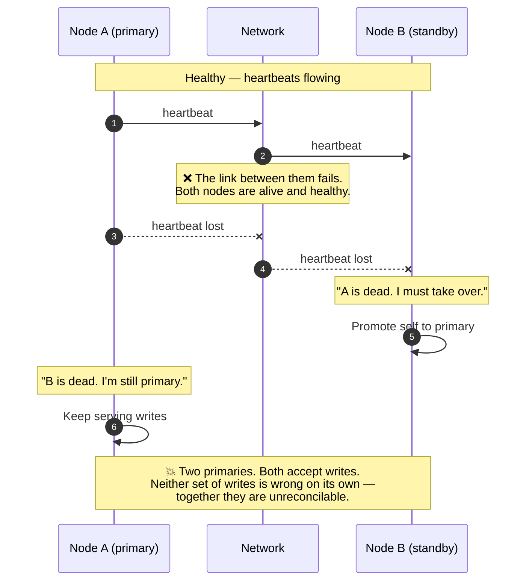
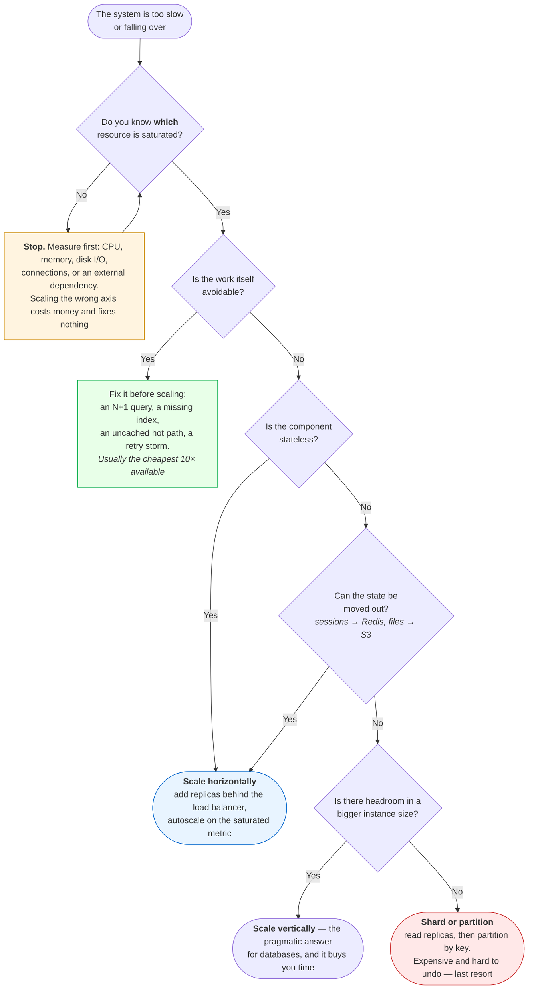
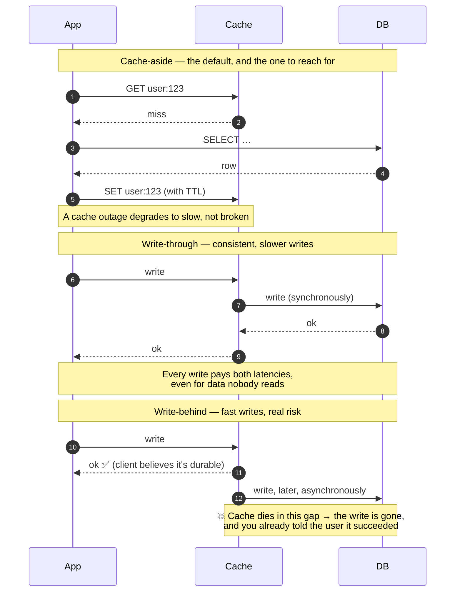
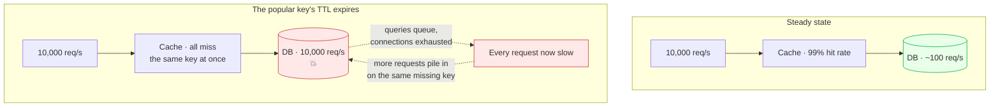
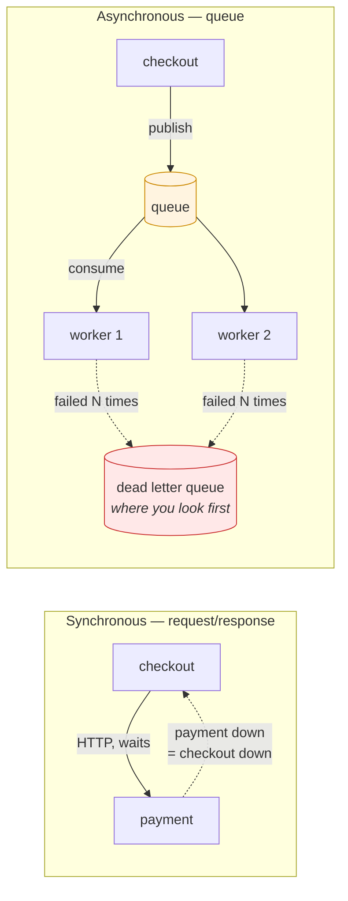

# Module 14: System Design for DevOps

> *"Good architecture is less about picking the right technology and more about knowing why you picked it." — Production Engineering Principle*

---

## 🎯 Why This Module Matters

Every production outage, every scaling failure, and every "it works on my machine" moment traces back to a system design decision. As a DevOps engineer, you don't just run infrastructure — you **design, evaluate, and defend architectural choices** that keep systems reliable, scalable, and recoverable.

**In real-world DevOps work**, you will:

- Evaluate whether a system can handle 10x traffic growth
- Design deployment architectures that survive component failures
- Choose between scaling vertically or horizontally
- Implement load balancing, caching, and CDN strategies
- Define SLAs, SLOs, and SLIs that drive operational decisions
- Plan for disaster recovery and business continuity

---

## 📚 Table of Contents

1. [High Availability — Designing for Failure](#1-high-availability--designing-for-failure)
2. [Load Balancing](#2-load-balancing)
3. [Scaling Strategies](#3-scaling-strategies)
4. [Caching](#4-caching)
5. [Database Considerations for DevOps](#5-database-considerations-for-devops)
6. [CDN and Edge Architecture](#6-cdn-and-edge-architecture)
7. [Async Communication and Message Queues](#7-async-communication-and-message-queues)
8. [SLAs, SLOs, and SLIs](#8-slas-slos-and-slis)
9. [Disaster Recovery](#9-disaster-recovery)
10. [Architecture Decision Framework](#10-architecture-decision-framework)
11. [Platform Engineering — Building the Paved Road](#11-platform-engineering--building-the-paved-road)
12. [Common Mistakes and Anti-Patterns](#12-common-mistakes-and-anti-patterns)
13. [Interview Insights](#13-interview-insights)

---

## 1. High Availability — Designing for Failure

### The Nines of Availability

```
AVAILABILITY   DOWNTIME/YEAR    DOWNTIME/MONTH   CONTEXT
99%            3.65 days        7.3 hours         Acceptable for internal tools
99.9%          8.77 hours       43.8 minutes      Standard web application
99.95%         4.38 hours       21.9 minutes      Business-critical service
99.99%         52.6 minutes     4.38 minutes      Financial/healthcare systems
99.999%        5.26 minutes     26.3 seconds      Telecom, life-safety systems

EACH ADDITIONAL NINE ≈ 10x MORE ENGINEERING EFFORT AND COST
```

### Single Points of Failure (SPOF)

```
A SINGLE POINT OF FAILURE is any component whose failure
brings down the entire system.

COMMON SPOFs:
  ❌ Single database server (no replica)
  ❌ Single load balancer
  ❌ Single DNS provider
  ❌ Single availability zone
  ❌ Single deployment pipeline
  ❌ One person who knows the system ("bus factor = 1")

FIX: Redundancy at every layer
  ✅ Database primary + replica(s)
  ✅ Active-passive or active-active load balancers
  ✅ Multi-AZ or multi-region deployment
  ✅ Multiple CI/CD paths (or at least manual fallback)
  ✅ Documented runbooks so anyone can operate the system
```

### HA Architecture Patterns

```
ACTIVE-PASSIVE (Failover):
  ┌──────────┐     heartbeat     ┌──────────┐
  │  Active  │◄─────────────────▶│ Passive  │
  │ (serves  │                   │ (standby,│
  │ traffic) │                   │  warm/hot)│
  └──────────┘                   └──────────┘
  Pro: Simpler, consistent state
  Con: Passive server is idle cost; failover delay

ACTIVE-ACTIVE:
  ┌──────────┐                   ┌──────────┐
  │ Active 1 │◄── shared state ─▶│ Active 2 │
  │ (serves  │     (replicated   │ (serves  │
  │ traffic) │      DB, cache)   │ traffic) │
  └──────────┘                   └──────────┘
  Pro: Full utilization, no failover delay
  Con: State synchronization complexity, split-brain risk
```

### Split-Brain — The Failure Failover Creates

"Split-brain risk" is one line in that table and a data-corruption incident in real life. Failover works by one node deciding another is dead — and a node cannot tell "peer is dead" apart from "I cannot reach the peer":



⭐ **Two nodes cannot solve this, ever.** With only two participants there is no way to distinguish a dead peer from an unreachable one, so both choices — take over, or stay put — are wrong in one of the two scenarios. That is why real systems use **an odd number of voters and require a quorum** (etcd, Consul, ZooKeeper, Kafka's KRaft controllers, RabbitMQ quorum queues): a node may only act as primary if it can see a strict majority, so a partition leaves at most one side able to proceed.

| Mechanism | What it does | Where you'll meet it |
|-----------|--------------|----------------------|
| **Quorum** | Only a majority partition may act — the minority stops | etcd, Consul, MongoDB replica sets, Kafka |
| **Fencing / STONITH** | The new primary forcibly kills or isolates the old one before taking over | Pacemaker clusters, storage fencing |
| **Lease with a TTL** | Primacy is a lease that must be renewed; miss a renewal and it lapses | Kubernetes leader election, Redis Sentinel |
| **A tiebreaker witness** | A cheap third voter so two real nodes can form a majority | Two-AZ deployments with a witness in a third |

⚠️ **This is why "just add a standby" is not a highly available design.** Ask three questions of any failover scheme: *who decides* a node is dead, *how many votes* that decision needs, and *what stops the old primary* from continuing to serve. If any answer is missing, you have built a system that turns a network blip into divergent data.

---

## 2. Load Balancing

### How Load Balancers Work

```
                    Internet
                       │
                 ┌─────▼─────┐
                 │    Load    │
                 │  Balancer  │
                 └─────┬─────┘
              ┌────────┼────────┐
              ▼        ▼        ▼
          ┌──────┐ ┌──────┐ ┌──────┐
          │ App  │ │ App  │ │ App  │
          │  #1  │ │  #2  │ │  #3  │
          └──────┘ └──────┘ └──────┘

PURPOSE:
  - Distribute traffic across healthy backends
  - Detect and stop sending to unhealthy servers
  - Terminate TLS (offload encryption from app servers)
  - Enable zero-downtime deployments
```

### Load Balancing Algorithms

```
ROUND ROBIN:
  Request 1 → Server A
  Request 2 → Server B
  Request 3 → Server C
  Request 4 → Server A ...
  Use when: All servers are identical

LEAST CONNECTIONS:
  Send to the server with fewest active connections
  Use when: Requests have varying processing times

WEIGHTED:
  Server A (weight 5): gets 5x more traffic than Server C (weight 1)
  Use when: Servers have different capacities

IP HASH:
  hash(client_ip) % server_count → always same server
  Use when: You need sticky sessions without cookies

HEALTH-CHECK BASED:
  All algorithms should include health checks:
  - HTTP GET /health → 200 OK means healthy
  - Failed checks → remove from pool
  - Recovered → add back after N consecutive passes
```

### Layer 4 vs Layer 7

```
LAYER 4 (Transport — TCP/UDP):
  Routes based on: IP address, port number
  Cannot inspect: HTTP headers, URLs, cookies
  Performance: Very fast, minimal overhead
  Tools: AWS NLB, HAProxy (TCP mode), iptables
  Use for: Database connections, non-HTTP protocols, raw performance

LAYER 7 (Application — HTTP/HTTPS):
  Routes based on: URL path, headers, cookies, content type
  Can do: Path-based routing, header manipulation, TLS termination
  Performance: Slightly slower, more CPU for inspection
  Tools: AWS ALB, Nginx, HAProxy (HTTP mode), Envoy
  Use for: Microservices routing, A/B testing, canary deploys
```

---

## 3. Scaling Strategies

### Vertical vs Horizontal

```
VERTICAL SCALING (Scale Up):
  ┌─────────────┐         ┌─────────────┐
  │   2 CPU     │         │   16 CPU    │
  │   4 GB RAM  │   ──▶   │   64 GB RAM │
  │   Small     │         │   Large     │
  └─────────────┘         └─────────────┘
  Pro: No code changes, simple
  Con: Hardware ceiling, single point of failure, expensive at top

HORIZONTAL SCALING (Scale Out):
  ┌───────┐               ┌───────┐ ┌───────┐ ┌───────┐ ┌───────┐
  │  App  │         ──▶   │  App  │ │  App  │ │  App  │ │  App  │
  └───────┘               └───────┘ └───────┘ └───────┘ └───────┘
  Pro: Near-infinite scale, redundancy built in, cost-efficient
  Con: Stateless design required, distributed system complexity

WHEN TO USE WHICH:
  Database (primary)     → Vertical first, then read replicas
  Application servers    → Horizontal (behind load balancer)
  Cache layer            → Horizontal (Redis Cluster, sharding)
  Static content         → CDN (horizontally distributed by design)
```

### Auto-Scaling

```
AUTO-SCALING COMPONENTS:
  1. METRIC     → What triggers scaling (CPU, memory, request count, queue depth)
  2. THRESHOLD  → When to scale (CPU > 70% for 5 minutes)
  3. POLICY     → How much to scale (add 2 instances, or increase by 50%)
  4. COOLDOWN   → Wait period before scaling again (prevent thrashing)

EXAMPLE AUTO-SCALING POLICY:
  Scale Out: CPU > 70% for 5 min → add 2 instances (cooldown: 5 min)
  Scale In:  CPU < 30% for 15 min → remove 1 instance (cooldown: 10 min)

  ⚠️ Scale out FAST, scale in SLOW
  ⚠️ Always set minimum and maximum instance counts
```

### Stateless vs Stateful Applications

```
STATELESS (easy to scale horizontally):
  - Any server can handle any request
  - Session stored externally (Redis, database, JWT)
  - No local file storage (use S3, shared volume)
  - Configuration from environment, not local files

STATEFUL (harder to scale):
  - Server holds session data in memory
  - Local file uploads tied to one server
  - Sticky sessions needed at the load balancer
  - Database connections with local connection pools

RULE: Make your applications STATELESS whenever possible.
      Push state to dedicated, purpose-built stores.
```

### Which Kind of Scaling — and Whether to Scale At All

The instinct is to add capacity. Frequently the honest answer is that the system is doing unnecessary work, and buying more machines to do it faster is the expensive way to hide a bug:



⭐ **The two boxes people skip are the first two**, and they are the ones that pay. "We doubled the pods and it's still slow" almost always means the bottleneck was a database the pods share — in which case doubling them made contention *worse*. Name the saturated resource before you touch a replica count.

⚠️ **Sharding is a one-way door.** It changes your data model, your queries, your migrations, and your backup strategy, and un-sharding is a project nobody funds. Exhaust vertical scaling and read replicas first — modern instances go far higher than most people assume, and a year of a larger instance is cheaper than a quarter of engineering time.

---

## 4. Caching

### Cache Layers

```
CLIENT ──▶ CDN CACHE ──▶ REVERSE PROXY ──▶ APP CACHE ──▶ DB CACHE ──▶ DATABASE
           (CloudFront)   (Nginx/Varnish)   (Redis)       (query cache)

EACH LAYER:
  Hit  → Return cached data (fast, cheap)
  Miss → Forward to next layer (slower, more expensive)

RULE: Cache as close to the user as possible.
```

### Caching Strategies

```
CACHE-ASIDE (Lazy Loading):
  App checks cache → miss → reads DB → writes to cache → returns
  Pro: Only requested data is cached; cache failure doesn't break reads
  Con: First request is always slow; data can go stale

WRITE-THROUGH:
  App writes to cache AND DB simultaneously
  Pro: Cache is always fresh
  Con: Write latency increases; cache may hold never-read data

WRITE-BEHIND (Write-Back):
  App writes to cache → cache async writes to DB
  Pro: Fast writes
  Con: Data loss risk if cache crashes before DB write

TTL (Time to Live):
  Set expiry on cached data → auto-evict after N seconds
  Short TTL (30s): Near-real-time, higher DB load
  Long TTL (1h): Lower DB load, staler data
  Pick based on how stale your users can tolerate
```

The three write strategies differ in *where the crash window is*, which is easier to see as message order than as prose:



⭐ **Cache-aside is the right default** because its failure mode is the mild one: if the cache is down, every read falls through to the database and the system is slow rather than wrong. Write-behind is the opposite — it is the fastest and it silently converts a cache from a performance optimisation into a *durability dependency*. Never put money, orders, or anything you'd have to apologise for behind a write-behind cache.

### Cache Stampede — The Outage a Cache Causes

A cache does not only fail by being slow. The classic incident is the cache working exactly as designed:



**Three fixes, and they compose:**

| Fix | How it works | Cost |
|-----|--------------|------|
| **Jittered TTL** | `ttl = base + random(0, base/10)` so keys expire at different moments | One line; do this always |
| **Single-flight lock** | The first miss takes a lock and refills; the rest wait briefly or serve stale | A little complexity, removes the herd entirely |
| **Refresh-ahead** | A background job refreshes hot keys before they expire | Needs to know which keys are hot |

⚠️ **The nastiest version is a cold cache after a restart.** Every key misses simultaneously, and a database sized for a 99% hit rate meets 100% of traffic — which is why "we restarted Redis to clear it" is a sentence that precedes an outage. Warm the cache, or roll the restart, and make sure the database has a connection limit that sheds load instead of falling over.

### Cache Invalidation

```
"There are only two hard things in computer science:
 cache invalidation and naming things." — Phil Karlton

STRATEGIES:
  1. TTL-based    → Data expires after a fixed time
  2. Event-based  → Publish invalidation on data change
  3. Version-based → Cache key includes version (v2:user:123)
  4. Manual purge  → Explicit API call to clear cache
```

---

## 5. Database Considerations for DevOps

### Replication Patterns

```
PRIMARY-REPLICA (Read Replicas):
  ┌─────────┐     async/sync     ┌──────────┐
  │ Primary │──────────────────▶ │ Replica  │
  │ (R+W)   │                    │ (R only) │
  └─────────┘                    └──────────┘
  Writes → Primary only
  Reads  → Distributed across replicas
  Use for: Read-heavy workloads, reporting queries

PRIMARY-PRIMARY (Multi-Master):
  ┌──────────┐                  ┌──────────┐
  │ Primary  │◄────────────────▶│ Primary  │
  │  (R+W)   │  bidirectional   │  (R+W)   │
  └──────────┘                  └──────────┘
  Pro: Write availability in multiple regions
  Con: Conflict resolution complexity, data consistency challenges
```

### Backup Strategy

```
BACKUP TYPES:
  Full     → Complete database copy (slow, large, complete)
  Incremental → Only changes since last backup (fast, small)
  Point-in-time → Transaction log replay to any moment

3-2-1 RULE:
  3 copies of your data
  2 different storage types (disk + object storage)
  1 offsite copy (different region or provider)

ALWAYS TEST RESTORES — An untested backup is not a backup.
```

---

## 6. CDN and Edge Architecture

```
WITHOUT CDN:
  User (Sydney) ──── 250ms ────▶ Origin (US-East) ──▶ Response
  Every request crosses the ocean.

WITH CDN:
  User (Sydney) ──── 10ms ────▶ Edge (Sydney) ──▶ Cached Response
  First request: Edge fetches from origin, caches it.
  Subsequent: Served from edge. Massively faster.

CDN USE CASES:
  ✅ Static assets (images, CSS, JS, fonts)
  ✅ Video and media streaming
  ✅ API responses that are cacheable (GET, public data)
  ✅ Whole-site acceleration (with edge compute)

CDN PROVIDERS: CloudFront (AWS), Cloudflare, Akamai, Fastly
```

---

## 7. Async Communication and Message Queues

### Why Anything Is Asynchronous

A synchronous call couples two services in availability and in latency: if payment is down, checkout is down, and if payment is slow, checkout is slow. A queue between them converts that into a different trade — checkout stays up and the work happens later, which is only acceptable if "later" is acceptable.

That is the whole decision. Not "queues are more scalable", but *can this work be done later, and can the caller tolerate not knowing the outcome yet?*



> **💡 DevOps Impact**: the queue does not remove the failure, it relocates it. Payment being down no longer shows up as checkout errors — it shows up as queue depth climbing and orders that are accepted but never fulfilled. That is a better failure, but only if you alert on queue depth and consumer lag. A queue with no monitoring is a silent backlog.

### Queue, Pub/Sub, or Stream

Three shapes get called "messaging" and they are not interchangeable:

| | Queue | Pub/Sub | Log / Stream |
|---|-------|---------|--------------|
| Model | One message → one consumer | One message → every subscriber | An ordered, replayable log; consumers track an offset |
| Message after delivery | Deleted | Deleted per subscription | ⭐ Retained for a window — you can rewind |
| Typical use | Work distribution: emails, thumbnails, charges | Fan-out: "order placed" to 4 teams | Event sourcing, analytics, replay, CDC |
| Ordering | Usually best-effort, or per group | Not guaranteed | Guaranteed per partition |
| Examples | SQS, RabbitMQ, Celery+Redis | SNS, Google Pub/Sub, RabbitMQ fanout | Kafka, Kinesis, Redpanda, Redis Streams |

Two consequences worth remembering: **ordering is per partition, never global** — so "process this customer's events in order" means partitioning by customer ID, and it caps your parallelism for that customer at one. And a stream's replayability is what makes it the right choice when a consumer bug means you need yesterday's events again.

### The Five Things That Bite

**1. At-least-once means duplicates.** Nearly every broker guarantees at-least-once, not exactly-once: a consumer that crashes after doing the work but before acknowledging will see the message again. Design for it with an idempotency key — a natural one (`order_id`) checked against a store before acting.

```python
# Idempotent consumer: the pattern, in eight lines
def handle(msg):
    key = msg["order_id"]
    if store.setnx(f"processed:{key}", 1):        # atomic claim, TTL a few days
        try:
            charge(msg)                           # the actual work
        except Exception:
            store.delete(f"processed:{key}")      # ⭐ release the claim so a retry can work
            raise
    else:
        log.info("duplicate, skipping", extra={"order_id": key})
    ack(msg)
```

**2. Retries need a dead letter queue.** A message that will never succeed — malformed, or referencing a deleted record — retried forever is a *poison message*: it blocks a partition or burns your consumers indefinitely. Cap the attempts and route the failures to a DLQ. Then alert on the DLQ, because an unmonitored DLQ is a folder of work nobody is doing.

**3. Consumer lag is your real health metric.** Not CPU, not queue length alone: the gap between what has been produced and what has been consumed, and whether it is growing. If lag grows, consumers are losing the race and every downstream promise is now late.

**4. Backpressure has to go somewhere.** When consumers cannot keep up, either the queue grows (memory, disk, cost, and eventually a broker refusing writes) or the producer must be slowed down. Decide which deliberately, and set a retention/quota so you find out on your terms rather than at the broker's hard limit.

**5. Visibility timeouts and long-running work.** If handling a message takes longer than the invisibility window, the broker redelivers it and two workers do the same job. Either extend the timeout while working (heartbeating) or split the work into smaller messages.

### Operating One

```bash
# Kafka: lag is the number that matters — check it before anything else
kafka-consumer-groups.sh --bootstrap-server localhost:9092 --describe --group orders
#   TOPIC  PARTITION  CURRENT-OFFSET  LOG-END-OFFSET  LAG   ⭐ is LAG growing?
kafka-topics.sh --bootstrap-server localhost:9092 --describe --topic orders

# RabbitMQ
rabbitmqctl list_queues name messages messages_unacknowledged consumers
#   messages_unacknowledged high with few consumers = handlers are stuck, not slow

# SQS
aws sqs get-queue-attributes --queue-url "$Q" \
  --attribute-names ApproximateNumberOfMessages ApproximateAgeOfOldestMessage
#   ⭐ AgeOfOldestMessage is the SLO-relevant one; a count of 10 that is 4 hours old is worse
#   than a count of 10,000 that is 5 seconds old
```

Four alerts cover most of it: **consumer lag growing over N minutes**, **age of oldest message beyond your SLO**, **any DLQ depth above zero**, and **zero consumers on a queue with messages** — the last being the one that catches a deployment that quietly stopped starting workers.

### Choosing

```
USE A QUEUE WHEN:
  ✅ The work can be done later, and the caller doesn't need the result now
  ✅ You want to survive a downstream outage without failing the user's request
  ✅ Load is spiky and you want to smooth it into steady consumer throughput
  ✅ Several teams need the same event and you don't want N synchronous calls

STAY SYNCHRONOUS WHEN:
  ❌ The caller needs the answer to continue (auth, payment authorisation, validation)
  ❌ The workflow is simple and a queue would add a broker to operate for no gain
  ❌ You cannot make the consumer idempotent — duplicates will hurt you
  ❌ Debuggability matters more than decoupling; async traces are harder to follow
```

Run both shapes: [Lab 02 — Message Queues and Async Failure](./labs/lab-02-message-queues.md) for the queue (depth, unacked, a dead letter queue, duplicate charges), then [Lab 04 — Kafka: Partitions, Consumer Groups, and Offsets](./labs/lab-04-kafka-partitions.md) for the log (per-partition lag, the parallelism ceiling, a rebalance storm, and a replay). The Break It sections are the interview follow-ups, and Lab 04 ends with the queue-versus-log comparison from first-hand evidence rather than a vendor page.

> ⭐ **The interview trap** is "we'll use a queue for scalability". Say instead what the queue *decouples* and what it *costs*: a broker to operate, at-least-once duplicates to handle, a DLQ to monitor, and end-to-end tracing that now has to propagate context through message attributes rather than HTTP headers (Module 07 §9 — this is the boundary where trace propagation is most often lost).

---

## 8. SLAs, SLOs, and SLIs

```
SLI — Service Level Indicator
  A measurable metric: "What are we measuring?"
  Examples: Request latency, error rate, throughput, availability

SLO — Service Level Objective
  A target for the SLI: "What is acceptable?"
  Examples: p99 latency < 300ms, error rate < 0.1%, 99.9% uptime

SLA — Service Level Agreement
  A contract with consequences: "What happens if we fail?"
  Examples: Below 99.9% uptime → service credits, penalty clauses

RELATIONSHIP:
  SLI (measurement) ──▶ SLO (internal target) ──▶ SLA (external promise)

  ⚠️ SLOs should be STRICTER than SLAs
  ⚠️ Measure SLIs continuously, alert when SLO is at risk
  ⚠️ Use error budgets: if SLO is 99.9%, you have 0.1% error budget
```

### Error Budgets

```
ERROR BUDGET = 1 - SLO

If SLO = 99.9% uptime per month:
  Error budget = 0.1% = 43.8 minutes of downtime

Budget remaining > 50%:
  → Ship features, take calculated risks, deploy frequently

Budget remaining < 25%:
  → Slow down, focus on reliability, reduce deploy frequency

Budget exhausted:
  → Feature freeze, all engineering effort on stability
```

---

## 9. Disaster Recovery

### Recovery Objectives

```
RPO — Recovery Point Objective
  "How much data can we afford to lose?"
  RPO = 1 hour → backups must run at least every hour
  RPO = 0      → synchronous replication required

RTO — Recovery Time Objective
  "How fast must we recover?"
  RTO = 4 hours → must be back online within 4 hours of disaster
  RTO = 0       → active-active with automatic failover required

         data loss           downtime
  ◄──────────────────┤ DISASTER ├──────────────────►
         RPO                        RTO
```

### DR Strategies (Cost vs Speed)

```
BACKUP & RESTORE (Cheapest, Slowest):
  RPO: Hours     RTO: Hours to days
  Restore from backups to new infrastructure
  Cost: $ (storage only)

PILOT LIGHT (Low cost, moderate speed):
  RPO: Minutes   RTO: 30-60 minutes
  Core systems always running (DB replica), scale up on failover
  Cost: $$ (minimal always-on infra)

WARM STANDBY (Moderate cost, fast):
  RPO: Seconds   RTO: Minutes
  Scaled-down copy of production always running
  Cost: $$$ (partial duplicate infrastructure)

MULTI-REGION ACTIVE-ACTIVE (Most expensive, fastest):
  RPO: Zero      RTO: Seconds
  Full production in multiple regions, traffic split
  Cost: $$$$ (full duplicate infrastructure)
```

What you are really buying at each tier is **how much is already running when the disaster starts**:

```mermaid
flowchart TB
    subgraph T1["Backup & Restore · $ · RTO hours-days"]
        B1[("Backups in object storage")]
        B1 -.->|"on disaster: build everything,<br/>then restore"| B1x["Nothing is running"]
    end

    subgraph T2["Pilot Light · $$ · RTO 30-60 min"]
        P1[("DB replica, always on")]
        P2["App tier: defined but scaled to zero"]
        P1 -.->|"on disaster: promote DB,<br/>scale the app up"| P2
    end

    subgraph T3["Warm Standby · $$$ · RTO minutes"]
        W1[("DB replica")] --- W2["App tier running,<br/>scaled down"]
        W2 -.->|"on disaster: scale out,<br/>switch DNS"| W3["Full capacity"]
    end

    subgraph T4["Active-Active · $$$$ · RTO seconds"]
        A1["Region 1 serving traffic"] --- A2["Region 2 serving traffic"]
        A2 -.->|"on disaster: the LB stops<br/>sending to the dead region"| A3["No promotion step at all"]
    end

    style T1 fill:#e8ffe8,stroke:#00aa44
    style T4 fill:#ffe8e8,stroke:#cc3333
```



⭐ **RTO is bought with always-on infrastructure, RPO with replication frequency.** They are separate purchases and it is normal to want different tiers for each — hourly backups (RPO 1h) with a warm standby (RTO 10 min) is a perfectly coherent, and cheap, combination. Deciding the *strategy* before answering the two questions is how organisations end up paying for active-active to protect a system nobody would miss for a day.

⚠️ **An untested DR plan has an RTO of infinity.** The failure is never the backup — it is the restore path: expired credentials, a bootstrap that needs a service in the dead region, a runbook naming someone who left, a DNS TTL of 24 hours. Schedule a real game day, restore into a clean account, and time it. **The number you measure is your RTO; the number in the document is a wish.**

---

## 10. Architecture Decision Framework

### How to Evaluate Architecture Trade-Offs

```
For every design decision, evaluate:

1. AVAILABILITY   → What happens when this component fails?
2. SCALABILITY    → Can this handle 10x traffic?
3. COST           → What does this cost at current and projected scale?
4. COMPLEXITY     → Can the team operate and debug this?
5. SECURITY       → What is the blast radius of a breach here?
6. DATA INTEGRITY → Can we lose data? How much?
7. LATENCY        → Does this meet user-facing performance requirements?

DOCUMENT YOUR DECISIONS:
  Use Architecture Decision Records (ADRs):
  - Title: Short description of the decision
  - Context: What problem are we solving?
  - Decision: What did we choose?
  - Consequences: Trade-offs, risks, and what we accept
  - Status: Proposed / Accepted / Superseded
```

### GitOps — Declarative Deployment Architecture

GitOps is a deployment pattern where **Git is the single source of truth** for both application code and infrastructure. Instead of CI/CD pushing changes to clusters, a GitOps operator **pulls** the desired state from Git and reconciles it continuously.

```
TRADITIONAL (Push-based CI/CD):
  Developer → push → CI pipeline → build → test → push image → deploy to K8s
  The pipeline HAS credentials to the cluster.

GITOPS (Pull-based):
  Developer → push → CI pipeline → build → test → push image → update Git manifest
  ArgoCD/Flux WATCHES Git → detects change → applies to K8s
  The cluster pulls its own state. CI never touches the cluster directly.

  ┌──────────┐    ┌──────────┐    ┌─────────────┐    ┌─────────────┐
  │Developer │───▶│CI Pipeline│───▶│ Git (manifests)│◀───│ ArgoCD/Flux │
  │          │    │build+test │    │ (desired state)│    │ (reconciles)│
  └──────────┘    └──────────┘    └─────────────┘    └──────┬──────┘
                                                            │
                                                    ┌───────▼──────┐
                                                    │  Kubernetes   │
                                                    │  (actual state)│
                                                    └──────────────┘
```

```
GITOPS BENEFITS:
  ✅ Auditable — every change is a Git commit (who, what, when, why)
  ✅ Rollback = git revert (instant, tested, safe)
  ✅ Drift detection — ArgoCD alerts if cluster state ≠ Git state
  ✅ Security — CI/CD pipeline doesn't need cluster credentials
  ✅ Self-healing — if someone manually changes the cluster, ArgoCD reverts it

WHEN TO USE GITOPS:
  ✅ Kubernetes-based infrastructure (primary use case)
  ✅ Multiple environments managed from Git branches or directories
  ✅ Teams that want strong audit trails and compliance

WHEN GITOPS IS OVERKILL:
  ❌ Single-server deployments (Docker Compose on one host)
  ❌ Very small teams (1-3 people) with simple deployment needs
  ❌ Non-Kubernetes workloads (GitOps tooling is K8s-native)

KEY TOOLS:
  ArgoCD — UI-driven, popular, CNCF graduated project
  Flux    — CLI-driven, lightweight, CNCF graduated project
```

> 💡 **GitOps is increasingly common in interviews.** Know the pull vs push model distinction and when GitOps makes sense versus traditional CI/CD.

Run it: [Module 12, Lab 06 — GitOps with Argo CD](../12-kubernetes/labs/lab-06-gitops-argocd.md). The four failure scenarios there are the interview follow-ups — what `Synced` does *not* prove.

### Capacity Planning

```
CAPACITY PLANNING STEPS:
  1. MEASURE current usage (CPU, memory, disk, network, request rate)
  2. IDENTIFY growth trend (linear, exponential, seasonal)
  3. PROJECT future needs (3 months, 6 months, 1 year)
  4. ADD headroom (30-50% buffer for spikes)
  5. PLAN procurement or auto-scaling rules

EXAMPLE:
  Current: 1000 req/s, 4 servers at 60% CPU
  Growth: 20% per quarter
  In 6 months: 1440 req/s → need 6 servers
  With headroom: 8 servers or auto-scaling 4-10
```

---

## 11. Platform Engineering — Building the Paved Road

### The Problem It Answers

"You build it, you run it" is right, and taken literally it does not scale. Fifty product engineers cannot each become expert in Terraform, Kubernetes RBAC, Prometheus, and your cloud account's IAM model — and if they try, you get fifty subtly different deployment patterns, and the person who can debug any given service is whoever wrote it.

Platform engineering is the response: a small team builds the **paved road** — a well-lit default path from code to production — and product teams stay responsible for what they ship. The platform is a product, and its users are engineers.

The distinction that matters, and the one interviews probe:

| | A DevOps team (anti-pattern) | A platform team |
|---|---|---|
| Requests | "Raise a ticket, we'll deploy it" | "Here's the pipeline; you deploy it" |
| Responsibility for prod | Theirs | The service team's |
| Output | Completed tickets | Self-service capabilities |
| Failure mode | Becomes the queue everything waits in | Builds something nobody adopts |
| Measured by | Tickets closed | ⭐ Adoption, lead time, and how often the road is bypassed |

### Golden Paths, Not Golden Cages

A golden path is the supported way to do a common thing: create a service, get a database, ship to production, get a dashboard. It should be so much easier than the alternative that people choose it — not so mandatory that they resent it.

```
A GOLDEN PATH FOR "NEW SERVICE" GIVES YOU, IN ONE STEP:
  ✅ A repository from a template: Dockerfile, healthz, structured logs, tests
  ✅ A CI pipeline that already lints, tests, scans, and publishes a SHA-tagged image
  ✅ Deployment manifests with probes, limits, and a rollback path
  ✅ A dashboard and the four golden-signal alerts, wired up
  ✅ An entry in the service catalogue with an owner and an on-call rotation
  ✅ Secrets wiring that does not involve pasting anything into a UI

WHAT MAKES IT A CAGE INSTEAD:
  ❌ No escape hatch when a team genuinely needs something different
  ❌ The abstraction hides the failure but not the failure's consequences
     ("your deploy failed" with no way to see the underlying rollout)
  ❌ It only works for the ideal service the platform team imagined
```

> **💡 DevOps Impact**: the escape hatch is not a weakness, it is what keeps the platform honest. If a team can drop down to raw manifests when they must, they will tell you why they had to — and that is your roadmap. If they cannot, they build a shadow platform instead and you find out a year later.

### What a Platform Is Made Of

Nothing here is new to this handbook; the platform is these modules assembled into defaults:

| Layer | Concretely |
|-------|-----------|
| **Infrastructure** | Terraform modules teams consume — a database, a queue, a bucket — with sane, secure defaults baked in (Module 10 §7) |
| **Delivery** | A reusable CI pipeline and a GitOps repository, so deploying is a merge (Modules 06, 12 lab 06) |
| **Runtime** | The cluster, with limits, probes, policy, and RBAC already enforced (Modules 12, 13) |
| **Observability** | Dashboards and alerts created *with* the service, not requested afterwards (Module 07) |
| **Interface** | A CLI, a repository template, a pull request, or a portal (Backstage and friends) |
| **Catalogue** | What services exist, who owns them, who is on call, what they depend on |

Note that the portal is *last* and optional. A polished UI over a platform nobody wants is the most common expensive mistake in this space; a repository template plus a `Makefile` that works is a real platform.

### Measuring It

A platform team without metrics drifts into building what is interesting rather than what is needed:

- **Adoption** — what share of services are on the golden path? Falling adoption is the earliest warning you get.
- **Lead time for a new service** — from "we need a service" to "it serves traffic in production". Days to hours is the usual goal.
- **DORA metrics for the teams you serve** — the platform exists to move these (Module 00 §8). If deployment frequency has not moved, the platform has not worked.
- **Bypass rate** — how often teams go around the road. Each instance is a requirement you missed.
- **Time to first successful deploy for a new engineer** — the honest measure of your documentation.

### When You Do Not Need a Platform Team

```
TOO EARLY WHEN:
  ❌ Under ~4 teams — a shared repository template and a good README is your platform
  ❌ You have not standardised anything yet; there is no road to pave
  ❌ It would be one person, part-time. That is a bottleneck with a job title
  ❌ The real problem is that nobody owns production. A platform does not fix ownership

WORTH IT WHEN:
  ✅ Multiple teams solve the same delivery problem differently, badly
  ✅ Onboarding a service takes weeks, mostly waiting on other people
  ✅ Security and reliability requirements are impossible to meet per-team by hand
  ✅ You can staff it as a product team, with users, feedback, and a roadmap
```

> ⭐ **The interview answer**: "Platform engineering is treating internal tooling as a product with engineers as its users. The point is a golden path — the supported way to create, deploy, and observe a service — that is easier than doing it yourself, with an escape hatch for teams that need something else. It is not a DevOps team that deploys on your behalf; the service team still owns production. I would measure it on adoption, lead time for a new service, and whether the DORA metrics of the teams it serves actually moved."

---

## 12. Common Mistakes and Anti-Patterns

### ❌ Premature Optimization

```
BAD:  Building for 1M users on day one (10 actual users)
GOOD: Design for 10x current load, have a plan for 100x
```

### ❌ Ignoring Failure Modes

```
BAD:  "The database will never go down"
GOOD: "When the database goes down, the app serves cached data
       and queues writes for replay"
```

### ❌ Distributed Monolith

```
BAD:  Microservices that all depend on each other synchronously
      (you split the code but kept the coupling)
GOOD: Services communicate asynchronously where possible,
      can degrade gracefully when dependencies are down
```

### ❌ No Observability in the Design

```
BAD:  Build first, figure out monitoring later
GOOD: Metrics, logging, and tracing are part of the architecture
      from day one — they are not optional add-ons
```

---

## 13. Interview Insights

**Q: How would you design a system for high availability?**
> Eliminate single points of failure at every layer. Use multiple application servers behind a load balancer with health checks. Deploy across multiple availability zones. Use database replication with automated failover. Implement health checks and circuit breakers. Define RTO/RPO and choose a DR strategy that matches. Monitor everything and alert on SLO violations, not just server metrics.

**Q: Explain the difference between vertical and horizontal scaling.**
> Vertical scaling adds resources to a single machine (bigger CPU, more RAM). It's simple but has a hardware ceiling and remains a single point of failure. Horizontal scaling adds more machines behind a load balancer. It requires stateless application design but offers near-unlimited growth and built-in redundancy. Most production systems use both: scale the database vertically first, then add read replicas; scale application servers horizontally from the start.

**Q: What are SLAs, SLOs, and SLIs?**
> SLIs are measurable metrics like latency and error rate. SLOs are internal targets for those metrics ("p99 latency under 200ms"). SLAs are external contracts with penalties for missing targets. SLOs should be stricter than SLAs. Error budgets — the allowed failure margin — drive the balance between shipping features and investing in reliability.

**Q: How do you approach capacity planning?**
> Measure current utilization across all resources (CPU, memory, disk, network). Identify growth trends from historical data. Project needs for 3-6-12 months. Add 30-50% headroom for unexpected spikes. Implement auto-scaling where possible with appropriate policies. Review and adjust quarterly.

**Q: Describe a caching strategy and when it can go wrong.**
> Cache-aside is the most common: the app checks cache first, falls back to the database on miss, then populates the cache. It goes wrong when cache invalidation is missed — users see stale data. Cache stampede happens when many keys expire simultaneously and all requests hit the database. Mitigate with jittered TTLs, write-through on critical paths, and circuit breakers that serve stale data over no data.

**Q: Walk me through a disaster recovery plan.**
> Define RPO and RTO based on business requirements. For a typical web application: RPO of 5 minutes (continuous DB replication), RTO of 15 minutes (warm standby). Maintain a replica environment in a second region. Automate failover with DNS and health checks. Test the DR plan quarterly with actual failover drills — an untested plan is not a plan. Document the runbook so any on-call engineer can execute it.

---

## 🧪 Labs and Projects

Read the sections above first, then work through these **in order**. Every lab ends with a 🧨 **Break It** section — those are not optional; they are where the debugging skill actually comes from.

| # | Lab | What you'll do |
|---|-----|----------------|
| 1 | **[High Availability and Load Balancing](./labs/lab-01-ha-load-balancing.md)** | Build a load-balanced, highly available web application using Nginx as a reverse proxy with health checks, and simulate real-world failure scenarios… |
| 2 | **[Message Queues and Async Failure](./labs/lab-02-message-queues.md)** | Operate a queue the way you will have to on call: watch a backlog form, drain it by scaling consumers, and deal with the message that can never… |
| 3 | **[Platform Engineering](./labs/lab-03-golden-path.md)** | Build the paved road: one command that takes a team from "we need a service" to a repository with probes, limits, a pipeline, alerts, and a named… |
| 4 | **[Kafka](./labs/lab-04-kafka-partitions.md)** | Operate a partitioned log the way Kafka actually behaves: read lag per partition, prove that partition count rather than replica count is your… |

**Portfolio project:**

- [Project: Architecture Design Document](./projects/project-01-architecture-design-doc.md) — Design a production-ready architecture for a web application that must handle growing traffic, survive component failures, and be operationally…

**Reference code** for every lab: [`code/`](./code/) — real files, validated in CI.

---

## ✅ Self-Check

Answer these from memory before you expand them. If more than two give you trouble, re-read the sections they come from — the labs assume this material is solid.

<details>
<summary><strong>1. SLI, SLO, SLA — and what is an error budget for?</strong></summary>

The SLI is the measurement (the proportion of requests that succeeded). The SLO is your internal target. The SLA is the contract with consequences, and it is always looser than the SLO. The error budget is the failure the SLO permits: while it is unspent you ship features, and when it is gone you stop and spend the time on reliability. It turns an argument into arithmetic.

</details>

<details>
<summary><strong>2. RTO and RPO — what do they decide?</strong></summary>

How long you can be down, and how much data you can afford to lose. Together they pick the disaster recovery strategy and its cost: backup-and-restore, pilot light, warm standby, or active-active. Choosing the strategy before answering these two questions is how organizations pay for a tier they did not need.

</details>

<details>
<summary><strong>3. Why is 99.99% so much more expensive than 99.9%?</strong></summary>

43 minutes of downtime a month becomes 4.3. Every manual step is now too slow, so failover has to be automatic and tested, and a single availability zone stops being enough. The uncomfortable question is usually who asked for the extra nine and what it is worth to them.

</details>

<details>
<summary><strong>4. Vertical or horizontal scaling?</strong></summary>

Vertical is a bigger machine: no code changes, immediate relief, a hard ceiling, and usually a reboot. Horizontal is more machines: it needs statelessness and a load balancer, but it has no ceiling and it removes a single point of failure. Vertical buys you time; horizontal is the answer.

</details>

<details>
<summary><strong>5. What is a cache stampede and how do you avoid one?</strong></summary>

A hot key expires and every concurrent request misses at once, so the full load lands on the database you were protecting. Mitigate with jittered TTLs so keys do not expire together, request coalescing so one caller refills while the rest wait, and serving stale data while revalidating in the background.

</details>

<details>
<summary><strong>6. How should a load balancer health check be designed?</strong></summary>

Shallow enough that one slow dependency does not drain the whole fleet, deep enough to notice an instance that cannot serve. Keep the check the load balancer uses separate from a detailed readiness endpoint: too shallow leaves broken instances in rotation, too deep takes every instance out simultaneously and turns a degraded dependency into a total outage.

</details>

<details>
<summary><strong>7. What do retries do to a struggling dependency, and what makes them safe?</strong></summary>

Naive retries multiply load exactly when the system can least absorb it. Safe retries need exponential backoff with jitter, a cap on attempts, idempotency so a duplicate request is not a duplicate charge, and a circuit breaker that stops calling a dependency that is clearly down.

</details>

---

## Practical Checkpoint

Before moving on, you should be able to:

- Draw a high-availability architecture for a web application with no single points of failure.
- Explain the trade-offs between at least two scaling strategies for a given scenario.
- Define SLIs, SLOs, and error budgets for a service you've worked with in previous modules.

Portfolio evidence to keep:

- An architecture diagram with annotations explaining design decisions.
- A written trade-off analysis comparing two approaches (e.g., active-passive vs active-active).
- SLO definitions with error budget calculations for a realistic service.

Suggested project: [Architecture Design Document](./projects/project-01-architecture-design-doc.md)

---

## ➡️ What's Next?

With system design fundamentals covered, you're ready to combine everything into real-world portfolio projects.

**[Module 15: Capstone Projects →](../15-projects/)**

---

<div align="center">

**Module 14 Complete** ✅

[← Back to Security Basics](../13-security-basics/) | [Next: Projects →](../15-projects/)

</div>
