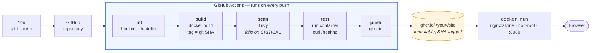

# Project 01: Static Site Pipeline (Beginner)

## Problem Statement

Build a containerized static website with an automated CI/CD pipeline that lints, builds, scans, and deploys on every push. This is the simplest end-to-end DevOps project, but it must be done with production-quality practices.

**Time**: ~1 week at 10–15 hours. **Cost**: £0 — everything here is free tier or local.

## Architecture

This is what you are building. Every box is something you write; every arrow is something you have to prove works.



> **💡 DevOps Impact**: notice that the artefact is built **once**, tagged with the commit SHA, and everything downstream refers to that tag. Rebuilding per environment is the most common way teams end up shipping something they never tested — and the habit is much easier to form on a project this small than to retrofit later.

## Requirements

### Application

- A static website (HTML/CSS/JS) — can be a personal portfolio, landing page, or documentation site
- Served by Nginx in a Docker container
- Health check endpoint that returns 200

### Dockerfile

- Uses `nginx:alpine` (slim base image)
- Runs as non-root user
- Copies only static files (no source code, no build tools in final image)
- Pinned image version (not `:latest`)

### CI/CD Pipeline (GitHub Actions)

- **Lint**: Validate HTML (htmlhint or similar)
- **Build**: Build the Docker image with a unique tag (git SHA)
- **Scan**: Run Trivy on the built image, fail on CRITICAL CVEs
- **Test**: Start the container and verify the health endpoint responds
- **Push** (optional): Push to GitHub Container Registry or Docker Hub

### Documentation

- README with architecture diagram
- Setup instructions for running locally
- Cleanup instructions

## Repository Layout

Start from this skeleton. It is deliberately a list of files and what belongs in each — the
files themselves are the project, so writing them is the work.

```
project-01-static-pipeline/
├── README.md                     # problem, architecture, how to run, what you'd change
├── Dockerfile                    # nginx:alpine pinned, non-root, COPY site/ only
├── docker-compose.yml            # one service, healthcheck, port 8080:8080
├── .dockerignore                 # ⭐ keep .git and docs out of the build context
├── nginx/
│   └── default.conf              # listen 8080 (non-root can't bind 80), /healthz → 200
├── site/
│   ├── index.html
│   └── assets/
├── .github/
│   └── workflows/
│       └── ci.yml                # lint → build → scan → test → push, SHA-tagged
├── .htmlhintrc                   # linter config — a linter with no config is a suggestion
└── docs/
    ├── architecture.md           # the diagram above, redrawn as YOUR system
    ├── troubleshooting.md        # every error you hit, with the fix
    └── failure-notes.md          # the failure you introduced on purpose, and how CI caught it
```

Two details that trip everyone up on the first attempt, so decide them now:

- **Non-root cannot bind port 80.** Either listen on 8080 in `nginx/default.conf`, or use
  `nginxinc/nginx-unprivileged`. Discovering this from a `permission denied` in CI is fine;
  discovering it and not writing it down in `troubleshooting.md` is a wasted lesson.
- **A health endpoint is not the index page.** `/healthz` should be a distinct location that
  returns 200 with no dependencies, so a failing health check means the server is broken
  rather than the content being late.

## Build Sequence

Five phases. Do not start the next one until the gate passes — each gate is something you can
paste into your evidence file.

| Phase | Build | Done when |
|-------|-------|-----------|
| **1. Runs locally** | `site/`, `nginx/default.conf`, `Dockerfile` | `docker build` succeeds, `curl localhost:8080/healthz` returns 200, `docker exec <id> whoami` is **not** root |
| **2. Composed** | `docker-compose.yml` with a `healthcheck` | `docker compose ps` shows `healthy`, not just `running` — they are different claims |
| **3. CI green** | `ci.yml` with lint + build | A push produces a green run, and the image tag in the log is the commit SHA |
| **4. CI has teeth** | Trivy scan + container smoke test in CI | You can point at a run that **failed** for a real reason, and explain the log line that proves why |
| **5. Documented** | `README.md`, `docs/` | A person who has never seen it clones and runs it from your README alone, without asking you anything |

> ⭐ Phase 4 is the one people skip, and it is the only one an interviewer will dig into. "My pipeline passes" is unremarkable; "here is the run where it caught a critical CVE and refused to publish" is the project.

## Deliverables

- Git repository with all source code, Dockerfile, and CI/CD workflow
- Screenshot or link to a passing CI/CD pipeline run
- Trivy scan output showing no critical vulnerabilities
- Evidence of the health check working (curl output)
- Architecture diagram showing the build → test → deploy flow

## Validation

- `docker compose up` brings the site up on localhost
- CI pipeline passes on a clean push
- Trivy scan runs and reports results
- Health endpoint returns 200
- Container runs as non-root (verify with `docker exec <id> whoami`)

## Failure Scenario

Introduce one of these failures and document how the pipeline catches it:

1. Add a `<script>alert('xss')</script>` tag and see if the linter flags it
2. Switch to an image with known CRITICAL CVEs and see Trivy fail the pipeline
3. Break the Nginx config so the container starts but returns 500 on the health check

## What to Commit

- All source files, Dockerfile, docker-compose.yml, and GitHub Actions workflow
- Screenshot of passing and failing pipeline runs
- Trivy scan summary
- Troubleshooting notes from at least one issue you encountered

## Cost and Teardown

Nothing here should cost you money, but two of these have limits worth knowing:

| Resource | Free allowance | What to watch |
|----------|---------------|---------------|
| GitHub Actions | 2,000 minutes/month on free accounts (unlimited for public repos) | A workflow that runs on every push to every branch burns this fast. Scope triggers to `push` on your branches and `pull_request` |
| GitHub Container Registry | Free for public images | Private images count against package storage. Keep this one public |
| Local Docker | Your disk | `docker system df` — build caches and dangling images from a week of iterating are easily 10 GB |

```bash
# Teardown
docker compose down -v                 # containers, networks, volumes
docker image rm ghcr.io/<you>/site:<sha>
docker system prune -f                 # ⭐ then check `docker system df` actually dropped
```

Leave the GitHub repository up — it is the deliverable.

## Review Rubric

Score each criterion 1–5, multiply by the weight, and total it. Weights are here because these
criteria are not equally interesting to a reviewer: a pipeline with no evidence of catching a
real failure is a demo, not a project.

| Criteria | Weight | What a 5 looks like | Score (1-5) |
|----------|:------:|---------------------|:-----------:|
| **Debugging evidence** | ×3 | A CI run that failed for a real reason, with the log line and the fix documented in `failure-notes.md` | |
| **Reproducibility** | ×3 | Fresh clone → `docker compose up` → working site, with no undocumented step | |
| **Pipeline correctness** | ×2 | Stages ordered cheapest-first, image tagged by SHA, artefact built once | |
| **Security basics** | ×2 | Non-root container, pinned base image, Trivy gate that actually fails the build, no secrets | |
| **Explanation clarity** | ×2 | README states the problem and one tradeoff you chose, not a tool list | |
| **Cleanup quality** | ×1 | Teardown documented and verified — nothing left running or cached | |

**Scoring**: 1 = Not attempted · 2 = Partial · 3 = Meets expectations · 4 = Exceeds expectations · 5 = Production quality.
**Out of 65.** Below 40 means keep working; 40–52 is portfolio-ready; above 52 is genuinely good.

## Interview Pitch

Rehearse this out loud until it is under two minutes, because you will be asked for it in
exactly that form. Structure: problem → what you built → one decision → how you'd know it broke.

> "I wanted a deploy I couldn't get wrong by hand, so I containerised a static site and put a
> five-stage pipeline in front of it. The interesting part is the scan gate — I pinned the base
> image and made Trivy fail the build on criticals, then deliberately swapped in an old base
> image to prove the gate works. The image is tagged with the commit SHA and built once, so what
> gets published is exactly what was tested."

The follow-ups you should be ready for:

- *"Why non-root, on a static site?"* — blast radius, and the fact that port 8080 vs 80 is the only cost.
- *"Your scan blocks criticals. What do you do when there's no fix available?"* — the real answer involves reachability and an explicitly recorded, expiring exception, not disabling the gate. (Module 13.)
- *"How would you deploy this for real?"* — and here you should have an opinion about push vs pull delivery. (Module 06 §5.)
