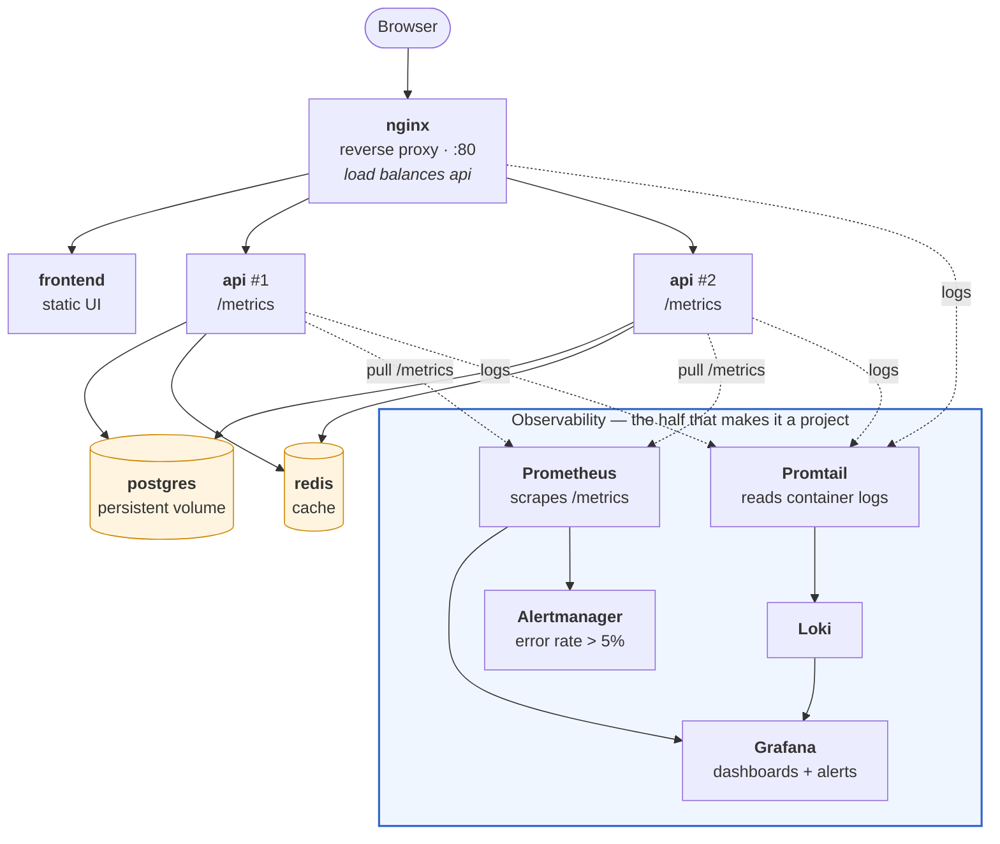

# Project 02: Microservices Platform (Intermediate)

## Problem Statement

Deploy a multi-service application with a reverse proxy, centralized monitoring, and centralized logging. Demonstrate that you can operate, observe, and debug a distributed system.

**Time**: ~2 weeks at 10–15 hours. **Cost**: £0 in cash, but budget ~4 GB of RAM and ~10 GB of disk — this stack is where a laptop starts to complain.

## Architecture

Eight containers on one Docker network. The request path is the top row; everything below it exists so you can answer questions about the top row.



> **💡 DevOps Impact**: two API replicas behind the proxy are not there for throughput on a laptop — they are there so that "stop one container and nothing breaks" is a claim you can demonstrate, and so your dashboards have to aggregate across instances instead of graphing a single pet.

## Requirements

### Application Stack

- **Frontend**: Static site or simple web UI served by Nginx
- **API**: A small REST API (Python Flask, Node Express, or Go) with at least 3 endpoints
- **Database**: PostgreSQL or MySQL for persistent data
- **Cache**: Redis for session or response caching
- **Reverse Proxy**: Nginx load balancing traffic to the API

### Observability Stack

- **Metrics**: Prometheus scraping application and infrastructure metrics
- **Dashboards**: Grafana with at least one custom dashboard (4+ panels)
- **Logging**: Loki + Promtail (or ELK) collecting logs from all services
- **Alerting**: At least one alert rule (e.g., API error rate > 5%)

### Infrastructure

- All services run via Docker Compose
- Health checks defined for every service
- Environment variables for configuration (no hardcoded values)
- `.env.example` file documenting required variables

### Documentation

- Architecture diagram showing all services and connections
- Setup instructions that work from `docker compose up`
- Troubleshooting guide with at least 3 real issues you encountered

## Repository Layout

```
project-02-microservices/
├── README.md
├── docker-compose.yml            # all services, healthchecks, depends_on: condition: service_healthy
├── .env.example                  # ⭐ every variable, with safe placeholder values
├── .gitignore                    # .env FIRST — this is the project where secrets leak
├── services/
│   ├── api/
│   │   ├── Dockerfile
│   │   ├── app.py                # 3+ endpoints, /metrics, /healthz, structured JSON logs
│   │   └── requirements.txt
│   └── frontend/
│       ├── Dockerfile
│       └── src/
├── nginx/
│   └── nginx.conf                # upstream block with both api replicas, X-Forwarded-For
├── monitoring/
│   ├── prometheus/
│   │   ├── prometheus.yml        # scrape api replicas, nginx exporter, itself
│   │   └── alert_rules.yml       # error rate, latency, target down
│   ├── alertmanager/
│   │   └── alertmanager.yml      # a webhook receiver is fine — it just has to fire
│   └── grafana/
│       └── provisioning/         # ⭐ datasources + dashboards as code, not clicked in
├── logging/
│   ├── loki/loki-config.yml
│   └── promtail/promtail-config.yml
├── db/
│   └── init.sql                  # schema — the API should not create its own tables at boot
└── docs/
    ├── architecture.md
    ├── troubleshooting.md
    ├── failure-notes.md
    └── runbook.md                # symptom → check → cause → fix, for each alert you defined
```

Three decisions to make deliberately rather than by accident:

- **`depends_on` alone does not wait for readiness.** It waits for *started*. Without
  `condition: service_healthy` plus a real healthcheck, your API will race Postgres on every
  `compose up` and fail intermittently — the single most common frustration in this project.
- **Provision Grafana, don't click it.** A dashboard configured through the UI dies with the
  volume and cannot be reviewed in a diff. Datasources and dashboards belong in
  `monitoring/grafana/provisioning/`.
- **Structured logs from day one.** JSON with a `request_id`, from the first line of code. Adding
  it after you have written the log statements is twice the work and you will not do it.

## Build Sequence

Six phases. Resist building the whole `docker-compose.yml` first — bring services up one at a
time and prove each one before adding the next, or you will debug five things at once.

| Phase | Build | Done when |
|-------|-------|-----------|
| **1. API alone** | `services/api` + Postgres | `curl` creates and reads a record; API survives a Postgres restart without manual intervention |
| **2. Cache** | Redis + a cached read path | Second identical request is measurably faster, and you can show both numbers |
| **3. Proxy** | nginx with two API replicas | `docker compose stop api-1` and traffic still succeeds — proven with a loop of curls, not a single one |
| **4. Metrics** | Prometheus + Grafana, provisioned | Dashboard shows request rate, error rate, and p95 **aggregated across both replicas** |
| **5. Logs** | Promtail + Loki | You can filter to one `request_id` and see its path across nginx and the API |
| **6. Alerting** | Alert rules + a runbook | An alert fires from a real induced failure, and `runbook.md` says what to do about it |

> ⭐ Phases 4–6 are the project. Phases 1–3 are a docker-compose tutorial that thousands of people have also done. Budget your two weeks accordingly — if you are running out of time, ship fewer API endpoints, not less observability.

## Deliverables

- Git repository with all source code, configs, and Compose files
- Architecture diagram
- Grafana dashboard screenshot or JSON export
- Log query demonstrating a debugging workflow
- Alert rule definition and evidence of it firing
- Troubleshooting guide

## Validation

- `docker compose up` brings the full stack online
- Frontend can reach the API through the reverse proxy
- API reads/writes to the database correctly
- Redis cache reduces response time on repeated requests
- Prometheus scrapes metrics from all instrumented targets
- Grafana dashboard shows live data
- Loki/ELK contains logs from all services
- At least one alert fires when a failure condition is simulated

## Failure Scenario

Simulate and document at least two of these scenarios:

1. **Database crash**: Stop the database container. How does the API respond? What do the logs show? How do metrics reflect the failure? Restart and verify recovery.
2. **API memory leak**: Set a very low memory limit on the API container. Generate traffic until it OOM-kills. Document the symptoms in metrics and logs.
3. **Cache failure**: Stop Redis. Does the API degrade gracefully or crash? Implement a fallback path.
4. **Traffic spike**: Use `hey` or `ab` to send 1000 concurrent requests. Observe latency, error rates, and resource utilization in Grafana.

## What to Commit

- All source code, Dockerfiles, Compose files, and configs
- Prometheus and Grafana configuration files
- Dashboard JSON export
- Troubleshooting guide with real issues and fixes
- Failure scenario documentation with evidence

## Cost and Teardown

No cloud spend, but this stack is not free in resources — and knowing its footprint is itself
a legitimate answer to "how would you size this?".

| Resource | Rough footprint | What to watch |
|----------|----------------|---------------|
| RAM | ~2.5–4 GB with all eight containers | Grafana + Prometheus + Loki are the heavy ones. Add `deploy.resources.limits` and watch what gets OOM-killed — that *is* failure scenario 2 |
| Disk | ~5–10 GB | Prometheus TSDB and Loki chunks grow while you iterate. Set short retention: `--storage.tsdb.retention.time=24h` |
| CPU | Idles low; the load test is the spike | `docker stats` during your `hey`/`ab` run belongs in your evidence |

```bash
# Teardown — the -v matters, that's where Postgres, Prometheus and Loki data live
docker compose down -v
docker system prune -f
docker system df                       # ⭐ confirm reclaimed, don't assume
```

If you later move this to a cloud VM to show it off: one 4 GB instance runs it (roughly
£15–20/month at typical 2026 small-instance pricing — check current rates), and you must put a
budget alert on the account before you start. An idle demo VM left running for a year is the
single most common self-inflicted cloud bill.

## Review Rubric

Score each criterion 1–5, multiply by the weight, total it. The weights say plainly what this
project is for: anyone can start eight containers, and almost nobody can show you the debugging
workflow that the observability stack was built to support.

| Criteria | Weight | What a 5 looks like | Score (1-5) |
|----------|:------:|---------------------|:-----------:|
| **Observability actually used** | ×3 | A written investigation: alert fired → dashboard narrowed it → log query for one `request_id` found the cause. Screenshots at each step | |
| **Failure evidence** | ×3 | Two or more induced failures, each with metrics *and* logs showing the symptom, plus recovery | |
| **Reproducibility** | ×2 | `cp .env.example .env && docker compose up` on a fresh machine, no manual ordering, no race | |
| **Monitoring as code** | ×2 | Dashboards, datasources, and alert rules committed and reviewable — not clicked into a UI | |
| **Security basics** | ×2 | No secrets committed, no default database password, non-root containers, `.env` gitignored | |
| **Explanation clarity** | ×2 | `runbook.md` maps each alert to a check and a fix; architecture doc explains the cache and the replicas | |
| **Cleanup quality** | ×1 | `down -v` verified, retention configured, footprint documented | |

**Scoring**: 1 = Not attempted · 2 = Partial · 3 = Meets expectations · 4 = Exceeds expectations · 5 = Production quality.
**Out of 75.** Below 45 means keep working; 45–60 is portfolio-ready; above 60 is genuinely good.

## Interview Pitch

> "It's a five-service stack behind nginx, but the point of it is the observability. I instrumented
> the API with RED metrics, shipped structured logs to Loki with a request id, and wrote one alert
> on error rate. Then I killed the database under load and used my own dashboards to work out what
> was happening — the alert fired, the dashboard showed which replica, and the log query gave me
> the exact exception. That investigation is written up in the runbook."

The follow-ups you should be ready for:

- *"Your API is stateless — how do you know?"* — the answer is that you stopped one replica mid-traffic and nothing broke, and you can show the curl loop.
- *"What did the cache actually buy you?"* — have both latency numbers, and be honest about what it cost you in invalidation complexity.
- *"Why alert on error rate rather than CPU?"* — symptoms versus causes. (Module 07 §7.)
- *"How would this look on Kubernetes?"* — a good moment to say what Compose does *not* give you: rolling updates, probes-driven traffic removal, self-healing. That's project 03.
