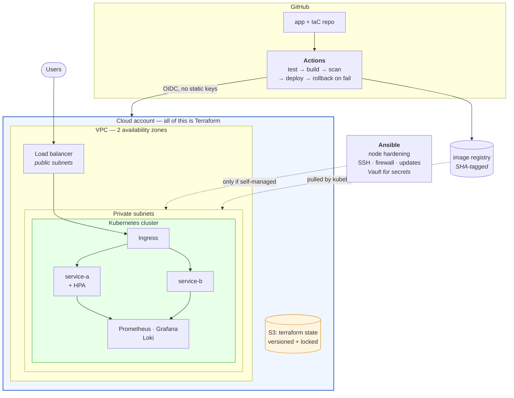

# Project 03: Production Infrastructure (Advanced)

## Problem Statement

Design, provision, and manage a complete production-grade environment using Infrastructure as Code, container orchestration, configuration management, and full observability. This is the capstone project that integrates skills from every module in the handbook.

**Time**: 2–3 weeks at 10–15 hours. **Cost**: £0 on the local path, roughly £100–160/month on the managed-cloud path if you leave it running — read [Cost and Teardown](#cost-and-teardown) *before* your first `terraform apply`, not after.

## Architecture

Everything below is provisioned from code. The one thing that is not is the Terraform state bucket, which has to exist before Terraform can use it.



> **💡 DevOps Impact**: the arrow from CI into the cloud is labelled OIDC for a reason — this is the project where you stop putting long-lived access keys in a CI system. A federated role that mints short-lived credentials is barely more work to set up and removes the single most valuable thing an attacker could steal from your pipeline.

### Pick Your Path First

The requirements are identical; only the substrate changes. Decide now, and write down why.

| | Local path | Managed cloud path |
|---|---|---|
| Cluster | k3s or minikube on your machine (or one small VM) | EKS / GKE / AKS |
| Cost | £0 | ~£100–160/month if left running |
| What you still prove | IaC, Ansible, K8s, observability, CI/CD, security, failure scenarios | All of that, plus VPC design, IAM, and cloud cost awareness |
| What you cannot show | Real VPC/subnet/IAM design, multi-AZ, managed load balancers | — |
| Honest interview framing | "I built it on k3s to keep it free; here is the Terraform for the AWS version and what would change" | "Here is the bill, and here is what I turned off" |

Either is defensible. What is *not* defensible is running the cloud version for three weeks without a budget alert, or claiming multi-AZ resilience you never provisioned.

## Requirements

### Infrastructure (Terraform)

- VPC with public and private subnets across 2 availability zones
- Security groups following least privilege
- An EKS/K3s/minikube Kubernetes cluster (cloud or local)
- S3 bucket for Terraform state (remote backend)
- IAM roles for services (not user access keys)

### Configuration Management (Ansible)

- Playbook to bootstrap cluster nodes (if using self-managed K8s)
- Role for common security hardening (SSH, firewall, updates)
- Ansible Vault for any sensitive variables

### Application Deployment (Kubernetes)

- At least 2 microservices deployed as Kubernetes Deployments
- Services exposed via Kubernetes Services and Ingress
- ConfigMaps for non-sensitive configuration
- Kubernetes Secrets for sensitive configuration
- Resource limits and requests on all pods
- Readiness and liveness probes on all containers
- Horizontal Pod Autoscaler on at least one service
- Rolling update strategy with rollback evidence

### Observability

- Prometheus + Grafana for metrics (deployed in-cluster or external)
- Loki or EFK for centralized logging
- At least 2 custom dashboards (infrastructure + application)
- At least 2 alert rules with notification channel configured
- Evidence of using observability to debug a real issue

### CI/CD

- GitHub Actions pipeline that:
  - Runs tests
  - Builds and scans container images
  - Deploys to Kubernetes (kubectl apply or Helm)
  - Includes rollback on failure

### Security

- Container images scanned with Trivy
- No secrets in source code or git history
- RBAC configured in Kubernetes
- Network policies restricting pod-to-pod traffic
- Pod security contexts (non-root, read-only filesystem)

## Repository Layout

```
project-03-production-infra/
├── README.md
├── docs/
│   ├── architecture.md           # your version of the diagram above, plus the tradeoffs
│   ├── adr/                      # ⭐ one file per real decision: EKS vs k3s, Helm vs kubectl
│   ├── runbook.md                # symptom → check → cause → fix, per alert
│   ├── cost.md                   # the table below, filled in with YOUR numbers
│   ├── troubleshooting.md        # 5+ real issues
│   └── failure-notes.md          # the induced failures, with evidence
├── terraform/
│   ├── bootstrap/                # ⭐ state bucket + lock table. Run FIRST, local state, once
│   ├── modules/
│   │   ├── network/              # VPC, subnets, route tables, NAT
│   │   └── cluster/              # cluster + node group / k3s hosts
│   └── environments/
│       ├── dev/                  # backend.hcl, main.tf, terraform.tfvars
│       └── prod/                 # same modules, different values — NOT copy-pasted resources
├── ansible/
│   ├── ansible.cfg
│   ├── inventory/                # dynamic inventory if cloud, static if local
│   ├── group_vars/
│   │   └── all/vault.yml         # ansible-vault encrypted. The .vault_pass file is gitignored
│   └── roles/
│       ├── common/               # updates, timezone, users
│       └── hardening/            # SSH config, firewall, fail2ban
├── kubernetes/
│   ├── base/                     # deployments, services, ingress, configmaps
│   ├── overlays/                 # dev / prod differences (Kustomize) or a Helm chart
│   ├── observability/            # kube-prometheus-stack values, Loki values, dashboards
│   └── policy/                   # RBAC, NetworkPolicies, Pod Security admission labels
└── .github/workflows/
    ├── ci.yml                    # test → build → scan → push
    └── deploy.yml                # deploy → verify rollout → rollback on failure
```

Four things that will cost you a day each if you decide them late:

- **`terraform/bootstrap/` is a separate root module with local state.** The bucket that holds
  your state cannot be described by the configuration that uses it. Create it once, commit it,
  and never point it at itself.
- **`environments/dev` and `environments/prod` must call the same modules.** Two copies of the
  resources that drift apart is the failure this layout exists to prevent — and the drift always
  reveals itself at the worst moment.
- **Secrets: pick one place and one mechanism.** Ansible Vault for host-level secrets, a cloud
  secret manager or Sealed Secrets/SOPS for cluster secrets. Kubernetes Secrets are base64,
  not encryption (Module 13 §2).
- **Deploy with a verified rollout, not `kubectl apply`.** `kubectl rollout status --timeout` is
  what turns "the pipeline succeeded" into "the pods are actually serving", and it is what your
  rollback step keys off.

## Build Sequence

Eight phases. Each gate is evidence for your final write-up — capture it as you go, because
recreating it after teardown means paying twice.

| Phase | Build | Done when |
|-------|-------|-----------|
| **1. Bootstrap** | `terraform/bootstrap` — state bucket, lock table, budget alert | State is remote and locked; a second `apply` from another shell is refused. ⭐ Budget alert exists **before** phase 2 |
| **2. Network** | `modules/network` — VPC, two AZs, public/private, NAT | `terraform plan` is empty on a re-run; a test instance in a private subnet can reach the internet but is not reachable from it |
| **3. Cluster** | `modules/cluster` — cluster + nodes | `kubectl get nodes` all Ready, from a kubeconfig that Terraform output |
| **4. Hardened** | Ansible `common` + `hardening` roles | Second run reports **zero changed** — idempotence is the deliverable, not the playbook |
| **5. Apps** | `kubernetes/base` — 2 services, probes, limits, ingress | Both services reachable through the Ingress; every pod has requests, limits, and both probes |
| **6. Observable** | `kubernetes/observability` | Dashboards show live data from your services; 2 alert rules; logs queryable and correlated |
| **7. Delivered** | `ci.yml` + `deploy.yml` | A code change reaches the cluster automatically, and a deliberately broken image triggers an automatic rollback |
| **8. Locked down** | `kubernetes/policy` — RBAC, NetworkPolicies, PSA | A pod in namespace A cannot reach namespace B; a privileged pod is rejected; `kubectl auth can-i --as=` proves the RBAC boundary |

> ⭐ Phase 7's rollback is the highest-value single thing in this project. "My pipeline deploys" is table stakes; "my pipeline noticed the rollout was failing and put the previous version back without me" is a story with a beginning and an end. Do not let it slip to the last day.

## Deliverables

- Git repository with Terraform, Ansible, Kubernetes, and CI/CD configs
- Architecture diagram showing all components and data flows
- Terraform plan output and apply evidence
- Kubernetes deployment evidence (kubectl get all)
- Grafana dashboard screenshots or JSON exports
- Security scan results
- CI/CD pipeline run evidence (passing and failing)
- Troubleshooting guide with at least 5 real issues

## Validation

- `terraform plan` shows the complete infrastructure
- `terraform apply` provisions all resources successfully
- Ansible playbook runs idempotently (second run = zero changes)
- All Kubernetes pods are Running and Ready
- Application is accessible through the Ingress
- Prometheus scrapes metrics from all targets
- Grafana dashboards show live data
- Alert rules are configured and functional
- CI/CD pipeline deploys a code change end-to-end
- `terraform destroy` tears everything down cleanly

## Failure Scenarios

Simulate and document at least three:

1. **Pod crash loop**: Deploy a misconfigured container. Use `kubectl describe` and `kubectl logs` to diagnose. Fix and redeploy.
2. **Failed deployment**: Push a broken image tag. Observe the rollout failure. Execute a rollback. Verify the previous version is restored.
3. **Node failure** (if multi-node): Cordon and drain a node. Observe pod rescheduling. Uncordon and verify rebalancing.
4. **Security incident**: Simulate a leaked secret. Rotate it, update Kubernetes Secrets, and redeploy without downtime.
5. **Resource exhaustion**: Set very low memory limits. Generate load. Observe OOM kills and HPA scaling in action.

## What to Commit

- All Terraform, Ansible, Kubernetes, and CI/CD configuration files
- Architecture diagram and design document
- `terraform plan` and `terraform apply` output summaries
- Grafana dashboard JSON exports
- Security scan results (Trivy, kube-bench)
- Troubleshooting guide with evidence of debugging
- Cost estimate for the cloud resources used

## Cost and Teardown

This is the only project in the handbook that can send you a bill. Treat the numbers below as
**illustrative shapes, not quotes** — check current pricing for your region before you apply, and
put the budget alert in place first.

### Managed cloud path (AWS, eu-west-1, illustrative)

| Resource | Rough monthly if left running | Notes |
|----------|------------------------------:|-------|
| EKS control plane | ~£70 | Charged per cluster-hour whether or not anything runs on it. ⭐ The single biggest surprise |
| 2 × `t3.small` nodes | ~£28 | Spot instances cut this substantially and are fine for a lab |
| NAT gateway | ~£30 + data | Hourly **and** per-GB. Two AZs means two of them if you follow the textbook |
| Application load balancer | ~£16 + LCU | Per-hour plus capacity units |
| EBS volumes, snapshots | ~£3–8 | Volumes survive instance termination. So do snapshots |
| S3 state + ECR images | < £1 | Genuinely cheap; keep the state bucket |
| CloudWatch logs | £0–10 | ⭐ Default retention is *forever*. Set it to 7 days on day one |
| **Total** | **~£150–160/month** | **~£5/day.** Three weeks of continuous running is real money |

Ways to cut it that are also good engineering answers:

- Destroy at the end of each session. `terraform apply` from scratch takes ~15–20 minutes for EKS — an acceptable price, and it proves reproducibility every single time.
- Single AZ and one NAT gateway while building; two AZs only for the run you take evidence from.
- Spot node groups for the node pool.
- Or take the **local path**: k3s on your machine costs nothing and still demonstrates seven of the eight phases.

### Teardown checklist

`terraform destroy` is necessary and not sufficient — cloud providers leave behind anything
Terraform did not create, including things your cluster created on your behalf.

```bash
# 1. Kubernetes first: services of type LoadBalancer created cloud load balancers that
#    Terraform does not know about. Delete them BEFORE destroying the network.
kubectl delete svc --all-namespaces --field-selector spec.type=LoadBalancer
kubectl delete pvc --all --all-namespaces        # ⭐ these are real EBS volumes

# 2. Then the infrastructure
terraform -chdir=terraform/environments/dev destroy

# 3. Then verify by hand — this is the step people skip and then pay for
aws elbv2 describe-load-balancers --query 'LoadBalancers[].LoadBalancerName'
aws ec2 describe-addresses --query 'Addresses[?AssociationId==null].PublicIp'   # unattached EIPs
aws ec2 describe-volumes --filters Name=status,Values=available --query 'Volumes[].VolumeId'
aws ec2 describe-snapshots --owner-ids self --query 'Snapshots[].SnapshotId'
aws ec2 describe-nat-gateways --filter Name=state,Values=available
aws logs describe-log-groups --query 'logGroups[].logGroupName'
aws ecr describe-repositories --query 'repositories[].repositoryName'
```

Keep the state bucket and your budget alert. Delete everything else, then **check the billing
console 48 hours later** — charges lag, and "I verified the bill went to zero" is a sentence
that impresses interviewers precisely because so few candidates can say it.

## Review Rubric

Score each criterion 1–5, multiply by the weight, total it. This is the capstone: the weights
reward the things that distinguish someone who has operated a system from someone who has
provisioned one.

| Criteria | Weight | What a 5 looks like | Score (1-5) |
|----------|:------:|---------------------|:-----------:|
| **Failure handling proven** | ×3 | 3+ induced failures with evidence, including an automatic rollback triggered by a broken deploy | |
| **Reproducibility** | ×3 | `bootstrap → apply → ansible → deploy` from a fresh clone with documented steps; a re-run of `plan` is empty | |
| **Security posture** | ×3 | RBAC scoped and proven with `auth can-i --as=`, NetworkPolicies enforced, PSA rejecting privileged pods, OIDC instead of static CI keys, no secrets in history | |
| **Observability** | ×2 | Dashboards and alerts as code, and a written investigation where they found a real problem | |
| **Cost discipline** | ×2 | `docs/cost.md` with real numbers, a budget alert from day one, and verified teardown including the orphan sweep | |
| **Decision quality** | ×2 | ADRs recording what you chose, what you rejected, and why. Local vs cloud framed honestly | |
| **Idempotence** | ×1 | Second Ansible run: zero changed. Second `terraform plan`: no diff | |
| **Explanation clarity** | ×1 | Architecture doc and runbook a stranger could operate from | |

**Scoring**: 1 = Not attempted · 2 = Partial · 3 = Meets expectations · 4 = Exceeds expectations · 5 = Production quality.
**Out of 85.** Below 50 means keep working; 50–68 is portfolio-ready; above 68 is the strongest thing in your portfolio and should be the first project you mention.

## Interview Pitch

> "It's a two-AZ VPC with a Kubernetes cluster, all in Terraform, with Ansible hardening the
> nodes and a pipeline that deploys through OIDC — no static credentials anywhere. The part I'd
> point at is the rollback: I pushed a deliberately broken image tag, the rollout stalled on the
> readiness probe, the pipeline caught it on `rollout status` and put the previous version back
> automatically. And I can tell you what it cost — about £5 a day, mostly the EKS control plane
> and NAT gateways, which is why I destroy it between sessions."

The follow-ups you should be ready for:

- *"Why is your state in S3 and what happens if two people apply at once?"* — locking, and what the lock actually prevents. (Module 10 §5.)
- *"Walk me through a pod that won't start."* — `describe` → events → `logs --previous` → exit code, out loud, in order. (Module 12 §11.)
- *"Your NetworkPolicy — what's the default before you add one?"* — everything can reach everything, and that is the point of adding one.
- *"How do you know the cluster is healthy right now?"* — a specific dashboard and a specific alert, not "I'd check the pods".
- *"What would you do differently with more time?"* — have a real answer. Managed database instead of in-cluster state, or tracing, or per-environment accounts. Saying "nothing" reads as not having thought about it.
